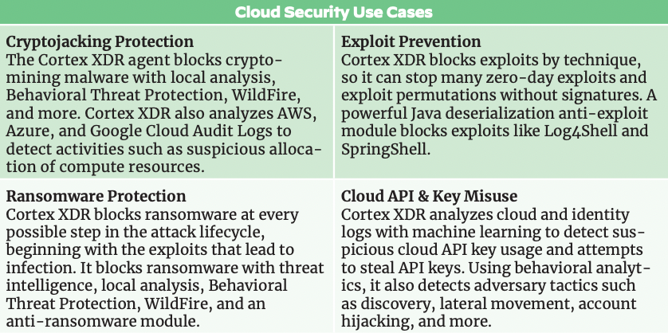

# Cloud Incident Response

As enterprise resources are moving to the cloud, attackers develop dedicated attacks to be able to access, manipulate, and exfiltrate cloud information and resources. Adequate response and remediation of such attacks requires cloud knowledge and extensive context.

This content pack helps you automate collection from cloud logs and then perform investigation and automated remediation of incidents based on cloud infrastructure activities in AWS, Azure, and GCP. It does not require an agent, resulting in a shorter time to resolution for cloud incidents.

To analyze cloud infrastructure alerts, a XSIAM license or a Cortex XDR Pro per TB license is required. Audit logs from the cloud provider should be ingested. The configuration varies between the different cloud providers:

[Set up cloud audit logs for Azure](https://docs-cortex.paloaltonetworks.com/r/Cortex-XDR/Cortex-XDR-Pro-Administrator-Guide/Ingest-Logs-from-Google-Kubernetes-Engine)  
[Set up cloud audit logs for AWS](https://docs-cortex.paloaltonetworks.com/r/Cortex-XDR/Cortex-XDR-Pro-Administrator-Guide/External-Data-Ingestion-Vendor-Support)  
[Set up cloud audit logs for GCP](https://docs-cortex.paloaltonetworks.com/r/Cortex-XDR/Cortex-XDR-Pro-Administrator-Guide/Ingest-Logs-and-Data-from-a-GCP-Pub/Sub?tocId=xlX52RIi48J7B4I5mEr4mw)

## What does this pack do?

This pack includes a collection of investigation and response playbooks for cloud alerts, aiding analyst investigations. The playbooks can also be used as templates to enrich, hunt, and block indicators.

The playbooks included in this pack help save time and automate repetitive tasks:

- Extract and enrich all relevant indicators from the alert.
- Automate alert triage.
- Investigate and hunt for additional activities by running advanced queries across major CSPs.
- Interact with the analyst to choose a remediation path or close the incident as a false positive based on the gathered information and incident severity.
- Hunt for related IOCs.
- Remediate the alerts by blocking malicious indicators, terminating newly created resources, and more.

As part of this pack, you will also get an out-of-the-box layout to facilitate analyst investigation. All of these components are easily customizable to suit the needs of your organization.

<~XSIAM>The playbooks are also included in the "Playbook Recommendation".</~XSIAM>

## Playbooks

The pack consists of three comprehensive playbooks tailored for handling common cloud security incidents
### 1. Cloud Token Theft

The Cloud Token Theft playbook is designed to guide security analysts through the response process in cases of compromised cloud access tokens. These tokens are crucial for accessing cloud resources and are often targeted by attackers to gain unauthorized access.

<~XSIAM>- [Cloud Token Theft Response](https://xsoar.pan.dev/docs/reference/playbooks/cloud-token-theft-response)<~/XSIAM>

<~XSOAR>- [Cortex XDR - Cloud Token Theft Response](https://xsoar.pan.dev/docs/reference/playbooks/cortex-xdr---x-cloud-token-theft-response)<~/XSOAR>

### 2. Cryptojacking Response

The Cryptojacking Response playbook assists security teams in detecting and mitigating cryptojacking incidents, where attackers illicitly use an organization's cloud resources to mine cryptocurrencies.

<~XSIAM>- [Cloud Cryptojacking](https://xsoar.pan.dev/docs/reference/playbooks/x-cloud-cryptomining)<~/XSIAM>

<~XSOAR>- [Cortex XDR - Cloud Cryptojacking](https://xsoar.pan.dev/docs/reference/playbooks/cortex-xdr---cloud-cryptomining)<~/XSOAR>

### 3. IAM User Investigation

The IAM User Investigation playbook provides step-by-step instructions for investigating suspicious activities related to IAM (Identity and Access Management) users in the cloud environment. It aids in identifying potential account compromises and unauthorized access.

<~XSIAM>- [Cloud IAM User Access Investigation](https://xsoar.pan.dev/docs/reference/playbooks/cloud-iam-user-access-investigation)<~/XSIAM>

<~XSOAR>- [Cortex XDR - Cloud IAM User Access Investigation](https://xsoar.pan.dev/docs/reference/playbooks/cortex-xdr---cloud-iam-user-access-investigation)<~/XSOAR>

### Investigative Playbooks

* [Cloud Response - Generic](https://xsoar.pan.dev/docs/reference/playbooks/cloud-response---generic)
* [Cloud Threat Hunting - Persistence](https://xsoar.pan.dev/docs/reference/playbooks/cloud-threat-hunting---persistence)
* [Cloud Enrichment - Generic](https://xsoar.pan.dev/docs/reference/playbooks/cloud-enrichment---generic)

## How to Use the Playbooks

Each playbook is provided in a user-friendly format, detailing the necessary actions, procedures, and tools required for effective incident response. To use the playbooks, follow the respective links provided above.

