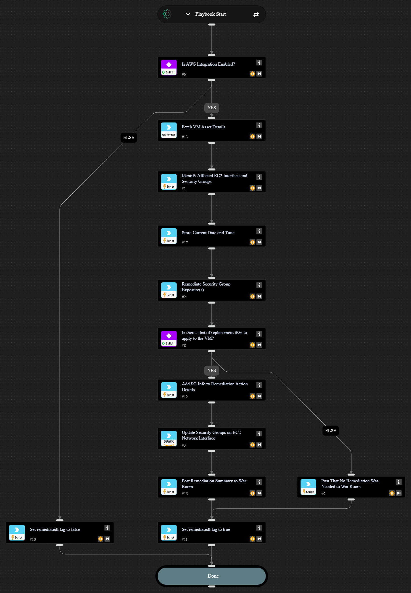

This playbook identifies the Security Group(s) used on the EC2 interface with the given public IP. It then determines which rules allow access to the interface on the given port and protocol and creates a new copy of the Security Group that has only the identified rules removed. The EC2 interface is then updated to use the modified security group(s). The original Security Groups are left unmodified so that the remediated copy is only applied to the exposed EC2 instance.

## Dependencies

This playbook uses the following sub-playbooks, integrations, and scripts.

### Sub-playbooks

This playbook does not use any sub-playbooks.

### Integrations

* AWS
* Cortex Core - Platform

### Scripts

* AWSIdentifySGPublicExposure
* AWSRemediateSG
* GetTime
* Print
* Set

### Commands

* aws-ec2-network-interface-attribute-modify
* core-get-asset-details

## Playbook Inputs

---

| **Name** | **Description** | **Default Value** | **Required** |
| --- | --- | --- | --- |
| AssetID | The Asset ID of the VM Instance |  | Required |
| PublicIP | The Public IP whose exposure to remediate. |  | Required |
| RemotePort | TCP/UDP port number to be restricted. |  | Required |
| RemoteProtocol | Protocol to be restricted \(tcp/udp\). |  | Required |
| RemediationAllowRanges | Comma-separated list of IPv4 network ranges to be used as source addresses for the \`cortex-remediation-allow-port-&lt;port\#&gt;-&lt;tcp\|udp&gt;\` rule to be created.  Typically this will be private IP ranges \(to allow access within the VPC and bastion hosts\) but other networks can be added as needed. | 10.0.0.0/16,172.16.0.0/12,192.168.0.0/16 | Optional |
| IntegrationInstance | AWS integration instance to use if multiple instances are configured \(optional\). |  | Optional |

## Playbook Outputs

---

| **Path** | **Description** | **Type** |
| --- | --- | --- |
| remediatedFlag | Output key to determine if remediation was successfully done. | boolean |
| remediation_action | Textual summary of remediation action\(s\) that were performed. | string |

## Playbook Image

---

