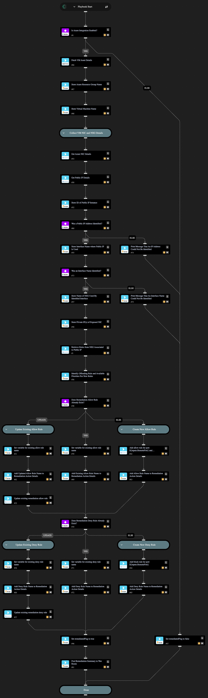

This playbook adds new Azure Network Security Group (NSG) rules to NSGs attached to a NIC. The new rules will give access only to a private IP address range and block traffic that's exposed to the public internet ([using the private IP of the VM as stated in Azure documentation](https://learn.microsoft.com/en-us/azure/virtual-network/network-security-groups-overview)). For example, if RDP is exposed to the public internet, this playbook adds new firewall rules that only allow traffic from private IP addresses and blocks the rest of the RDP traffic.

Conditions and limitations:
- Limited to one resource group.
- 2 priorities lower than the offending rule priority must be available.
- Adds rules to NSGs associated to NICs.

## Dependencies

This playbook uses the following sub-playbooks, integrations, and scripts.

### Sub-playbooks

This playbook does not use any sub-playbooks.

### Integrations

* Azure
* Cortex Core - Platform

### Scripts

* AzureIdentifyNSGExposureRule
* Print
* Set
* SetAndHandleEmpty

### Commands

* azure-nsg-security-rule-create
* azure-nsg-security-rule-update
* azure-nsg-security-rules-list
* azure-vm-network-interface-details-get
* azure-vm-public-ip-details-get
* core-get-asset-details

## Playbook Inputs

---

| **Name** | **Description** | **Default Value** | **Required** |
| --- | --- | --- | --- |
| AssetID | The Asset ID of the VM Instance |  | Required |
| PublicIP | The Public IP whose exposure to remediate. |  | Required |
| RemoteProtocol | The remote protocol that is publicly exposed. |  | Required |
| RemotePort | The remote port that is publicly exposed. |  | Required |
| IntegrationInstance | Azure Network Security Groups integration instance to use if you have multiple instances configured \(optional\). |  | Optional |
| RemediationAllowRanges | Comma-separated list of IPv4 network ranges to be used as source addresses for the \`cortex-remediation-allow-port-&lt;port\#&gt;-&lt;tcp\|udp&gt;\` rule to be created.  Typically this will be private IP ranges \(to allow access within the vnet and bastion hosts\) but other networks can be added as needed. | 172.16.0.0/12,10.0.0.0/8,192.168.0.0/16 | Optional |

## Playbook Outputs

---

| **Path** | **Description** | **Type** |
| --- | --- | --- |
| remediatedFlag | Output key to determine if remediation was successfully done. | boolean |
| remediation_action | Textual summary of remediation action\(s\) that were performed. | string |

## Playbook Image

---

