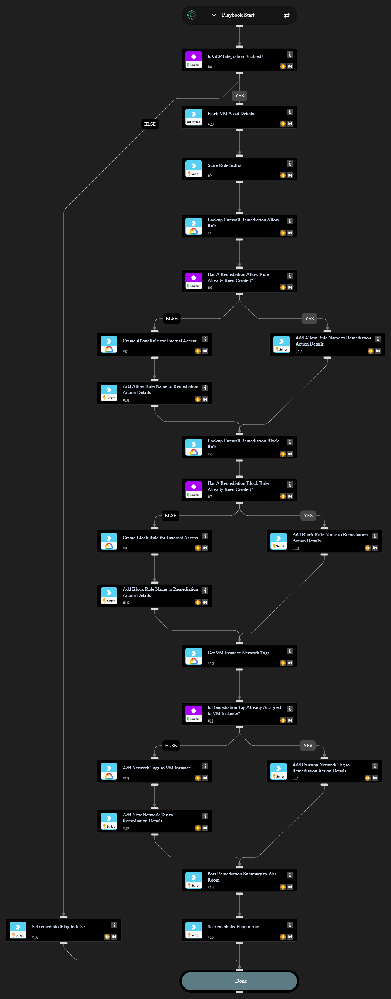

This playbook adds new VPC firewall rules to restrict access to private IP address ranges and block traffic exposed to the public internet. For example, if RDP is exposed this playbook adds new firewall rules that allow traffic only from private IP addresses and it blocks all other RDP traffic. New allow and block rules created by this playbook target only the exposed asset.

## Dependencies

This playbook uses the following sub-playbooks, integrations, and scripts.

### Sub-playbooks

This playbook does not use any sub-playbooks.

### Integrations

* Cortex Core - Platform
* GCP

### Scripts

* Print
* Set

### Commands

* core-get-asset-details
* gcp-compute-firewall-insert
* gcp-compute-firewall-list
* gcp-compute-instance-get
* gcp-compute-network-tag-set

## Playbook Inputs

---

| **Name** | **Description** | **Default Value** | **Required** |
| --- | --- | --- | --- |
| AssetID | The asset ID of the VM instance. |  | Required |
| RemotePort | The remote port that is publicly exposed. |  | Required |
| RemoteProtocol | The remote protocol that is publicly exposed. |  | Required |
| IntegrationInstance | The GCP integration instance to use if multiple instances are configured \(optional\). |  | Optional |
| RemediationAllowRanges | A comma-separated list of IPv4 network ranges to be used as source addresses for the \`cortex-remediation-allow-port-&lt;port\#&gt;-&lt;tcp\|udp&gt;\` rule to be created.  Typically these are private IP ranges \(to allow access within the VPC and bastion hosts\), but other networks can be added as needed. | 172.16.0.0/12,10.0.0.0/8,192.168.0.0/16 | Optional |

## Playbook Outputs

---

| **Path** | **Description** | **Type** |
| --- | --- | --- |
| remediatedFlag | Whether remediation was successfully done. | boolean |
| remediation_action | The summary of remediation actions that were performed. | string |

## Playbook Image

---

