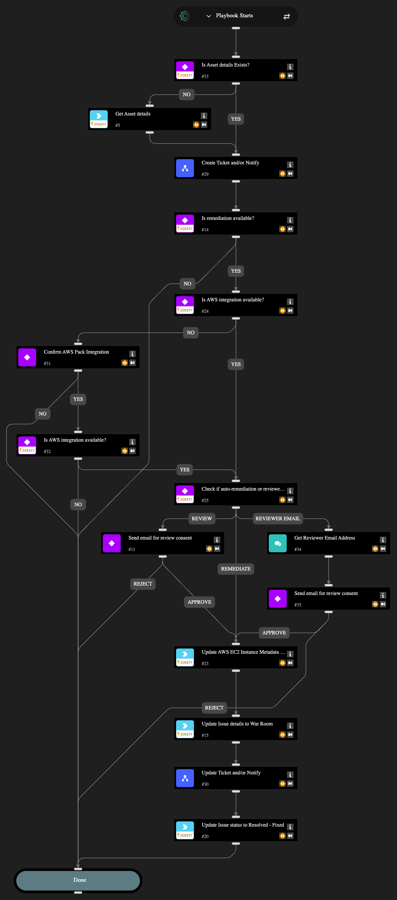

This playbook helps you fix cloud security misconfigurations on your AWS EC2 Instances. It also makes it easy to involve your team by creating tickets and sending notifications through your chosen services.
You have the flexibility to fully automate the fix or include an analyst review and approval step before any changes are made. Ticketing and notifications are handled by a sub-playbook, which you need to set up with your preferred integrations. To get started, provide inputs to select your desired ticketing and notification channels. If you want an analyst to approve the fix, you need to provide their email address. The playbook will send them the issue details and wait for their decision before applying any changes.

Caution: If you do not provide a reviewer email, the playbook will automatically apply the fix without an approval step.

This playbook can fix the following misconfigurations:

- AWS EC2 instances not configured with Instance Metadata Service v2 (IMDSv2).

## Dependencies

This playbook uses the following sub-playbooks, integrations, and scripts.

### Sub-playbooks

- Create Ticket and Notify

### Integrations

- AWS
- Cortex Core - Platform

### Scripts

- IsIntegrationAvailable
- Print

### Commands

- aws-ec2-instance-metadata-options-modify
- core-get-asset-details
- setIssueStatus

## Playbook Inputs

---

| **Name** | **Description** | **Default Value** | **Required** |
| --- | --- | --- | --- |
| Preferred ticketing platform | Possible values: - Jira - ServiceNow - Both  Note: If you leave this empty, no issue ticket will be generated, and the playbook will skip this step. |  | Optional |
| Preferred notification platform | Possible values: - Microsoft Teams - Slack  Note: If you leave this blank, no notification message will be sent and the playbook will skip this step. |  | Optional |
| Notification email recipients | Provide the email address to send email notifications.  Note: If you leave this blank, no email notification will be sent and the playbook will skip this step. |  | Optional |
| Reviewer email address | Provide the designated reviewer's email address to request approval for executing the remediation command.  Note: If you leave this blank, no email notification will be sent for reviewer approval, and the playbook will skip directly to execute the remediation command. |  | Optional |
| Jira Project Key | Provide Jira project key where the issue will be created. |  | Optional |
| Teams Channel Name | Provide Microsoft Teams channel name to which to send messages. |  | Optional |
| Slack Channel Name | Provide Slack channel name to which to send messages. |  | Optional |

## Playbook Outputs

---
There are no outputs for this playbook.

## Playbook Image

---

