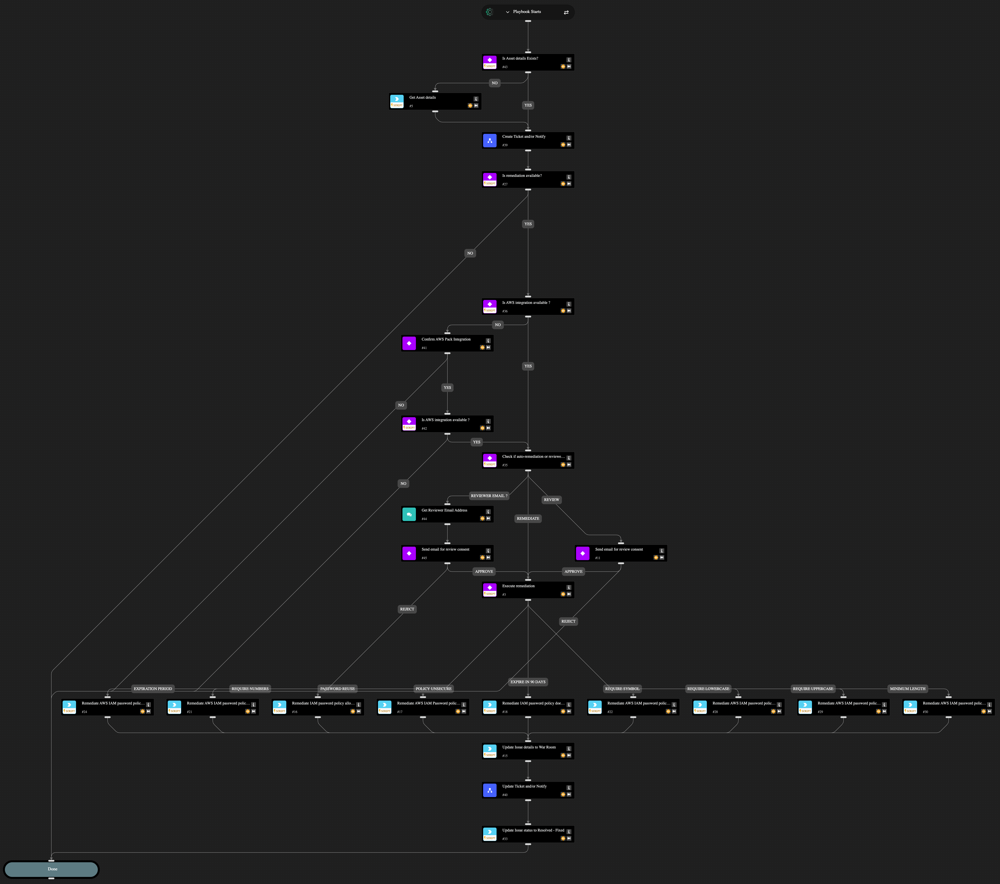

This playbook helps you fix cloud security misconfigurations related to your AWS IAM password policy. It also makes it easy to involve your team by creating tickets and sending notifications through your chosen services.
You have the flexibility to fully automate the fix or include an analyst review and approval step before any changes are made. Ticketing and notifications are handled by a sub-playbook, which you need to set up with your preferred integrations. You can choose to only create or update a ticket and skip the notification, skip creating or updating a ticket and send only a notification, or both create or update a ticket and notify relevant parties. If you want an analyst to approve the fix, you need to provide their email address. The playbook will send them the issue details and wait for their decision before applying any changes.

This playbook can fix the following misconfigurations:

- AWS IAM password policy allows password reuse
- AWS IAM password policy does not expire in 90 days
- AWS IAM password policy does not have a lowercase character
- AWS IAM password policy does not have a minimum of 14 characters
- AWS IAM password policy does not have a number
- AWS IAM password policy does not have a symbol
- AWS IAM password policy does not have an uppercase character
- AWS IAM password policy does not have password expiration period
- AWS IAM Password policy is unsecure.

## Dependencies

This playbook uses the following sub-playbooks, integrations, and scripts.

### Sub-playbooks

- Create Ticket and/or Notify
- Update Ticket and/or Notify

### Integrations

- AWS
- Cortex Core - Platform

### Scripts

- IsIntegrationAvailable
- Print

### Commands

- aws-iam-account-password-policy-update
- core-get-asset-details
- setIssueStatus

## Playbook Inputs

---

| **Name** | **Description** | **Default Value** | **Required** |
| --- | --- | --- | --- |
| Do you want to auto-remediate? | Possible values: - Yes - No  Note: If set to 'No', the Reviewer Email Address input is required. | No | Required |
| Do you want to create a ticket? | Possible values: - Yes - No  Note: If set to 'Yes', a configured ServiceNow and/or Jira integration is required.   If using Jira, the Jira Project Key input must also be provided. | No | Required |
| Do you want to send a message notification? | Possible values: - Yes - No  Note: If set to 'Yes', Microsoft Teams and/or Slack integration must be configured. If using Slack, the Slack Channel Name input must also be provided. | No | Required |
| Do you want to send an email notification? | Possible values: - Yes - No  Note: To send email notifications, specify the Notification Email Recipients input. | No | Required |
| Reviewer Email Address | Provide the designated reviewer's email address to request approval for executing the remediation command. |  | Optional |
| Jira Project Key | Provide Jira project key where the issue will be created. |  | Optional |
| Slack Channel Name | Provide Slack channel name to which to send messages. |  | Optional |
| Notification Email Recipients | Provide the email address to send email notifications. |  | Optional |

## Playbook Outputs

---
There are no outputs for this playbook.

## Playbook Image

---

