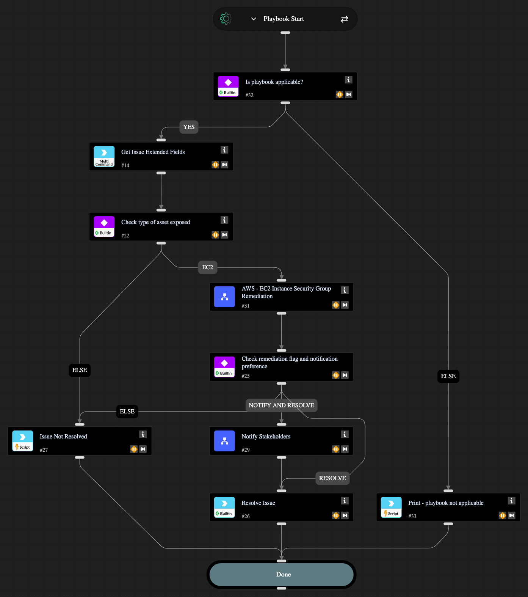

This playbook remediates the following AWS Network Exposure detections:
1. Amazon EC2 instance with management ports exposed to the public internet
It does so by updating the AWS asset with a new security group which is a copy of the original but without the offending security rule that causes public exposure.

## Dependencies

This playbook uses the following sub-playbooks, integrations, and scripts.

### Sub-playbooks

* AWS - EC2 Instance Security Group Remediation
* Notify Stakeholders

### Integrations

* Cortex Core - Platform

### Scripts

* Print

### Commands

* core-get-issue-recommendations
* setIssueStatus

## Playbook Inputs

---

| **Name** | **Description** | **Default Value** | **Required** |
| --- | --- | --- | --- |
| enableNotifications | Options: yes/no Choose if you wish to notify stakeholders about the remediation actions taken. The recipients need to be configured in the Playbook Triggered header of the "Notify Stakeholders" sub-playbook. If no recipients are provided, the playbook will pause to ask for an input. | yes | Optional |

## Playbook Outputs

---

| **Path** | **Description** | **Type** |
| --- | --- | --- |
| remediatedFlag | Output key to determine if remediation was successfully done. | boolean |

## Playbook Image

---

