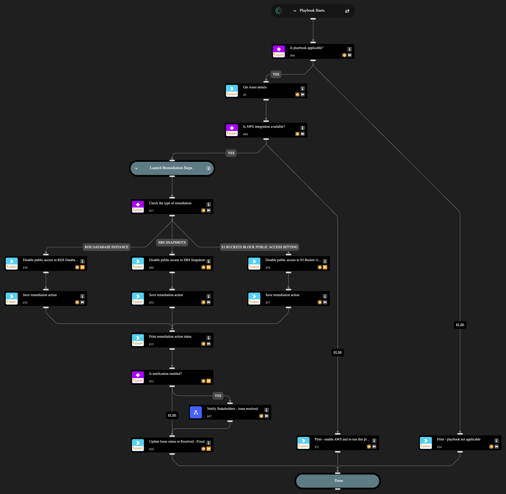

Automatically remediates 9 AWS public access misconfigurations: 1 RDS database, 1 EBS snapshot, and 7 S3 bucket issues:

1. AWS RDS database instance is publicly accessible
2. AWS EBS snapshots are accessible to public
3. AWS S3 buckets are accessible to public via ACL
4. AWS S3 Buckets Block public access setting disabled
5. AWS CloudTrail bucket is publicly accessible
6. AWS Connect instance using publicly accessible S3 bucket
7. AWS S3 bucket policy overly permissive to any principal
8. AWS S3 bucket publicly readable
9. AWS S3 bucket publicly writable

The playbook disables public access by modifying RDS publicly_accessible settings, removing EBS snapshot createVolumePermission, and enabling S3 PublicAccessBlockConfiguration respectively.

Optional stakeholder notification is available via the "Notify Stakeholders" sub-playbook by setting enableNotifications input to 'yes' (default: 'no'). When enabled, configure at least one recipient (email, Slack channel, or Teams channel) in the Notify Stakeholders playbook inputs. The playbook automatically updates the issue status to "Resolved - Fixed" upon successful remediation.

## Dependencies

This playbook uses the following sub-playbooks, integrations, and scripts.

### Sub-playbooks

* Notify Stakeholders

### Integrations

* AWS
* Cortex Core - Platform

### Scripts

* Print
* Set

### Commands

* aws-ec2-snapshot-attribute-modify
* aws-rds-db-instance-modify
* aws-s3-public-access-block-update
* core-get-asset-details
* setIssueStatus

## Playbook Inputs

---

| **Name** | **Description** | **Default Value** | **Required** |
| --- | --- | --- | --- |
| enableNotifications | Options: yes/no Choose if you wish to notify stakeholders about the remediation actions taken. The recipients need to be configured in the Playbook Triggered header of the "Notify Stakeholders" sub-playbook. If no recipients are provided, the playbook will pause to ask for an input. | no | Required |

## Playbook Outputs

---
There are no outputs for this playbook.

## Playbook Image

---

