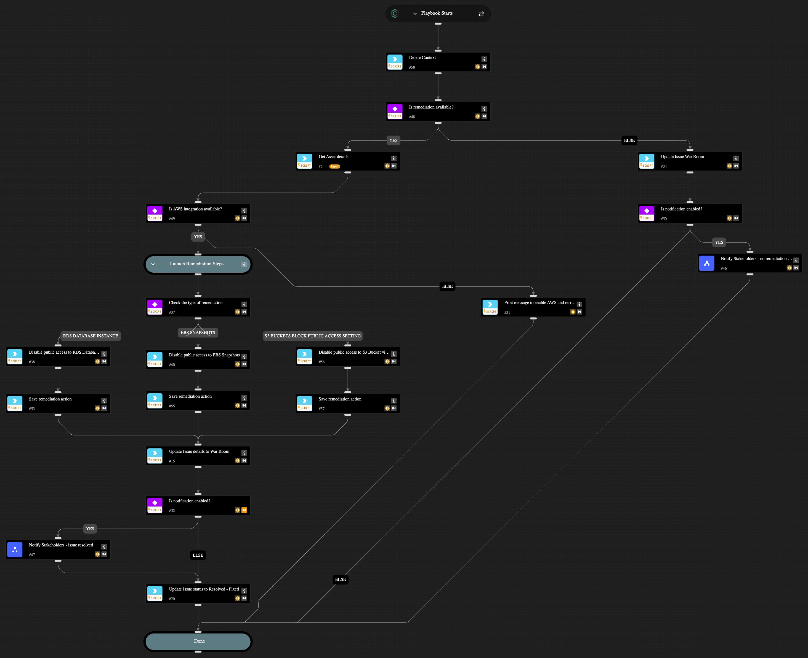

Automated remediation of the following AWS Misconfigurations:
1. AWS RDS database instance is publicly accessible
2. AWS S3 Buckets Block public access setting disabled
3. AWS S3 buckets are accessible to public via ACL
4. AWS EBS snapshots are accessible to public
5. AWS CloudTrail bucket is publicly accessible
6. AWS Connect instance using publicly accessible S3 bucket
7. AWS S3 bucket policy overly permissive to any principal
8. AWS S3 bucket publicly readable
9. AWS S3 bucket publicly writable

## Dependencies

This playbook uses the following sub-playbooks, integrations, and scripts.

### Sub-playbooks

* Notify Stakeholders - issue resolved
* Notify Stakeholders - no remediation available

### Integrations

* AWS
* Cortex Core - Platform

### Scripts

* DeleteContext
* Print
* Set

### Commands

* aws-ec2-snapshot-attribute-modify
* aws-rds-db-instance-modify
* aws-s3-public-access-block-update
* core-get-asset-details
* setIssueStatus

## Playbook Inputs

---

| **Name** | **Description** | **Default Value** | **Required** |
| --- | --- | --- | --- |
| enableNotifications | Options: yes/no Choose if you wish to notify stakeholders about the remediation actions taken. The recipients need to be configured in the Playbook Triggered header of the "Notify Stakeholders" sub-playbook. If no recipients are provided, the playbook will pause to ask for an input. | no | Required |

## Playbook Outputs

---
There are no outputs for this playbook.

## Playbook Image

---

