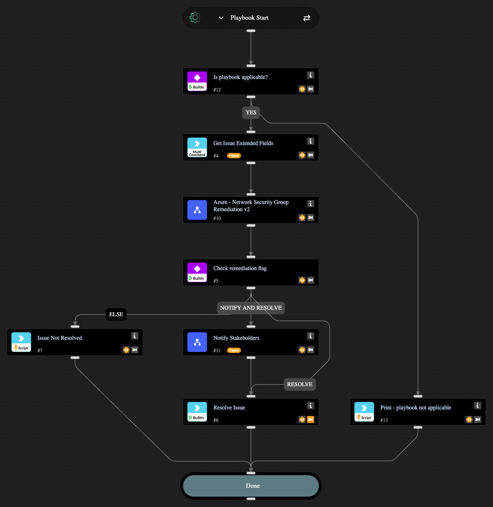

This playbook remediates the following Azure Network Exposure detections:
1. Azure virtual machine with management ports exposed to the public internet
It does so by updating the network security group of the vm instance, adding a Deny rule on top of the one that causes public exposure to block access to that specific VM instance. It also adds an Allow rule to permit access to the instance from internal IPs.

## Dependencies

This playbook uses the following sub-playbooks, integrations, and scripts.

### Sub-playbooks

* Azure - Network Security Group Remediation v2
* Notify Stakeholders

### Integrations

* Cortex Core - Platform

### Scripts

* Print

### Commands

* core-get-issue-recommendations
* setIssueStatus

## Playbook Inputs

---

| **Name** | **Description** | **Default Value** | **Required** |
| --- | --- | --- | --- |
| enableNotifications | Options: yes/no     Choose if you wish to notify stakeholders about the remediation actions taken. The recipients need to be configured in the Playbook Triggered header of the "Notify Stakeholders" sub-playbook. If no recipients are provided, the playbook will pause to ask for an input. | yes | Required |

## Playbook Outputs

---
There are no outputs for this playbook.

## Playbook Image

---

