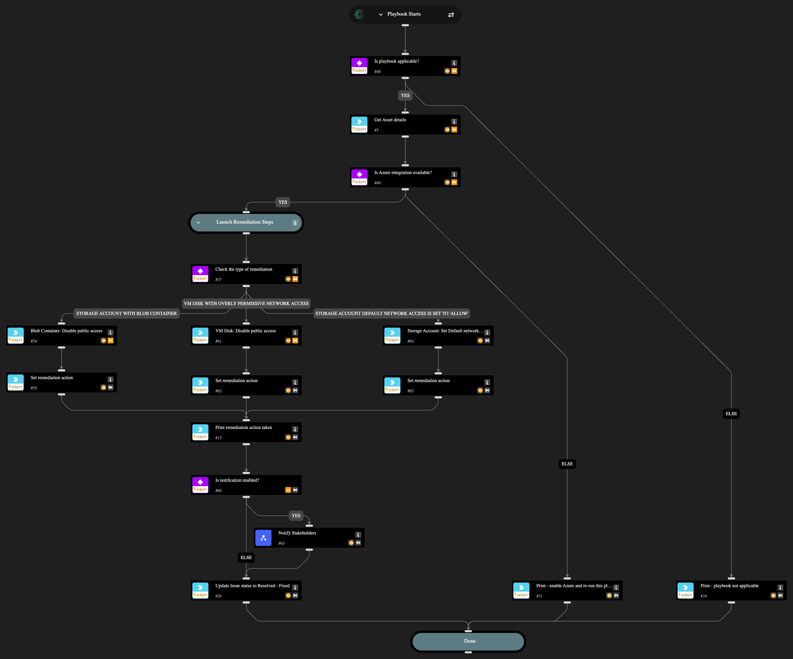

Automatically remediates 3 Azure public access misconfigurations:

1. Azure storage account has a blob container with public access
2. Azure VM disk configured with overly permissive network access
3. Azure Storage Account default network access is set to 'Allow'

The playbook disables public access by setting allowBlobPublicAccess to false, configuring VM disk publicNetworkAccess to Disabled with a DenyAll policy, and updating the storage account default network access action to Deny.

Optional stakeholder notification is available via the "Notify Stakeholders" sub-playbook by setting enableNotifications input to 'yes' (default: 'no'). When enabled, configure at least one recipient (email, Slack channel, or Teams channel) in the Notify Stakeholders playbook inputs. The playbook automatically updates the issue status to "Resolved - Fixed" upon successful remediation.

## Dependencies

This playbook uses the following sub-playbooks, integrations, and scripts.

### Sub-playbooks

* Notify Stakeholders

### Integrations

* Azure
* Cortex Core - Platform

### Scripts

* Print
* Set

### Commands

* azure-disk-update
* azure-storage-account-update
* core-get-asset-details
* setIssueStatus

## Playbook Inputs

---

| **Name** | **Description** | **Default Value** | **Required** |
| --- | --- | --- | --- |
| enableNotifications | Options: yes/no Choose if you wish to notify stakeholders about the remediation actions taken. The recipients need to be configured in the Playbook Triggered header of the "Notify Stakeholders" sub-playbook. If no recipients are provided, the playbook will pause to ask for an input. | no | Required |

## Playbook Outputs

---
There are no outputs for this playbook.

## Playbook Image

---

