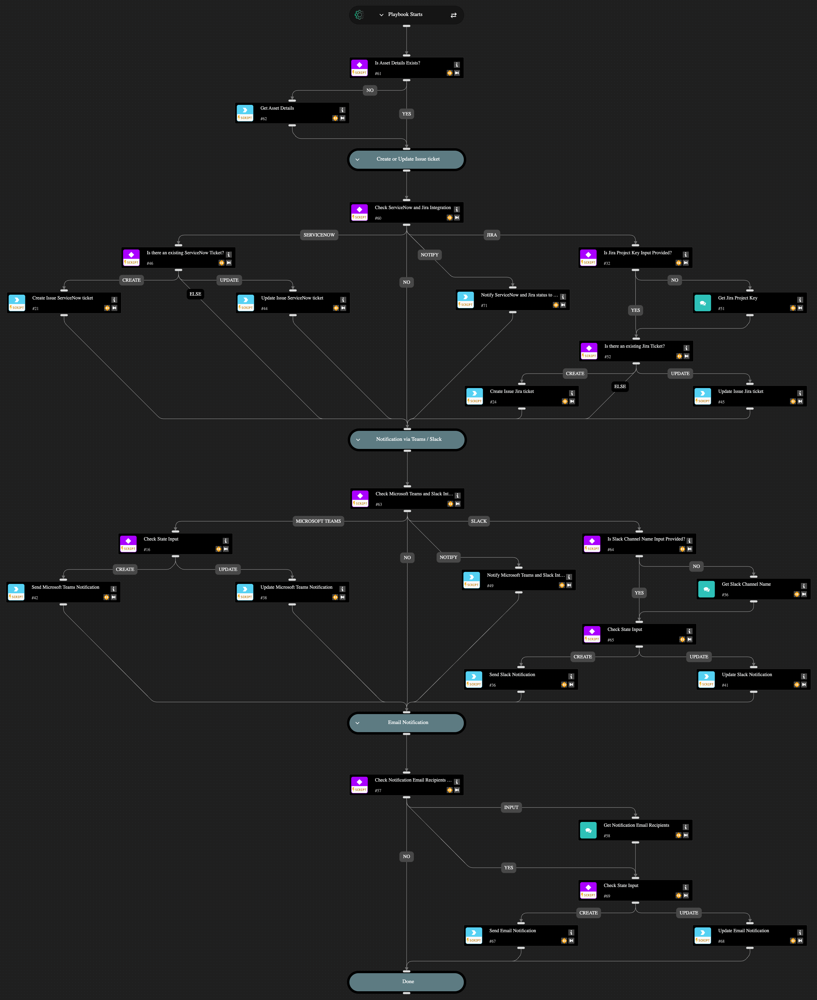

This playbook automates the handling of issues, sending them through ServiceNow v2 or Jira v3 and notifying stakeholders via Slack v3, Microsoft Teams, or email. You have the flexibility to create or update a ticket using Jira or ServiceNow, to notify other teams using Slack or Microsoft Teams, or to send an email. You can choose to only create or update a ticket and skip the notification, skip creating or updating a ticket and send only a notification, or both create or update a ticket and notify relevant parties. This playbook requires existing integrations with Jira, ServiceNow, Slack, or Microsoft Teams to perform these actions. If none of these integrations are found in your account, the playbook will post message to the Issue War Room notifying the missing integrations.

## Dependencies

This playbook uses the following sub-playbooks, integrations, and scripts.

### Sub-playbooks

This playbook does not use any sub-playbooks.

### Integrations

* Cortex Core - Platform
* Jira V3
* Microsoft Teams via Webhook
* ServiceNow v2
* SlackV3
* mail-sender

### Scripts

* Print

### Commands

* core-get-asset-details
* jira-create-issue-quick-action
* jira-issue-add-comment
* ms-teams-message
* send-mail
* servicenow-create-ticket-quick-action
* servicenow-update-ticket
* slack-send-notification-quick-action

## Playbook Inputs

---

| **Name** | **Description** | **Default Value** | **Required** |
| --- | --- | --- | --- |
| Do you want to create a ticket? | Possible values: - Yes - No  Note: If set to 'Yes', a configured ServiceNow and/or Jira integration is required.   If using Jira, the Jira Project Key input must also be provided. |  | Required |
| Do you want to send a message notification? | Possible values: - Yes - No  Note: If set to 'Yes', Microsoft Teams and/or Slack integration must be configured. If using Slack, the Slack Channel Name input must also be provided. |  | Required |
| Do you want to send an email notification? | Possible values: - Yes - No  Note: To send email notifications, specify the Notification Email Recipients input. |  | Required |
| Jira Project Key | Provide Jira project key where the issue will be created. |  | Optional |
| Slack Channel Name | Provide Slack channel name to which to send messages. |  | Optional |
| Notification Email Recipients | Provide the email address to send email notifications. |  | Optional |
| Issue State | Possible values: - Create - Update |  | Optional |

## Playbook Outputs

---
There are no outputs for this playbook.

## Playbook Image

---

