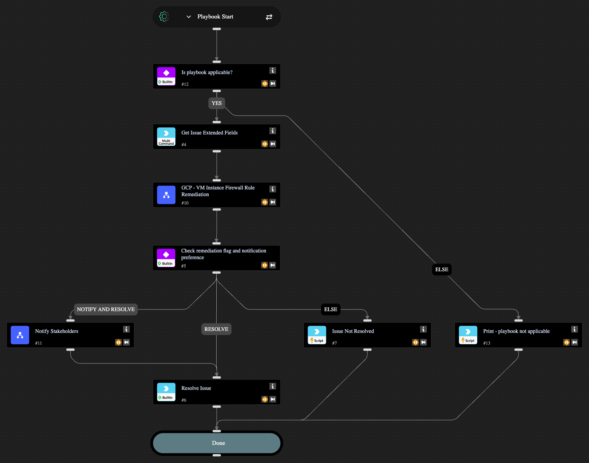

Automatically remediates the following Network Exposure detection:
1. Google Compute Engine instance with management ports exposed to the public internet
It does so by adding a GCP Firewall rule to deny internet access on the specified port from the internet and an allow rule to allow access from specific internal IPs. It uses network tags to specify the GCP resources that can use these rules. If a rule already exists, the appropriate network tag is added to the asset in question.

## Dependencies

This playbook uses the following sub-playbooks, integrations, and scripts.

### Sub-playbooks

* GCP - VM Instance Firewall Rule Remediation
* Notify Stakeholders

### Integrations

* Cortex Core - Platform

### Scripts

* Print

### Commands

* core-get-issue-recommendations
* setIssueStatus

## Playbook Inputs

---

| **Name** | **Description** | **Default Value** | **Required** |
| --- | --- | --- | --- |
| enableNotifications | Options: yes/no Choose if you wish to notify stakeholders about the remediation actions taken. The recipients need to be configured in the Playbook Triggered header of the "Notify Stakeholders" sub-playbook. If no recipients are provided, the playbook will pause to ask for an input. | no | Optional |

## Playbook Outputs

---
There are no outputs for this playbook.

## Playbook Image

---

