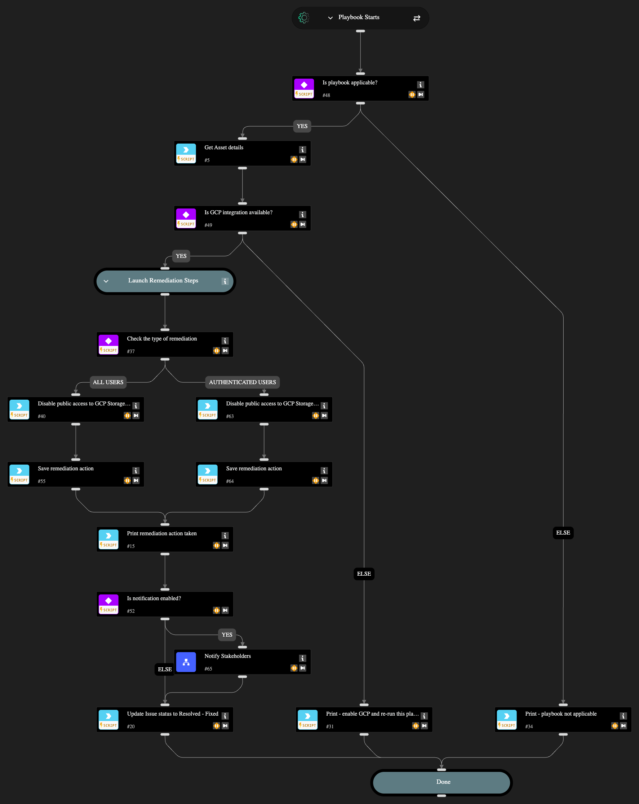

Automatically remediates 2 GCP public access misconfigurations:

1. GCP Storage buckets are publicly accessible to all users
2. GCP Storage buckets are publicly accessible to all authenticated users

The playbook removes public IAM policy bindings by deleting 'allUsers' and 'allAuthenticatedUsers' entities from the bucket's Access Control List respectively.

Optional stakeholder notification is available via the "Notify Stakeholders" sub-playbook by setting enableNotifications input to 'yes' (default: 'no'). When enabled, configure at least one recipient (email, Slack channel, or Teams channel) in the Notify Stakeholders playbook inputs. The playbook automatically updates the issue status to "Resolved - Fixed" upon successful remediation.

## Dependencies

This playbook uses the following sub-playbooks, integrations, and scripts.

### Sub-playbooks

* Notify Stakeholders

### Integrations

* Cortex Core - Platform
* GCP

### Scripts

* Print
* Set

### Commands

* core-get-asset-details
* gcp-storage-bucket-policy-delete
* setIssueStatus

## Playbook Inputs

---

| **Name** | **Description** | **Default Value** | **Required** |
| --- | --- | --- | --- |
| enableNotifications | Options: yes/no Choose if you wish to notify stakeholders about the remediation actions taken. The recipients need to be configured in the Playbook Triggered header of the "Notify Stakeholders" sub-playbook. If no recipients are provided, the playbook will pause to ask for an input. | no | Required |

## Playbook Outputs

---
There are no outputs for this playbook.

## Playbook Image

---

