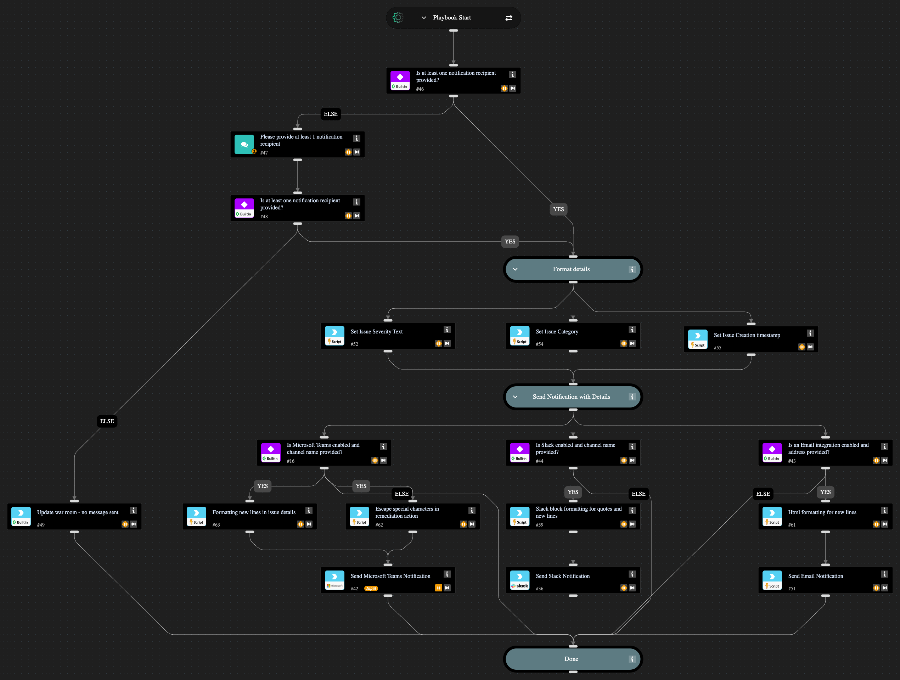

This playbook automates notifying stakeholders via Slack v3, Microsoft Teams, or email. You have the flexibility to notify other teams via Slack, Microsoft Teams or Email by configuring the necessary integration. This playbook requires existing integrations with Slack, Microsoft Teams, Mail Sender or Gmail to perform these actions. If none of these integrations are found in your account, the playbook will exit with no action.

## Dependencies

This playbook uses the following sub-playbooks, integrations, and scripts.

### Sub-playbooks

This playbook does not use any sub-playbooks.

### Integrations

* Microsoft Teams
* SlackV3
* mail-sender

### Scripts

* Print
* Set
* SetAndHandleEmpty

### Commands

* send-mail
* send-notification

## Playbook Inputs

---

| **Name** | **Description** | **Default Value** | **Required** |
| --- | --- | --- | --- |
| Teams Channel | Provide the Microsoft Teams channel to send messages to. | General | Optional |
| Slack Channel | Provide the Slack channel to send messages to. | general | Optional |
| Email Address | Provide an email address for notifications. Use comma separated values to provide multiple addresses | amore@paloaltonetworks.com | Optional |
| Subject | For email | You have a new message for - ${issue.name} | Optional |
| AssetName | Name of the asset related to the issue. | Core.CoreAsset.xdm__asset__name | Optional |
| AssetType | Type of the asset related to the issue, for example, EC2, Azure VM, Google Cloud Storage, etc. | Core.CoreAsset.xdm__asset__type__name | Optional |
| CloudRegion | Region of the asset related to the issue, for example, us-east-1, westus, etc. | Core.CoreAsset.xdm__asset__cloud__region | Optional |
| CloudAccountID | Account ID of the asset related to the issue. For AWS, it is the 12-digit account number. For Azure, it is the Subscription ID. | Core.CoreAsset.xdm__asset__realm | Optional |
| remediation_action | Description of the remediation action that was taken to resolve this issue, if any. | ${remediation_action} | Optional |
| AssetID | Internal ID of the asset related to the issue. | Core.CoreAsset.xdm__asset__id | Optional |

## Playbook Outputs

---
There are no outputs for this playbook.

## Playbook Image

---

