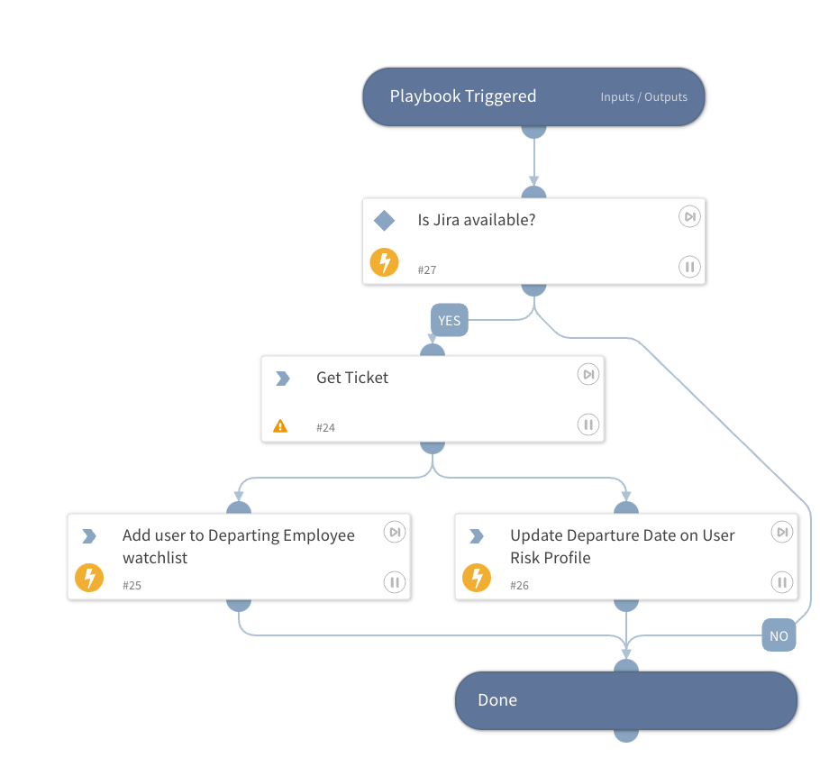

 Parses a Ticket Summary containing a username='username' and optionally a 
 departure='date' and adds the user to the Code42 Departing Employee list. This 
 playbook uses Jira out-of-the-box, but you can swap it with a different Ticketing
 system and achieve the same result. For example, to use Zendesk, change the command
 `jira-get-issue` to be `zendesk-ticket-details` and use the id parameter for the issue 
 ID. Change the output (what gets parsed) to be either the Subject or the Description 
 from Zendesk.

## Dependencies

This playbook uses the following sub-playbooks, integrations, and scripts.

### Sub-playbooks

This playbook does not use any sub-playbooks.

### Integrations

* Jira V3
* Code42

### Scripts

This playbook does not use any scripts.

### Commands

* jira-get-issue
* code42-watchlists-add-user
* code42-user-update-risk-profile

## Playbook Inputs

---

| **Name** | **Description** | **Default Value** | **Required** |
| --- | --- | --- | --- |
| IssueId | The ID of the Ticket to pull Departing Employee information from. |  | Optional |

## Playbook Outputs

---
There are no outputs for this playbook.

## Playbook Image

---
