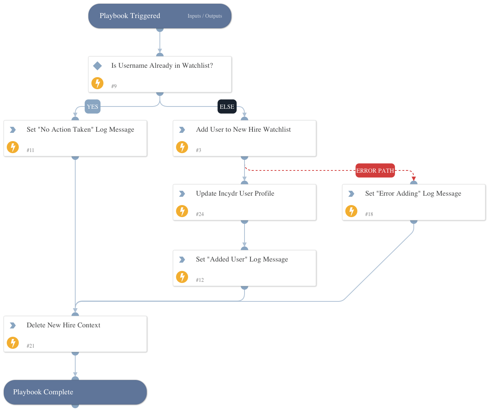

Loops through stand-up tickets provided by the New Hire Auto-Add playbook and adds employees to the New Hire watchlist in Code42 Incydr.

## Dependencies

This playbook uses the following sub-playbooks, integrations, and scripts.

### Sub-playbooks

This playbook does not use any sub-playbooks.

### Integrations

* Code42

### Scripts

* Set
* DeleteContext

### Commands

* code42-user-get-risk-profile
* code42-user-update-risk-profile
* code42-watchlists-add-user

## Playbook Inputs

---

| **Name** | **Description** | **Default Value** | **Required** |
| --- | --- | --- | --- |
| ticket_username | The username \(in email format\) provided in a stand-up ticket from Jira, Zendesk, etc. |  | Required |
| ticket_start_date | The start date \(in YYYY-MM-DD format\) provided in a stand-up ticket from Jira, Zendesk, etc. |  | Required |

## Playbook Outputs

---
There are no outputs for this playbook.

## Playbook Image

---

