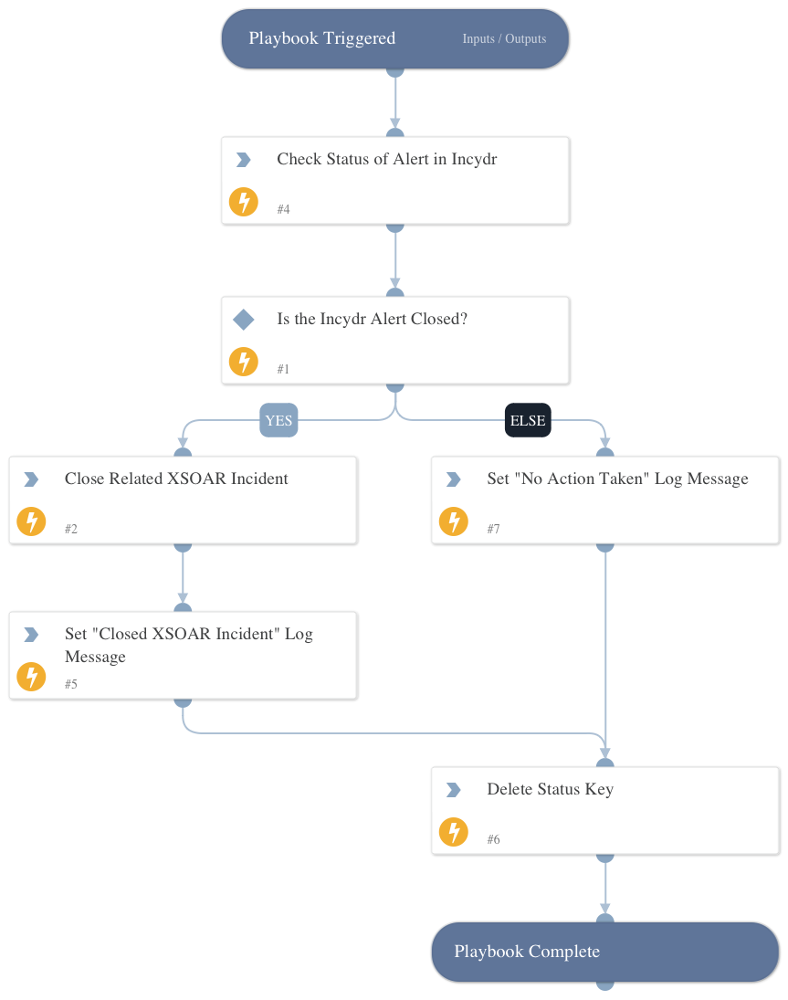

Loops through open XSOAR incidents and closes incidents created from Incydr alerts that are now dismissed.

## Dependencies

This playbook uses the following sub-playbooks, integrations, and scripts.

### Sub-playbooks

This playbook does not use any sub-playbooks.

### Integrations

* Code42

### Scripts

* Set
* DeleteContext

### Commands

* code42-alert-get
* closeInvestigation

## Playbook Inputs

---

| **Name** | **Description** | **Default Value** | **Required** |
| --- | --- | --- | --- |
| incydr_id | The unique identifier of an Incydr alert from Code42 Incydr. |  | Required |
| xsoar_id | The unique identifier of an XSOAR incident from Palo Alto XSOAR. |  | Required |

## Playbook Outputs

---
There are no outputs for this playbook.

## Playbook Image

---

