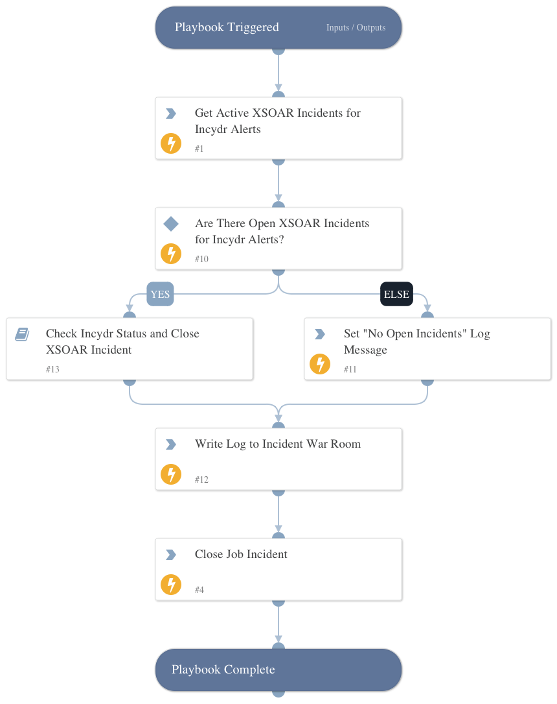

Checks for open XSOAR incidents associated with Incydr alerts and passes them to the Check Incydr Status and Close XSOAR Incident playbook.

## Dependencies

This playbook uses the following sub-playbooks, integrations, and scripts.

### Sub-playbooks

* Check Incydr Status and Close XSOAR Incident

### Integrations

This playbook does not use any integrations.

### Scripts

* Set
* SearchIncidentsV2
* Print

### Commands

* closeInvestigation

## Playbook Inputs

---
There are no inputs for this playbook.

## Playbook Outputs

---
There are no outputs for this playbook.

## Playbook Image

---

