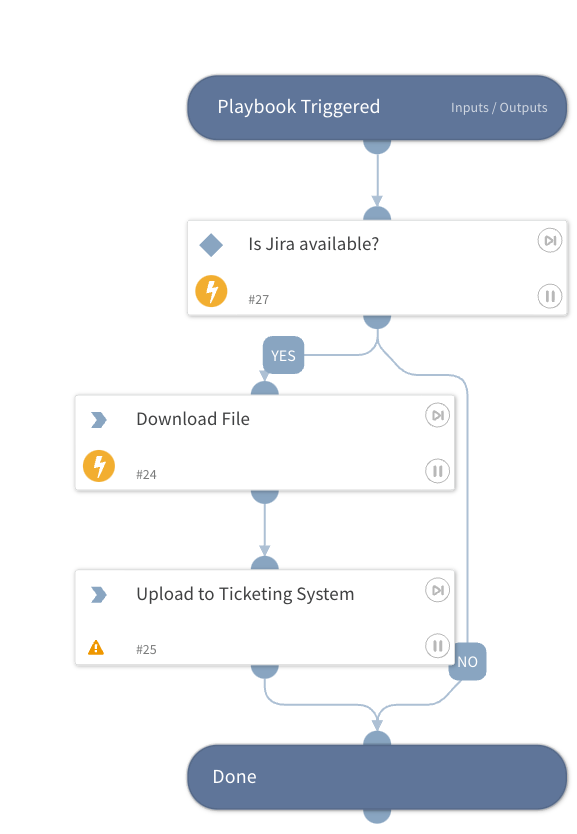

Downloads a file from Code42 and attaches it to a ticketing system. This playbook uses 
Jira out-of-the-box, but you can swap it with a different Ticketing system and achieve 
the same result. For example, to use ServiceNow, change the command 
`jira-issue-upload-file` to be `servicenow-upload-file` and use the `id` parameter for 
`issueId` and `file_id` for `entryId`.

## Dependencies

This playbook uses the following sub-playbooks, integrations, and scripts.

### Sub-playbooks

This playbook does not use any sub-playbooks.

### Integrations

* Jira V3
* Code42

### Scripts

This playbook does not use any scripts.

### Commands

* code42-download-file
* jira-issue-upload-file

## Playbook Inputs

---

| **Name** | **Description** | **Default Value** | **Required** |
| --- | --- | --- | --- |
| Hash | The hash of the file to download from Code42 and attach to the ticketing system. |  | Optional |
| IssueId | The ID of the Ticket to upload the file to. |  | Optional |
| Filename | The name of the file to download/upload. |  | Optional |

## Playbook Outputs

---
There are no outputs for this playbook.

## Playbook Image

---
