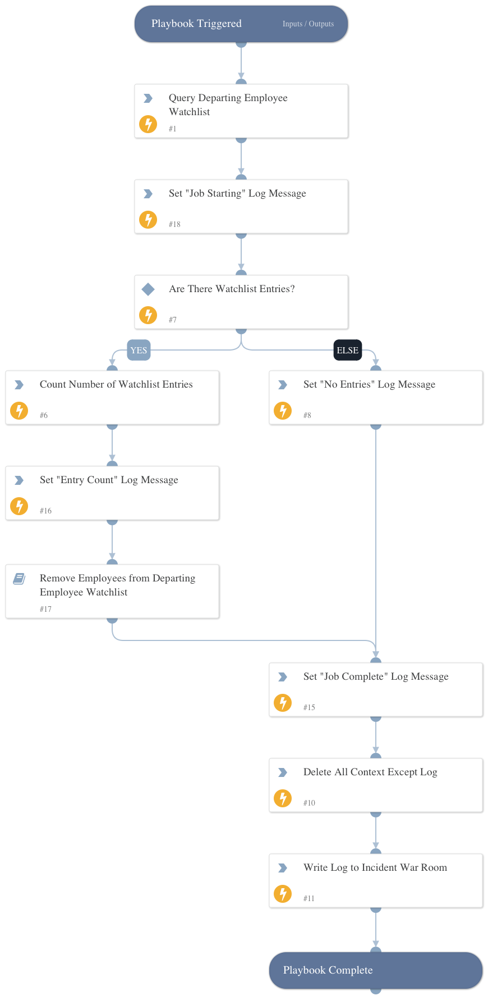

Queries the Departing Employee watchlist in Code42 Incydr and passes relevant employee data to the Remove Employees from Departing Employee Watchlist playbook.

## Dependencies

This playbook uses the following sub-playbooks, integrations, and scripts.

### Sub-playbooks

* Remove Employees from Departing Employee Watchlist

### Integrations

* Code42

### Scripts

* Set
* Print
* DeleteContext

### Commands

* code42-watchlists-list-included-users

## Playbook Inputs

---
There are no inputs for this playbook.

## Playbook Outputs

---
There are no outputs for this playbook.

## Playbook Image

---

