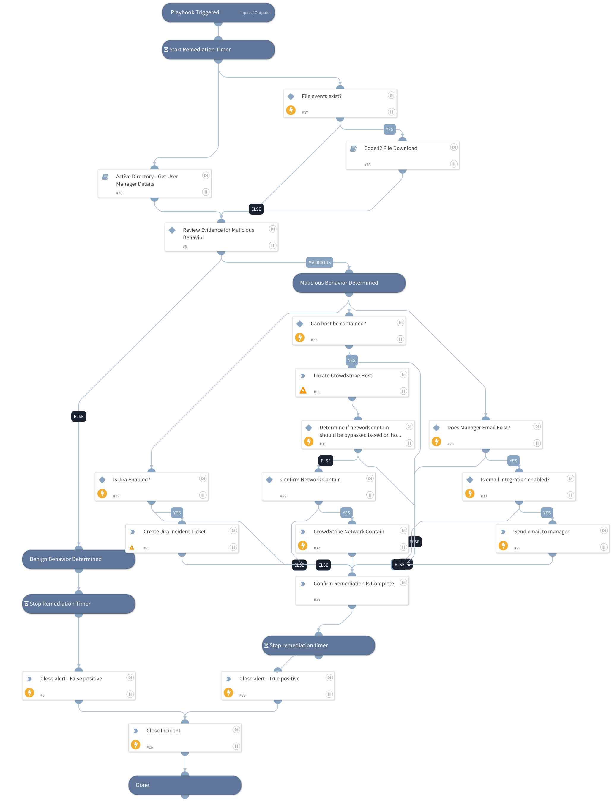

The Code42 Exfiltration playbook acts on Code42 Security Alerts, retrieves file event data, and allows security teams to remediate file exfiltration events by revoking access rights to cloud files or containing endpoints.

## Dependencies

This playbook uses the following sub-playbooks, integrations, and scripts.

### Sub-playbooks

* Active Directory - Get User Manager Details
* Code42 File Download

### Integrations

* jira-v2
* CrowdstrikeFalcon
* Code42

### Scripts

This playbook does not use any scripts.

### Commands

* code42-alert-update
* cs-falcon-search-device
* cs-falcon-contain-host
* closeInvestigation
* jira-create-issue
* send-mail

## Playbook Inputs

---

| **Name** | **Description** | **Default Value** | **Required** |
| --- | --- | --- | --- |
| JiraProject | Jira Project for created incident ticket | Security | Optional |
| JiraType | Type of Jira ticket to create | Investigation | Optional |
| JiraSummary | Summary to use with Jira ticket creation | Code42 Security Alert for Demisto Incident ${incident.id} | Optional |
| ContainHostsMax | Maximum number of network hosts to contain. | 2 | Optional |
| DemistoInstanceURL | URL of Demisto instance for emails. | https://example.com/ | Optional |

## Playbook Outputs

---
There are no outputs for this playbook.

## Playbook Image

---

