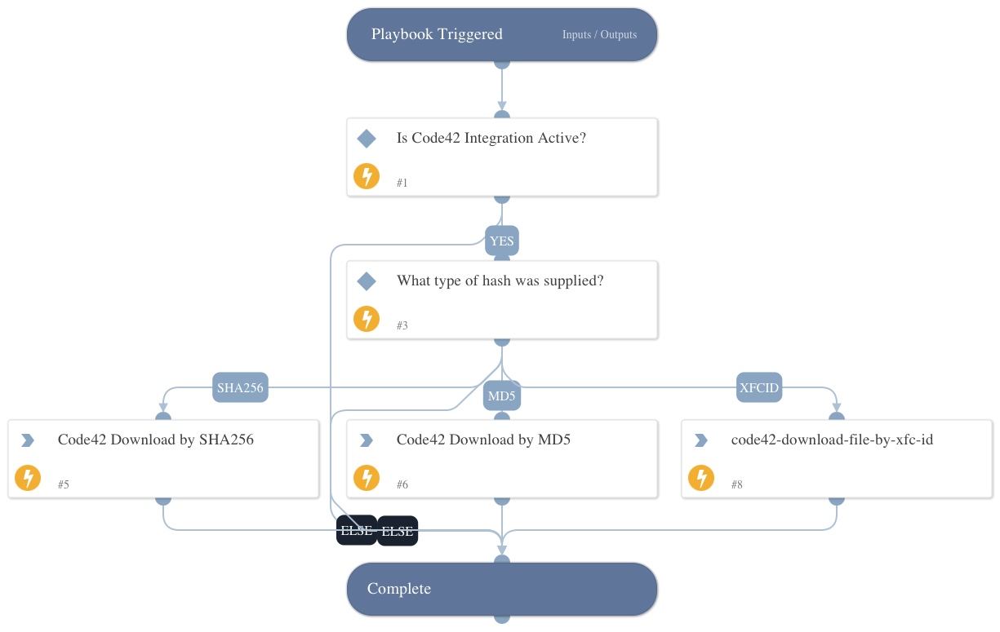

This playbook downloads a file via Code42 by either MD5 or SHA256 hash.

## Dependencies

This playbook uses the following sub-playbooks, integrations, and scripts.

### Sub-playbooks

This playbook does not use any sub-playbooks.

### Integrations

* Code42

### Scripts

This playbook does not use any scripts.

### Commands

* code42-download-file

## Playbook Inputs

---

| **Name** | **Description** | **Default Value** | **Required** |
| --- | --- | --- | --- |
| MD5 | MD5 hash to search for | File.MD5 | Optional |
| SHA256 | SHA256 hash to search for | File.SHA256 | Optional |
| Filename | The name of the file to save as. |  | Optional |

## Playbook Outputs

---

| **Path** | **Description** | **Type** |
| --- | --- | --- |
| File.Size | The size of the file. | unknown |
| File.SHA1 | The SHA1 hash of the file. | unknown |
| File.SHA256 | The SHA256 hash of the file. | unknown |
| File.Name | The name of the file. | unknown |
| File.SSDeep | The SSDeep hash of the file. | unknown |
| File.EntryID | The entry ID of the file. | unknown |
| File.Info | File information. | unknown |
| File.Type | The file type. | unknown |
| File.MD5 | The MD5 hash of the file. | unknown |
| File.Extension | The file extension. | unknown |

## Playbook Image

---

