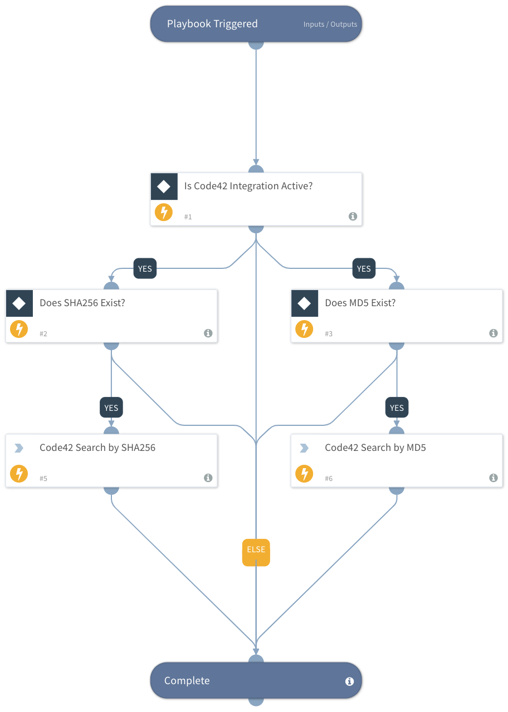

This playbook searches for files via Code42 security events by either MD5 or SHA256 hash. The data is output to the Code42.SecurityData context for use.

## Dependencies

This playbook uses the following sub-playbooks, integrations, and scripts.

### Sub-playbooks

This playbook does not use any sub-playbooks.

### Integrations

* Code42

### Scripts

This playbook does not use any scripts.

## Playbook Inputs

---

| **Name** | **Description** | **Default Value** | **Required** |
| --- | --- | --- | --- |
| MD5 | MD5 hash to search for | File.MD5 | Optional |
| SHA256 | SHA256 hash to search for | File.SHA256 | Optional |

## Playbook Outputs

---

| **Path** | **Description** | **Type** |
| --- | --- | --- |
| Code42.SecurityData | Returned File Results | unknown |
| Code42.SecurityData.EventTimestamp | Timestamp for event | unknown |
| Code42.SecurityData.FileCreated | File creation date | unknown |
| Code42.SecurityData.EndpointID | Code42 device ID | unknown |
| Code42.SecurityData.DeviceUsername | Username that device is associated with in Code42 | unknown |
| Code42.SecurityData.EmailFrom | Sender email address for email exfiltration events | unknown |
| Code42.SecurityData.EmailTo | Recipient email address for email exfiltration events | unknown |
| Code42.SecurityData.EmailSubject | Email subject line for email exfiltration events | unknown |
| Code42.SecurityData.EventID | Security Data event ID | unknown |
| Code42.SecurityData.EventType | Type of Security Data event | unknown |
| Code42.SecurityData.FileCategory | Type of file as determined by Code42 engine | unknown |
| Code42.SecurityData.FileOwner | Owner of file | unknown |
| Code42.SecurityData.FileName | File name | unknown |
| Code42.SecurityData.FilePath | Path to file | unknown |
| Code42.SecurityData.FileSize | Size of file in bytes | unknown |
| Code42.SecurityData.FileModified | File modification date | unknown |
| Code42.SecurityData.FileMD5 | MD5 hash of file | unknown |
| Code42.SecurityData.FileHostname | Hostname where file event was captured | unknown |
| Code42.SecurityData.DevicePrivateIPAddress | Private IP addresses of device where event was captured | unknown |
| Code42.SecurityData.DevicePublicIPAddress | Public IP address of device where event was captured | unknown |
| Code42.SecurityData.RemovableMediaType | Type of removable media | unknown |
| Code42.SecurityData.RemovableMediaCapacity | Total capacity of removable media in bytes | unknown |
| Code42.SecurityData.RemovableMediaMediaName | Full name of removable media | unknown |
| Code42.SecurityData.RemovableMediaName | Name of removable media | unknown |
| Code42.SecurityData.RemovableMediaSerialNumber | Serial number for removable medial device | unknown |
| Code42.SecurityData.RemovableMediaVendor | Vendor name for removable device | unknown |
| Code42.SecurityData.FileSHA256 | SHA256 hash of file | unknown |
| Code42.SecurityData.FileShared | Whether file is shared using cloud file service | unknown |
| Code42.SecurityData.FileSharedWith | Accounts that file is shared with on cloud file service | unknown |
| Code42.SecurityData.Source | Source of file event, Cloud or Endpoint | unknown |
| Code42.SecurityData.ApplicationTabURL | URL associated with application read event | unknown |
| Code42.SecurityData.ProcessName | Process name for application read event | unknown |
| Code42.SecurityData.ProcessOwner | Process owner for application read event | unknown |
| Code42.SecurityData.WindowTitle | Process name for application read event | unknown |
| Code42.SecurityData.FileURL | URL of file on cloud file service | unknown |
| Code42.SecurityData.Exposure | Exposure type for event | unknown |
| Code42.SecurityData.SharingTypeAdded | Type of sharing added to file | unknown |
| File | The file object. | unknown |
| File.Name | File name | unknown |
| File.Path | File path | unknown |
| File.Size | File size in bytes | unknown |
| File.MD5 | MD5 hash of file | unknown |
| File.SHA256 | SHA256 hash of file | unknown |
| File.Hostname | Hostname where file event was captured | unknown |

## Playbook Image

---

