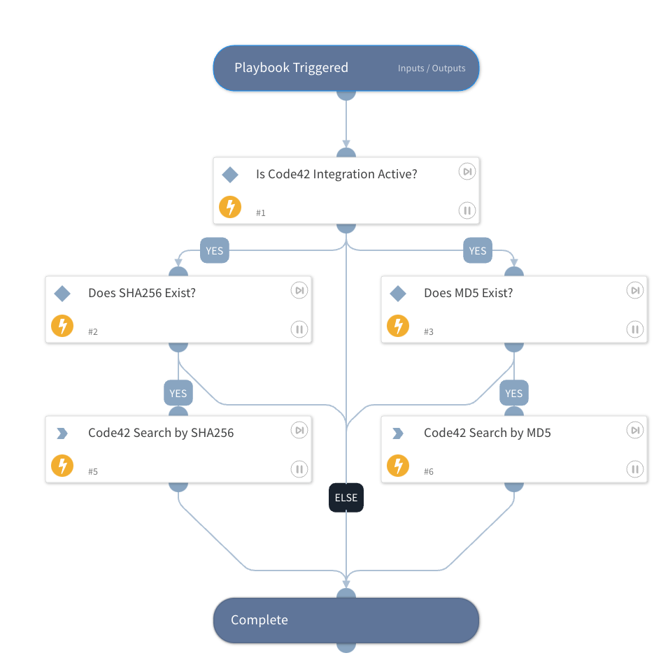

This playbook searches for files via Code42 security events by either MD5 or SHA256 hash. The data is output to the Code42.FileEvents context for use.

## Dependencies

This playbook uses the following sub-playbooks, integrations, and scripts.

### Sub-playbooks

This playbook does not use any sub-playbooks.

### Integrations

* Code42

### Scripts

This playbook does not use any scripts.

### Commands

* code42-file-events-search

## Playbook Inputs

---

| **Name** | **Description** | **Default Value** | **Required** |
| --- | --- | --- | --- |
| MD5 | MD5 hash to search for | File.MD5 | Optional |
| SHA256 | SHA256 hash to search for | File.SHA256 | Optional |

## Playbook Outputs

---

| **Path** | **Description** | **Type** |
| --- | --- | --- |
| Code42.FileEvents | Returned File Results | unknown |
| Code42.FileEvents.timestamp | The timestamp when the event occurred. | date |
| Code42.FileEvents.event | Summary information about the event, including date observed, event type, and event source. | unknown |
| Code42.FileEvents.user | Details about the user associated with the event \(if any\). | unknown |
| Code42.FileEvents.destination | Details about the destination target of the event \(if any\). | unknown |
| Code42.FileEvents.process | Details about the CPU process involved in the event \(if any\). | unknown |
| Code42.FileEvents.risk | Details overall risk severity for the event and lists all associated risk indicators. | unknown |
| Code42.FileEvents.git | Details about git repository involved in event \(if any\). | unknown |
| Code42.FileEvents.report | Details about Salesforce reports involved in the event \(if any\). | unknown |
| Code42.FileEvents.file | Details about file metadata for file involved in the event \(if any\). | unknown |
| Code42.FileEvents.source | Info about the origin of a file involved in the event \(if any\). | unknown |

## Playbook Image

---

