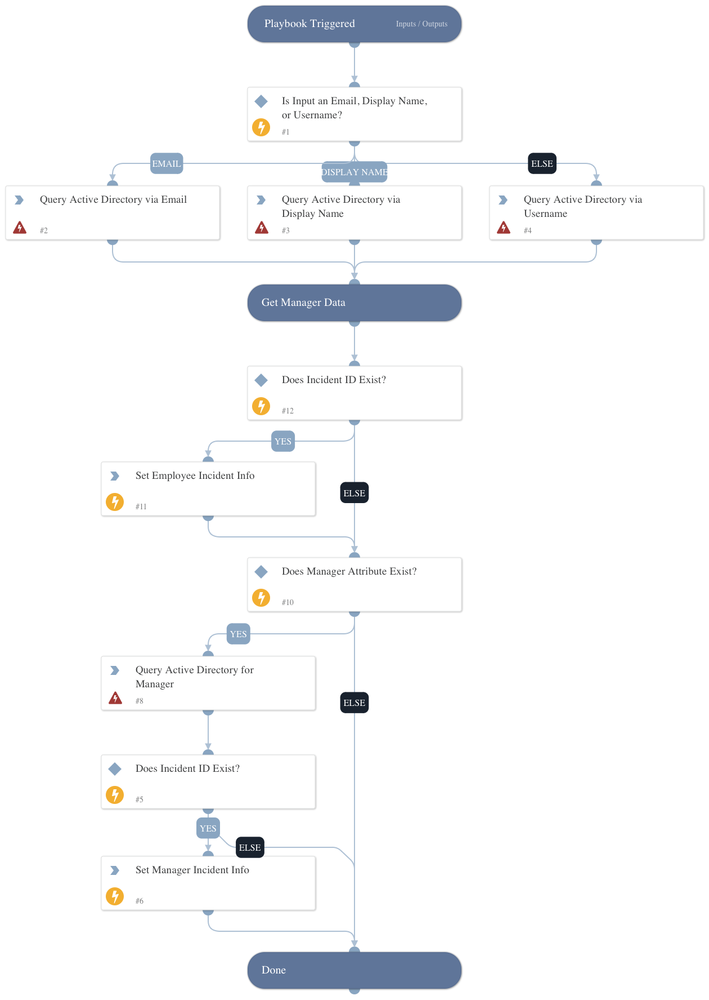

Receives usernames from a Code42 Incydr alert and queries Active Directory for employee and supervisor information, if applicable.

## Dependencies

This playbook uses the following sub-playbooks, integrations, and scripts.

### Sub-playbooks

This playbook does not use any sub-playbooks.

### Integrations

* Active Directory Query v2

### Scripts

This playbook does not use any scripts.

### Commands

* ad-get-user
* setIncident

## Playbook Inputs

---

| **Name** | **Description** | **Default Value** | **Required** |
| --- | --- | --- | --- |
| user | The username to query in Active Directory. |  | Required |
| incidentid | The Palo Alto XSOAR incident ID that receives the employee information \(optional\). |  | Optional |

## Playbook Outputs

---

| **Path** | **Description** | **Type** |
| --- | --- | --- |
| Account.DisplayName | The display name of the user. | string |
| Account.Manager | The manager of the user. | string |
| Account.Username | The samAccountName of the user. | string |
| Account.Email | The email address of the user. | string |
| Account.department | The Department of the user. | string |

## Playbook Image

---

