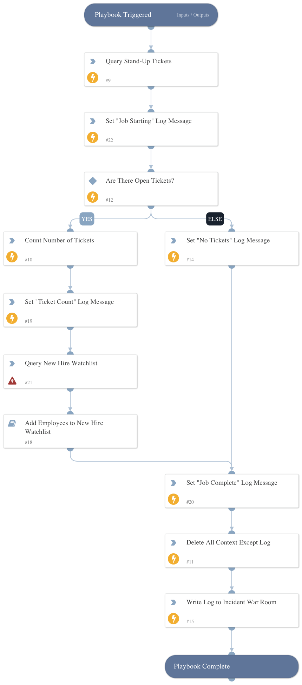

Queries stand-up tickets from a ticketing system and passes relevant employee data to the Add Employees to New Hire Watchlist playbook.

## Dependencies

This playbook uses the following sub-playbooks, integrations, and scripts.

### Sub-playbooks

* Add Employees to New Hire Watchlist

### Integrations

* Code42

### Scripts

* Set
* Print
* DeleteContext

### Commands

* code42-watchlists-list-included-users

## Playbook Inputs

---
There are no inputs for this playbook.

## Playbook Outputs

---
There are no outputs for this playbook.

## Playbook Image

---

