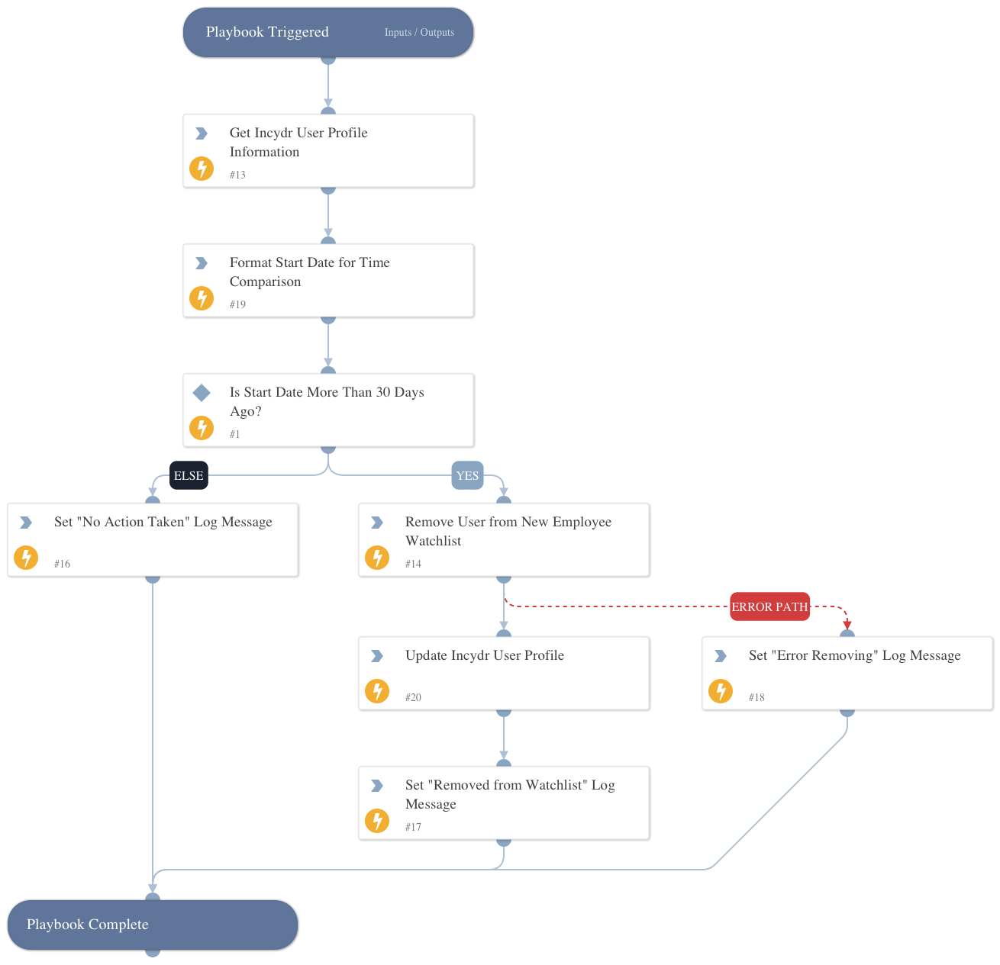

Loops through New Hire watchlist entries from Code42 Incydr and removes employees based on specified criteria.

## Dependencies

This playbook uses the following sub-playbooks, integrations, and scripts.

### Sub-playbooks

This playbook does not use any sub-playbooks.

### Integrations

* Code42

### Scripts

* Set

### Commands

* code42-user-update-risk-profile
* code42-watchlists-remove-user

## Playbook Inputs

---

| **Name** | **Description** | **Default Value** | **Required** |
| --- | --- | --- | --- |
| incydr_username | The username \(in email format\) provided by Code42 Incydr. |  | Required |

## Playbook Outputs

---
There are no outputs for this playbook.

## Playbook Image

---

