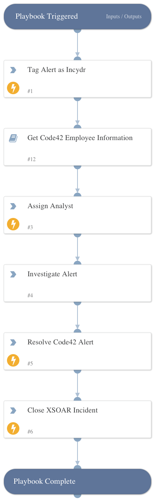

Retrieves Incydr alert details, assigns the alert to an analyst, and gathers employee and supervisor data from Active Directory, if applicable. Note: this playbook can be used as an alternate default to "Code42 Exfiltration Playbook" when the Code42 Incydr integration is set to "Fetch Incidents".

## Dependencies

This playbook uses the following sub-playbooks, integrations, and scripts.

### Sub-playbooks

* Get Code42 Employee Information

### Integrations

* Code42

### Scripts

* AssignAnalystToIncident

### Commands

* closeInvestigation
* code42-alert-resolve
* setIncident

## Playbook Inputs

---
There are no inputs for this playbook.

## Playbook Outputs

---
There are no outputs for this playbook.

## Playbook Image

---

