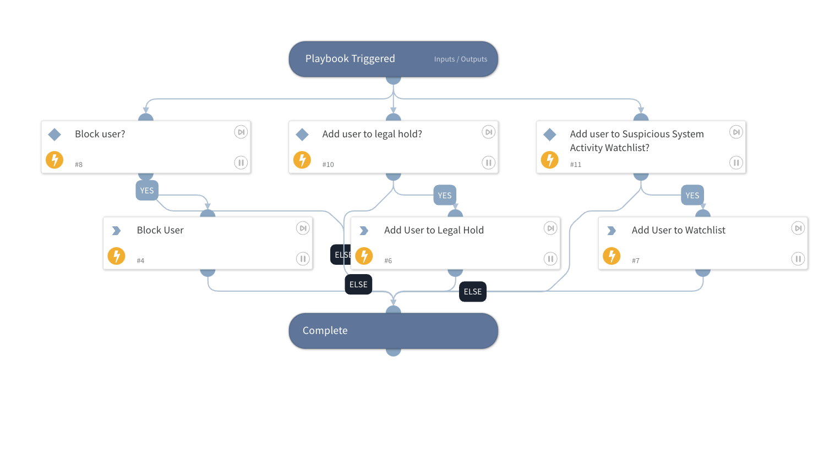

Take corrective actions against a Code42 user found to be exposing file data.

## Dependencies

This playbook uses the following sub-playbooks, integrations, and scripts.

### Sub-playbooks

This playbook does not use any sub-playbooks.

### Integrations

* Code42

### Scripts

This playbook does not use any scripts.

### Commands

* code42-legalhold-add-user
* code42-watchlists-add-user
* code42-user-block

## Playbook Inputs

---

| **Name** | **Description** | **Default Value** | **Required** |
| --- | --- | --- | --- |
| action | The comma\-separated list of remediation actions to take on the user. |  | Required |
| username | Email id of the employee on whom action is to be taken |  | Required |
| mattername | The name of the legal hold matter. |  | Optional |

## Playbook Outputs

---
There are no outputs for this playbook.

## Playbook Image

---
