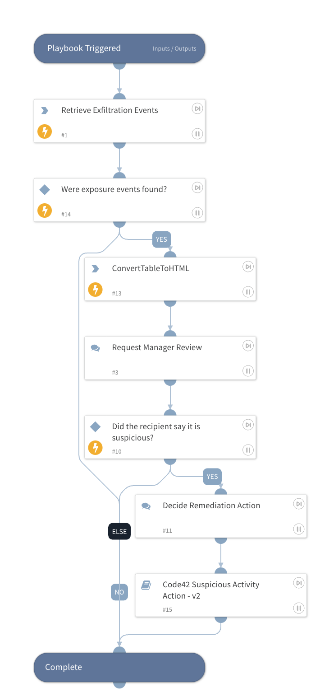

Detects suspicious activities of a user and allows a recipient to assess the results. Afterward, the playbook takes action on the user such as adding them to legal hold.

## Dependencies

This playbook uses the following sub-playbooks, integrations, and scripts.

### Sub-playbooks

* Code42 Suspicious Activity Action

### Integrations

* Code42

### Scripts

* ConvertTableToHTML

### Commands

* code42-file-events-search

## Playbook Inputs

---

| **Name** | **Description** | **Default Value** | **Required** |
| --- | --- | --- | --- |
| Username | The username of the employee. | ${incident.code42username} | Required |
| ReviewerEmail | The email recipient to review potential suspicious activity related to the user, such as the user's manager. |  | Required |
| LegalHoldMatterId | The legal hold matter ID to add the user to if selecting ADD\-TO\-LEGAL\-HOLD in the Decide Remediation Action task. |  | Optional |

## Playbook Outputs

---
There are no outputs for this playbook.

## Playbook Image

---
