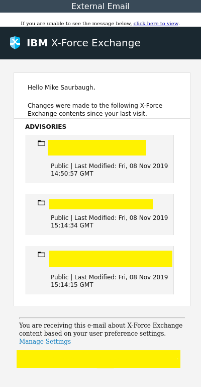

The Cofense Triage v3 integration uses the Cofense Triage v2 API (previous integrations were limited to Triage v1 API) that allows users to ingest phishing reports as incident alerts and execute commands.

Security teams can ingest data from Triage such as email reporters, email reports and clusters, threat indicators, and rule matching to name a few. In addition, ingest and create threat indicators, categorize reports, and obtain second stage threat indicators from malicious emails. This integration was integrated and tested with version 1.22.0 of Cofense Triage.

This is the default integration for this content pack when configured by the Data Onboarder in Cortex XSIAM.

Some changes have been made that might affect your existing content. 
If you are upgrading from a previous of this integration, see [Breaking Changes](#Breaking-changes-from-the-previous-version-of-this-integration---Cofense-Triage-v3).

## Configure Cofense Triage v3 in Cortex


| **Parameter** | **Description** | **Required** |
| --- | --- | --- |
| Server URL | Server URL to connect to Cofense Triage. | True |
| Client ID | Client ID and Client Secret associated with the Server URL to connect to Cofense Triage. | True |
| Maximum number of incidents per fetch | The maximum limit is 200. | False |
| First fetch time interval | Date or relative timestamp to start fetching incidents from. \(Formats accepted: 2 minutes, 2 hours, 2 days, 2 weeks, 2 months, 2 years, yyyy-mm-dd, yyyy-mm-ddTHH:MM:SSZ, etc\) | False |
| Report Location | Fetches the report based on the location within Cofense Triage. If not specified, it fetches all the reports. | False |
| Match Priority | Fetches reports based on the priority of the rules that match the reports. If not specified, it fetches all the reports. | False |
| Category ID | Fetches reports based on the unique identifier of the category. If not specified, it fetches all the reports. Note: Only the reports that have been processed will be retrieved. | False |
| Tags | Fetches reports based on the tags associated with the reports. If not specified, it fetches all the reports. Supports comma separated values. Note: Tags are associated with reports which are in Reconnaissance. | False |
| Categorization Tags | Fetches reports based on the tags assigned when the reported email was processed. If not specified, it fetches all the reports. Supports comma separated values. Note: Categorization tags are associated with the reports which are processed. | False |
| Incident Mirroring Direction | Choose the direction to mirror the incident: Incoming (from Cofens Triage to XSOAR). | False |
| Advanced Filters | Fetches incidents based on the advanced filters and type of the incident to be fetched. Specify the filters to filter the incidents by attribute values. Note: Enter values in key-value JSON format. To separate multiple values of a single attribute, use commas. Format accepted: \{"attribute1_operator": "value1, value2", "attribute2_operator" : "value3, value4"\} For example: \{"updated_at_gt":"2020-10-26T10:48:16.834Z","categorization_tags_any":"test, snow"\} | False |
| Use system proxy settings |  | False |
| Trust any certificate (not secure) |  | False |
| Incident type |  | False |
| Fetch incidents |  | False |


## Integration Settings Preferences

If Inbox or Reconnaissance is provided as a filter for Report Location:
- Category ID filter cannot be used. 
- Categorization Tags filter cannot be used.

If only Processed is provided as a filter for Report Location:
- Tags filter cannot be used.
 
If Category ID is used as a filter for fetch incidents:
- The Report Location cannot be Inbox or Reconnaissance.
- Tags filter cannot be used.

If Categorization tags are provided in fetch incident parameters:
- The Report Location must be Processed.

If Tags are provided in fetch incident parameters:
- The Report Location must be Reconnaissance.

## Filtering
For all the list commands provided filter_by argument to filter list by attribute values.
The general filtering syntax is as follows:

```{\"attribute_operator\": \"value1, value2\"}```
- `attribute` is the name of the attribute that the filter will be applied against.
- `operator` is the comparison operator to use when comparing the attribute to the specified value. The default is EQ. You can omit
this parameter if you want to use the default. See Comparison Operators for the expected syntax for other comparison
operators.
- `value` is the value being checked for. You can specify multiple values as a comma-separated list. Doing so returns records
that match _ANY_ of the supplied values.
- To specify multiple filters, use the comma ( , ) to separate them 
  (for example, `{\"attribute1_operator \": \"value1, value2\", \"attribute2_operator\" : \"value3, value4\"}`). 
  Doing so returns only those records that match _ALL_ the filters.
- A filter can be applied against the same attribute (and operator) multiple times.

## Comparison Operators

### Standard Comparison Operators
- `eq`: This is the default comparison operator if no operator is specified. Returns results when an attribute is equal to the supplied value.
- `not_eq`: Returns results when an attribute is not equal to the supplied value.
- `lt`: Returns results when an attribute is less than the supplied value.
- `lteq`: Returns results when an attribute is less than or equal to the supplied value.
- `gt`: Returns results when an attribute is greater than the supplied value.
- `gteq`: Returns results when an attribute is greater than or equal to the supplied value.

### String Comparison Operators
In addition to the standard comparison operators, string attributes can also use the following comparison operators:
- `start`: Returns results when an attribute starts with the supplied value.
- `not_start`: Returns results when an attribute does not start with the supplied value.
- `end`: Returns results when an attribute ends with the supplied value.
- `not_end`: Returns results when an attribute does not end with the supplied value.
- `cont`: Returns results when an attribute contains the supplied value.
- `not_cont`: Returns results when an attribute does not contain the supplied value.

### Array Comparison Operators
Some resources have an array attribute that contains a list of values. Array attributes follow a common usage pattern, but the
filters supported will vary.
- `any_OP`: Returns resources where any value in the array matches the standard or string comparison operator (`OP`).

### Tag List Comparison Operators
Some resources have a `tag_list` attribute that contains a list of Triage tags that were applied to that resource.
Tag List attributes do not support the standard or string comparison operators. Attributes of this type support the following
comparison operators:
- `any`: Returns results when a resource is tagged with any of the specified tags.
- `all`: Returns results when a resource is tagged with all of the specified tags.
- `none`: Returns results when a resource is not tagged with any of the specified tags.

## Mirroring
The data in Cofense Triage Report can be mirrored to Cortex XSOAR to view the modifications when the report is updated.

For example: When the report is processed, the fields like Report Category ID and Report location get modified, and hence the user will be able to see the modified field's value in XSOAR.

## Commands
You can execute these commands from the CLI, as part of an automation, or in a playbook.
After you successfully execute a command, a DBot message appears in the War Room with the command details.
### cofense-threat-indicator-list
***
Retrieves the list of threat indicators based on the provided parameters. 
Threat indicators identify the threat level of an email's subject, sender, domains, URLs, and MD5 and SHA256 attachment hash signatures.


#### Base Command

`cofense-threat-indicator-list`
#### Input

| **Argument Name** | **Description** | **Required** |
| --- | --- | --- |
| id | Specify the ID of the threat indicator to retrieve a specific threat indicator. Note: If 'id' argument is provided, then apart from 'fields_to_retrieve', all arguments will be neglected. | Optional | 
| page_size | Specify the number of threat indicators to retrieve per page. Note: Possible values are between 1 and 200. Default is 20. | Optional | 
| page_number | Specify a page number to retrieve the threat indicators. Default is 1. | Optional | 
| sort_by | Specify the attributes to sort the threat indicators. Note: The default sort order for an attribute is ascending. Prefix the attributes with a hyphen to sort in descending order. For example: threat_level, -created_at. | Optional | 
| filter_by | Specify the filters to filter the list of threat indicators by attribute values. Note: Enter values in key-value JSON format. To separate multiple values of a single attribute, use commas. Add backslash(\\) before quotes. Format accepted: {\\"attribute1_operator \\": \\"value1, value2\\", \\"attribute2_operator\\" : \\"value3, value4\\"} For example: {\\"threat_level_eq\\":\\"Malicious,Benign\\", \\"updated_at_gt\\":\\"2020-10-26T10:48:16.834Z\\"}. | Optional | 
| fields_to_retrieve | Specify the fields to retrieve the mentioned attributes only. For example: threat_level, threat_type, threat_value. | Optional | 
| threat_level | Specify the level of the threat to retrieve the threat indicators. Some possible values are: Malicious, Suspicious, Benign. | Optional | 
| threat_type | Specify the type of the threat to retrieve the threat indicators. Some possible values are: Sender, Subject, Domain, URL, MD5, SHA256, Hostname, or Header. | Optional | 
| threat_value | Specify the value corresponding to the type of threat indicated in threat_type to retrieve the threat indicators. | Optional | 
| threat_source | Specify the value corresponding to the source of the threat indicator. | Optional | 
| created_at | Specify the date and time of creation, from when to retrieve the threat indicators. Formats accepted: 2 minutes, 2 hours, 2 days, 2 weeks, 2 months, 2 years, yyyy-mm-dd, yyyy-mm-ddTHH:MM:SSZ, etc. | Optional | 
| updated_at | Specify the date and time of updation, from when to retrieve the threat indicators. Formats accepted: 2 minutes, 2 hours, 2 days, 2 weeks, 2 months, 2 years, yyyy-mm-dd, yyyy-mm-ddTHH:MM:SSZ, etc. | Optional | 


#### Context Output

| **Path** | **Type** | **Description** |
| --- | --- | --- |
| Cofense.ThreatIndicator.id | String | Unique identifier of the threat indicator. | 
| Cofense.ThreatIndicator.type | String | Type of the resource of Cofense Triage. | 
| Cofense.ThreatIndicator.links.self | String | Link of the resource. | 
| Cofense.ThreatIndicator.attributes.threat_level | String | The level of the threat. | 
| Cofense.ThreatIndicator.attributes.threat_type | String | The type of the threat. | 
| Cofense.ThreatIndicator.attributes.threat_value | String | Value corresponding to the type of threat indicated in the type of the threat. | 
| Cofense.ThreatIndicator.attributes.threat_source | String | Value corresponding to the source of the threat. | 
| Cofense.ThreatIndicator.attributes.created_at | Date | Date and time, in ISO 8601 format, when the resource was created. | 
| Cofense.ThreatIndicator.attributes.updated_at | Date | Date and time, in ISO 8601 format, when the resource  was last updated. | 
| Cofense.ThreatIndicator.relationships.owner.links.self | String | Link to retrieve the owner of the threat indicator. | 
| Cofense.ThreatIndicator.relationships.owner.links.related | String | Link to retrieve the detailed information of the owner of the threat indicator. | 
| Cofense.ThreatIndicator.relationships.owner.data.type | String | Type of the owner associated with the threat indicator. | 
| Cofense.ThreatIndicator.relationships.owner.data.id | String | Unique identifier of the owner associated with the threat indicator. | 
| Cofense.ThreatIndicator.relationships.reports.links.self | String | Link to retrieve the reports containing the threat indicator. | 
| Cofense.ThreatIndicator.relationships.reports.links.related | String | Link to retrieve the detailed information of the reports containing the threat indicator. | 
| Cofense.ThreatIndicator.relationships.comments.links.self | String | Link to retrieve the comments containing the threat indicator. | 
| Cofense.ThreatIndicator.relationships.comments.links.related | String | Link to retrieve the detailed information of the comments containing the threat indicator. | 


#### Command Example
```!cofense-threat-indicator-list page_size=2```

#### Context Example
```json
{
    "Cofense": {
        "ThreatIndicator": [
            {
                "attributes": {
                    "created_at": "2020-10-26T10:47:09.675Z",
                    "threat_level": "Malicious",
                    "threat_source": "URL",
                    "threat_type": "SHA256",
                    "threat_value": "dummy_hash",
                    "updated_at": "2021-06-22T05:52:10.016Z"
                },
                "id": "1",
                "links": {
                    "self": "https://triage.example.com/api/public/v2/threat_indicators/1"
                },
                "relationships": {
                    "comments": {
                        "links": {
                            "related": "https://triage.example.com/api/public/v2/threat_indicators/1/comments",
                            "self": "https://triage.example.com/api/public/v2/threat_indicators/1/relationships/comments"
                        }
                    },
                    "owner": {
                        "data": {
                            "id": "3",
                            "type": "api_applications"
                        },
                        "links": {
                            "related": "https://triage.example.com/api/public/v2/threat_indicators/1/owner",
                            "self": "https://triage.example.com/api/public/v2/threat_indicators/1/relationships/owner"
                        }
                    },
                    "reports": {
                        "links": {
                            "related": "https://triage.example.com/api/public/v2/threat_indicators/1/reports",
                            "self": "https://triage.example.com/api/public/v2/threat_indicators/1/relationships/reports"
                        }
                    }
                },
                "type": "threat_indicators"
            },
            {
                "attributes": {
                    "created_at": "2020-10-26T13:46:47.553Z",
                    "threat_level": "Malicious",
                    "threat_source": "Triage-UI",
                    "threat_type": "URL",
                    "threat_value": "dummy_url",
                    "updated_at": "2020-10-26T13:46:47.559Z"
                },
                "id": "2",
                "links": {
                    "self": "https://triage.example.com/api/public/v2/threat_indicators/2"
                },
                "relationships": {
                    "comments": {
                        "links": {
                            "related": "https://triage.example.com/api/public/v2/threat_indicators/2/comments",
                            "self": "https://triage.example.com/api/public/v2/threat_indicators/2/relationships/comments"
                        }
                    },
                    "owner": {
                        "data": {
                            "id": "2",
                            "type": "operators"
                        },
                        "links": {
                            "related": "https://triage.example.com/api/public/v2/threat_indicators/2/owner",
                            "self": "https://triage.example.com/api/public/v2/threat_indicators/2/relationships/owner"
                        }
                    },
                    "reports": {
                        "links": {
                            "related": "https://triage.example.com/api/public/v2/threat_indicators/2/reports",
                            "self": "https://triage.example.com/api/public/v2/threat_indicators/2/relationships/reports"
                        }
                    }
                },
                "type": "threat_indicators"
            }
        ]
    }
}
```

#### Human Readable Output

>### Threat Indicator(s)
>|Threat Indicator ID|Threat Level|Threat Type|Threat Value|Threat Source|Created At|Updated At|
>|---|---|---|---|---|---|---|
>| 1 | Malicious | SHA256 | dummy_hash | URL | 2020-10-26T10:47:09.675Z | 2021-06-22T05:52:10.016Z |
>| 2 | Malicious | URL | dummy_url | Triage-UI | 2020-10-26T13:46:47.553Z | 2020-10-26T13:46:47.559Z |


### cofense-report-list
***
Retrieves a report or a list of reports based on the filter values provided in the command arguments.


#### Base Command

`cofense-report-list`
#### Input

| **Argument Name** | **Description** | **Required** |
| --- | --- | --- |
| id | Specify the ID of the report to retrieve a specific report. Note: If 'id' argument is provided, then apart from 'fields_to_retrieve', all arguments will be neglected. | Optional | 
| page_size | Specify the number of reports to retrieve per page. Note: Possible values are between 1 and 200. Default is 20. | Optional | 
| page_number | Specify a page number to retrieve the reports. Default is 1. | Optional | 
| sort_by | Specify the attributes to sort the reports. Note: The default sort order for an attribute is ascending. Prefix the attributes with a hyphen to sort in descending order. For example: -received_at, match_priority. | Optional | 
| filter_by | Specify the filters to filter the list of reports by attribute values. Note: Enter values in key-value JSON format. To separate multiple values of a single attribute, use commas. Add backslash(\\) before quotes. Format accepted: {\\"attribute1_operator \\": \\"value1, value2\\", \\"attribute2_operator\\" : \\"value3, value4\\"} For example: {\\"updated_at_gt\\":\\"2020-10-26T10:48:16.834Z\\",\\"categorization_tags_any\\":\\"test, snow\\"}. | Optional | 
| fields_to_retrieve | Specify the fields to retrieve the mentioned attributes only. For example: location, from_address. | Optional | 
| match_priority | Specify the priority to retrieve the reports based on the priority of the rules that match the reports. Possible values are: 0, 1, 2, 3, 4, 5. | Optional | 
| tags | Specify the tags to retrieve the reports based on the tags associated with the reports. | Optional | 
| categorization_tags | Specify the categorization tags to retrieve the reports based on the tags assigned when the reported email was processed. | Optional | 
| report_location | Specify the location to retrieve the reports based on the location of the reported email within Cofense Triage. Some possible values are: inbox, reconnaissance, processed. | Optional | 
| category_id | Specify the ID of the category to retrieve the reports based on the category of the reports. Note: When both category_id and cluster_id are provided, higher priority will be given to category_id. Note: To retrieve category_id, execute cofense-category-list command. | Optional | 
| created_at | Specify the date and time of creation, from when to retrieve the reports. Formats accepted: 2 minutes, 2 hours, 2 days, 2 weeks, 2 months, 2 years, yyyy-mm-dd, yyyy-mm-ddTHH:MM:SSZ, etc. | Optional | 
| updated_at | Specify the date and time of updation, from when to retrieve the reports. Formats accepted: 2 minutes, 2 hours, 2 days, 2 weeks, 2 months, 2 years, yyyy-mm-dd, yyyy-mm-ddTHH:MM:SSZ, etc. | Optional | 
| cluster_id | Specify the ID of the cluster to retrieve the reports present in the specific cluster. Note: When both category_id and cluster_id are provided, higher priority will be given to category_id. Note: To retrieve cluster_id, execute cofense-cluster-list command. | Optional | 


#### Context Output

| **Path** | **Type** | **Description** |
| --- | --- | --- |
| Cofense.Report.id | String | Unique identifier of the report. | 
| Cofense.Report.type | String | Type of the resource of Cofense Triage. | 
| Cofense.Report.links.self | String | Link of the resource. | 
| Cofense.Report.attributes.location | String | Location of the reported email within Triage. \(Inbox, Reconnaissance, or Processed\). | 
| Cofense.Report.attributes.risk_score | Number | Risk score of the report. | 
| Cofense.Report.attributes.from_address | String | Sender email address of the reported email. | 
| Cofense.Report.attributes.subject | String | Subject of the reported email. | 
| Cofense.Report.attributes.received_at | Date | Date and time, in ISO 8601 format, when the reporter received the email. | 
| Cofense.Report.attributes.reported_at | Date | Date and time, in ISO 8601 format, when the reporter reported the email. | 
| Cofense.Report.attributes.raw_headers | String | Headers of the reported email. | 
| Cofense.Report.attributes.text_body | String | Text body of the reported email. | 
| Cofense.Report.attributes.html_body | String | HTML body of the reported email. | 
| Cofense.Report.attributes.md5 | String | MD5 hash signature of the reported email. | 
| Cofense.Report.attributes.sha256 | String | SHA256 hash signature of the reported email. | 
| Cofense.Report.attributes.match_priority | Number | Highest priority of a rule matching the reported email. | 
| Cofense.Report.attributes.tags | Unknown | Tags associated with the report. | 
| Cofense.Report.attributes.categorization_tags | Unknown | Tags assigned when the reported email was processed. | 
| Cofense.Report.attributes.processed_at | Date | Date and time, in ISO 8601 format, when the reported email was processed. If the reported email is still in Inbox or Recon, the response contains a null value. | 
| Cofense.Report.attributes.created_at | Date | Date and time, in ISO 8601 format, when the resource was created. | 
| Cofense.Report.attributes.updated_at | Date | Date and time, in ISO 8601 format, when the resource was last updated. | 
| Cofense.Report.relationships.assignee.links.self | String | Link to retrieve the operator assigned to the report. | 
| Cofense.Report.relationships.assignee.links.related | String | Link to retrieve the detailed information of the operator assigned to the report. | 
| Cofense.Report.relationships.assignee.data.type | String | Type of the assignee associated with the report. | 
| Cofense.Report.relationships.assignee.data.id | String | Unique identifier of the assignee associated with the report. | 
| Cofense.Report.relationships.category.links.self | String | Link to retrieve the category assigned to the report. | 
| Cofense.Report.relationships.category.links.related | String | Link to retrieve the detailed information of the category assigned to the report. | 
| Cofense.Report.relationships.category.data.type | String | Type of the category associated with the report. | 
| Cofense.Report.relationships.category.data.id | String | Unique identifier of the category associated with the report. | 
| Cofense.Report.relationships.cluster.links.self | String | Link to retrieve the cluster of the report. | 
| Cofense.Report.relationships.cluster.links.related | String | Link to retrieve the detailed information of the cluster of the report. | 
| Cofense.Report.relationships.cluster.data.type | String | Type of the cluster context associated with the report. | 
| Cofense.Report.relationships.cluster.data.id | String | Unique identifier of the cluster context associated with the report. | 
| Cofense.Report.relationships.reporter.links.self | String | Link to retrieve the reporter of the report. | 
| Cofense.Report.relationships.reporter.links.related | String | Link to retrieve the detailed information of the reporter of the report. | 
| Cofense.Report.relationships.reporter.data.type | String | Type of the reporter associated with the report. | 
| Cofense.Report.relationships.reporter.data.id | String | Unique identifier of the reporter associated with the report. | 
| Cofense.Report.relationships.attachment_payloads.links.self | String | Link to retrieve the payloads of attachments associated with the report. | 
| Cofense.Report.relationships.attachment_payloads.links.related | String | Link to retrieve the detailed information of the payloads of attachments associated with the report. | 
| Cofense.Report.relationships.attachments.links.self | String | Link to retrieve the attachments to the reported email. | 
| Cofense.Report.relationships.attachments.links.related | String | Link to retrieve the detailed information of the attachments to the reported email. | 
| Cofense.Report.relationships.domains.links.self | String | Link to retrieve the domain of the report. | 
| Cofense.Report.relationships.domains.links.related | String | Link to retrieve the detailed information of the domain of the report. | 
| Cofense.Report.relationships.headers.links.self | String | Link to retrieve the headers of the report. | 
| Cofense.Report.relationships.headers.links.related | String | Link to retrieve the detailed information of the headers of the report. | 
| Cofense.Report.relationships.hostnames.links.self | String | Link to retrieve the hostnames of URLs associated with the report. | 
| Cofense.Report.relationships.hostnames.links.related | String | Link to retrieve the detailed information of the hostnames of URLs associated with the report. | 
| Cofense.Report.relationships.urls.links.self | String | Link to retrieve the URLs associated with the report. | 
| Cofense.Report.relationships.urls.links.related | String | Link to retrieve the detailed information of the URLs associated with the report. | 
| Cofense.Report.relationships.rules.links.self | String | Link to retrieve the rules matching the report. | 
| Cofense.Report.relationships.rules.links.related | String | Link to retrieve the detailed information of the rules matching the report. | 
| Cofense.Report.relationships.threat_indicators.links.self | String | Link to retrieve the threat indicators identified the report. | 
| Cofense.Report.relationships.threat_indicators.links.related | String | Link to retrieve the detailed information of the threat indicators identified the report. | 
| Cofense.Report.relationships.comments.links.self | String | Link to retrieve the comments of the report. | 
| Cofense.Report.relationships.comments.links.related | String | Link to retrieve the detailed information of the comments of the report. | 
| Cofense.Report.meta.risk_score_summary.integrations | Number | Number of integrations associated with the report. | 
| Cofense.Report.meta.risk_score_summary.vip | Number | Number of VIP reporters of the report. | 
| Cofense.Report.meta.risk_score_summary.reporter | Number | Number of reporters of the report. | 
| Cofense.Report.meta.risk_score_summary.rules | Number | Number of the rules associated with the report. | 


#### Command Example
```!cofense-report-list page_size=2```

#### Context Example
```json
{
    "Cofense": {
        "Report": [
            {
                "attributes": {
                    "created_at": "2020-10-21T20:54:23.444Z",
                    "html_body": "dummy html body",
                    "location": "Processed",
                    "match_priority": 0,
                    "md5": "12345727a75f1231be55c9d47513f510",
                    "processed_at": "2021-06-22T05:56:04.472Z",
                    "raw_headers": "dummy raw headers",
                    "received_at": "2019-11-08T17:28:19.000Z",
                    "reported_at": "2019-11-08T17:17:05.000Z",
                    "risk_score": 15,
                    "sha256": "123c12345c3131479335d5d118da42118e802a48f4bc91992b8e93f87ec95f5c",
                    "subject": "IBM X-Force Exchange Notifications",
                    "text_body": "dummy text body",
                    "updated_at": "2021-06-22T05:44:47.075Z"
                },
                "id": "4",
                "links": {
                    "self": "https://triage.example.com/api/public/v2/reports/4"
                },
                "meta": {
                    "risk_score_summary": {
                        "integrations": 0,
                        "reporter": 15,
                        "rules": 0,
                        "vip": 0
                    }
                },
                "relationships": {
                    "assignee": {
                        "links": {
                            "related": "https://triage.example.com/api/public/v2/reports/4/assignee",
                            "self": "https://triage.example.com/api/public/v2/reports/4/relationships/assignee"
                        }
                    },
                    "attachment_payloads": {
                        "links": {
                            "related": "https://triage.example.com/api/public/v2/reports/4/attachment_payloads",
                            "self": "https://triage.example.com/api/public/v2/reports/4/relationships/attachment_payloads"
                        }
                    },
                    "attachments": {
                        "links": {
                            "related": "https://triage.example.com/api/public/v2/reports/4/attachments",
                            "self": "https://triage.example.com/api/public/v2/reports/4/relationships/attachments"
                        }
                    },
                    "category": {
                        "data": {
                            "id": "1",
                            "type": "categories"
                        },
                        "links": {
                            "related": "https://triage.example.com/api/public/v2/reports/4/category",
                            "self": "https://triage.example.com/api/public/v2/reports/4/relationships/category"
                        }
                    },
                    "cluster": {
                        "data": {
                            "id": "1",
                            "type": "clusters"
                        },
                        "links": {
                            "related": "https://triage.example.com/api/public/v2/reports/4/cluster",
                            "self": "https://triage.example.com/api/public/v2/reports/4/relationships/cluster"
                        }
                    },
                    "comments": {
                        "links": {
                            "related": "https://triage.example.com/api/public/v2/reports/4/comments",
                            "self": "https://triage.example.com/api/public/v2/reports/4/relationships/comments"
                        }
                    },
                    "domains": {
                        "links": {
                            "related": "https://triage.example.com/api/public/v2/reports/4/domains",
                            "self": "https://triage.example.com/api/public/v2/reports/4/relationships/domains"
                        }
                    },
                    "headers": {
                        "links": {
                            "related": "https://triage.example.com/api/public/v2/reports/4/headers",
                            "self": "https://triage.example.com/api/public/v2/reports/4/relationships/headers"
                        }
                    },
                    "hostnames": {
                        "links": {
                            "related": "https://triage.example.com/api/public/v2/reports/4/hostnames",
                            "self": "https://triage.example.com/api/public/v2/reports/4/relationships/hostnames"
                        }
                    },
                    "reporter": {
                        "data": {
                            "id": "4",
                            "type": "reporters"
                        },
                        "links": {
                            "related": "https://triage.example.com/api/public/v2/reports/4/reporter",
                            "self": "https://triage.example.com/api/public/v2/reports/4/relationships/reporter"
                        }
                    },
                    "rules": {
                        "links": {
                            "related": "https://triage.example.com/api/public/v2/reports/4/rules",
                            "self": "https://triage.example.com/api/public/v2/reports/4/relationships/rules"
                        }
                    },
                    "threat_indicators": {
                        "links": {
                            "related": "https://triage.example.com/api/public/v2/reports/4/threat_indicators",
                            "self": "https://triage.example.com/api/public/v2/reports/4/relationships/threat_indicators"
                        }
                    },
                    "urls": {
                        "links": {
                            "related": "https://triage.example.com/api/public/v2/reports/4/urls",
                            "self": "https://triage.example.com/api/public/v2/reports/4/relationships/urls"
                        }
                    }
                },
                "type": "reports"
            },
            {
                "attributes": {
                    "categorization_tags": [
                        "testingPhantom"
                    ],
                    "created_at": "2020-10-21T20:54:25.974Z",
                    "html_body": "dummy html body",
                    "location": "Processed",
                    "match_priority": 0,
                    "md5": "123456f87ce51c42ef80b74e96a3b161",
                    "processed_at": "2021-06-15T10:03:02.941Z",
                    "raw_headers": "dummy raw header",
                    "received_at": "2019-11-08T20:00:25.000Z",
                    "reported_at": "2019-11-08T19:50:17.000Z",
                    "risk_score": 8,
                    "sha256": "f1d4ff19af66c7e04c5ac123456c961b2e2b0e837ddd33461fa3730e4f5ceab1",
                    "subject": "(Hey), Developer!",
                    "text_body": "dummy text body",
                    "updated_at": "2021-06-15T10:03:03.739Z"
                },
                "id": "6",
                "links": {
                    "self": "https://triage.example.com/api/public/v2/reports/6"
                },
                "meta": {
                    "risk_score_summary": {
                        "integrations": 0,
                        "reporter": 8,
                        "rules": 0,
                        "vip": 0
                    }
                },
                "relationships": {
                    "assignee": {
                        "links": {
                            "related": "https://triage.example.com/api/public/v2/reports/6/assignee",
                            "self": "https://triage.example.com/api/public/v2/reports/6/relationships/assignee"
                        }
                    },
                    "attachment_payloads": {
                        "links": {
                            "related": "https://triage.example.com/api/public/v2/reports/6/attachment_payloads",
                            "self": "https://triage.example.com/api/public/v2/reports/6/relationships/attachment_payloads"
                        }
                    },
                    "attachments": {
                        "links": {
                            "related": "https://triage.example.com/api/public/v2/reports/6/attachments",
                            "self": "https://triage.example.com/api/public/v2/reports/6/relationships/attachments"
                        }
                    },
                    "category": {
                        "data": {
                            "id": "1",
                            "type": "categories"
                        },
                        "links": {
                            "related": "https://triage.example.com/api/public/v2/reports/6/category",
                            "self": "https://triage.example.com/api/public/v2/reports/6/relationships/category"
                        }
                    },
                    "cluster": {
                        "data": {
                            "id": "2",
                            "type": "clusters"
                        },
                        "links": {
                            "related": "https://triage.example.com/api/public/v2/reports/6/cluster",
                            "self": "https://triage.example.com/api/public/v2/reports/6/relationships/cluster"
                        }
                    },
                    "comments": {
                        "links": {
                            "related": "https://triage.example.com/api/public/v2/reports/6/comments",
                            "self": "https://triage.example.com/api/public/v2/reports/6/relationships/comments"
                        }
                    },
                    "domains": {
                        "links": {
                            "related": "https://triage.example.com/api/public/v2/reports/6/domains",
                            "self": "https://triage.example.com/api/public/v2/reports/6/relationships/domains"
                        }
                    },
                    "headers": {
                        "links": {
                            "related": "https://triage.example.com/api/public/v2/reports/6/headers",
                            "self": "https://triage.example.com/api/public/v2/reports/6/relationships/headers"
                        }
                    },
                    "hostnames": {
                        "links": {
                            "related": "https://triage.example.com/api/public/v2/reports/6/hostnames",
                            "self": "https://triage.example.com/api/public/v2/reports/6/relationships/hostnames"
                        }
                    },
                    "reporter": {
                        "data": {
                            "id": "6",
                            "type": "reporters"
                        },
                        "links": {
                            "related": "https://triage.example.com/api/public/v2/reports/6/reporter",
                            "self": "https://triage.example.com/api/public/v2/reports/6/relationships/reporter"
                        }
                    },
                    "rules": {
                        "links": {
                            "related": "https://triage.example.com/api/public/v2/reports/6/rules",
                            "self": "https://triage.example.com/api/public/v2/reports/6/relationships/rules"
                        }
                    },
                    "threat_indicators": {
                        "links": {
                            "related": "https://triage.example.com/api/public/v2/reports/6/threat_indicators",
                            "self": "https://triage.example.com/api/public/v2/reports/6/relationships/threat_indicators"
                        }
                    },
                    "urls": {
                        "links": {
                            "related": "https://triage.example.com/api/public/v2/reports/6/urls",
                            "self": "https://triage.example.com/api/public/v2/reports/6/relationships/urls"
                        }
                    }
                },
                "type": "reports"
            }
        ]
    }
}
```

#### Human Readable Output

>### Report(s)
>|Report ID|Subject|Match Priority|Location|MD5|SHA256|Created At|
>|---|---|---|---|---|---|---|
>| 4 | IBM X-Force Exchange Notifications | 0 | Processed | 12345727a75f1231be55c9d47513f510 | 123c12345c3131479335d5d118da42118e802a48f4bc91992b8e93f87ec95f5c | 2020-10-21T20:54:23.444Z |
>| 6 | (Hey), Developer! | 0 | Processed | 123456f87ce51c42ef80b74e96a3b161 | f1d4ff19af66c7e04c5ac123456c961b2e2b0e837ddd33461fa3730e4f5ceab1 | 2020-10-21T20:54:25.974Z |


### cofense-report-download
***
Downloads the raw email for the report that matches the specified report ID.


#### Base Command

`cofense-report-download`
#### Input

| **Argument Name** | **Description** | **Required** |
| --- | --- | --- |
| id | Specify the ID of the report to download the email file. Note: To retrieve id, execute cofense-report-list command. | Required | 


#### Context Output

| **Path** | **Type** | **Description** |
| --- | --- | --- |
| File.Size | String | File size in bytes. | 
| File.SHA1 | String | SHA1 hash of file. | 
| File.SHA256 | String | SHA256 hash of file. | 
| File.SHA512 | String | SHA512 hash of file. | 
| File.Name | String | File name. | 
| File.SSDeep | String | SSDeep hash of the file. | 
| File.EntryID | Unknown | The entry ID of the file. | 
| File.Info | String | File information. | 
| File.Type | String | The file type. | 
| File.MD5 | String | MD5 hash of the file. | 
| File.Extension | String | The file extension. | 


#### Command Example
```!cofense-report-download id=4```

#### Context Example
```json
{
    "File": {
        "EntryID": "12345@24e2b8bb-acd8-4ad6-8f7c-5140d65ea600",
        "Extension": "eml",
        "Info": "eml",
        "MD5": "12345727a75f1231be55c9d47513f510",
        "Name": "Report ID - 4.eml",
        "SHA1": "3db21fa900493764134a0fb93867cd712086ad1c",
        "SHA256": "123c12345c3131479335d5d118da42118e802a48f4bc91992b8e93f87ec95f5c",
        "SHA512": "d2e415d721796901ed9867570b62604ac5ee48e0c4a4541a0e5e12345678eaa89a2873ffff61b024ec867f9f0c4a45ddf6534be718393e087e6da017a071a723",
        "SSDeep": "12:sentTp60+VqTKBV+VUllVDVSm+s1C1609QfzYxVNtMt7JvVNtMtZTRVNtMtO6hFC:smVp6DJV+6ku8QfzYr",
        "Size": 10069,
        "Type": "HTML document, ASCII text, with CRLF line terminators"
    }
}
```

#### Human Readable Output

>Uploaded file: Report ID - 4.eml Download

>|Property|Value|
>|---|---|
>| Type | eml |
>| Size | 10,069 bytes |
>| Info | HTML document, ASCII text, with CRLF line terminators |
>| MD5 | 12345727a75f1231be55c9d47513f510 |
>| SHA1 | 3db21fa900493764134a0fb93867cd712086ad1c |
>| SHA256 | 123c12345c3131479335d5d118da42118e802a48f4bc91992b8e93f87ec95f5c |
>| SHA512 | d2e415d721796901ed9867570b62604ac5ee48e0c4a4541a0e5e12345678eaa89a2873ffff61b024ec867f9f0c4a45ddf6534be718393e087e6da017a071a723 |
>| SSDeep | 12:sentTp60+VqTKBV+VUllVDVSm+s1C1609QfzYxVNtMt7JvVNtMtZTRVNtMtO6hFC:smVp6DJV+6ku8QfzYr |

### cofense-report-categorize
***
Categorizes a report into a specific category provided by the user.


#### Base Command

`cofense-report-categorize`
#### Input

| **Argument Name** | **Description** | **Required** |
| --- | --- | --- |
| id | Specify the ID of the report to be categorized. Note: To retrieve id, execute cofense-report-list command. | Required | 
| category_id | Specify the ID of the category in which report is to be categorized. Note: To retrieve category_id, execute cofense-category-list command. | Required | 
| categorization_tags | Specify the tags that are to be assigned to the report. | Optional |

#### Context Output

There is no context output for this command.

#### Command Example
```!cofense-report-categorize category_id=1 id=4```

#### Human Readable Output

>Report with ID = 4 is categorized successfully.


### cofense-report-attachment-payload-list
***
Retrieves attachment payloads based on provided report id in the command arguments.
Attachment payloads identify the MIME type and MD5 and SHA256 hash signatures of a reported email attachment.


#### Base Command

`cofense-report-attachment-payload-list`
#### Input

| **Argument Name** | **Description** | **Required** |
| --- | --- | --- |
| id | Specify ID of the report to retrieve the attachment payloads. | Required |
| page_size | Specify the number of attachment payloads to retrieve per page. Note: Possible values are between 1 and 200. Default is 20. | Optional |
| page_number | Specify a page number to retrieve the attachment payloads. Default is 1. | Optional |
| created_at | Specify the date and time of creation, from when to retrieve the attachment payloads. Formats accepted: 2 minutes, 2 hours, 2 days, 2 weeks, 2 months, 2 years, yyyy-mm-dd, yyyy-mm-ddTHH:MM:SSZ, etc. | Optional | 
| updated_at | Specify the date and time of updation, from when to retrieve the attachment payloads. Formats accepted: 2 minutes, 2 hours, 2 days, 2 weeks, 2 months, 2 years, yyyy-mm-dd, yyyy-mm-ddTHH:MM:SSZ, etc. | Optional | 


#### Context Output

| **Path** | **Type** | **Description** |
| --- | --- | --- |
| Cofense.AttachmentPayload.id | String | Unique identifier of the attachment payload. | 
| Cofense.AttachmentPayload.type | String | Type of the resource of Cofense Triage. | 
| Cofense.AttachmentPayload.links.self | String | Link of the resource. | 
| Cofense.AttachmentPayload.attributes.mime_type | String | MIME type of the payload. | 
| Cofense.AttachmentPayload.attributes.md5 | String | MD5 hash of the payload. | 
| Cofense.AttachmentPayload.attributes.sha256 | String | SHA256 hash of the payload. | 
| Cofense.AttachmentPayload.attributes.risk_score | Number | Risk score of the payload. | 
| Cofense.AttachmentPayload.attributes.created_at | Date | Date and time, in ISO 8601 format, when the resource was created. | 
| Cofense.AttachmentPayload.attributes.updated_at | Date | Date and time, in ISO 8601 format, when the resource was last updated. | 
| Cofense.AttachmentPayload.relationships.attachments.links.self | String | Link to retrieve the attachment containing the payload. | 
| Cofense.AttachmentPayload.relationships.attachments.links.related | String | Link to retrieve the detailed information of the attachment containing the payload. | 
| Cofense.AttachmentPayload.relationships.clusters.links.self | String | Link to retrieve the cluster of reports containing the payload. | 
| Cofense.AttachmentPayload.relationships.clusters.links.related | String | Link to retrieve the detailed information of the cluster of reports containing the payload. | 
| Cofense.AttachmentPayload.relationships.integration_submissions.links.self | String | Link to retrieve the integration submissions related to attachment. | 
| Cofense.AttachmentPayload.relationships.integration_submissions.links.related | String | Link to retrieve the detailed information of the integration submissions related to attachment. | 
| Cofense.AttachmentPayload.relationships.reports.links.self | String | Link to retrieve the report with attachments containing the payload. | 
| Cofense.AttachmentPayload.relationships.reports.links.related | String | Link to retrieve the detailed information of the report with attachments containing the payload. | 


#### Command Example
```!cofense-report-attachment-payload-list id=47024 page_size=2```

#### Context Example
```json
{
  "Cofense": {
    "AttachmentPayload": [
      {
        "attributes": {
          "created_at": "2020-10-21T20:57:56.750Z",
          "md5": "99a9eb2612d7e84c5402fde1114c53ee",
          "mime_type": "application/xml; charset=us-ascii",
          "risk_score": 0,
          "sha256": "22b3e2a4f41a0a0b6c93cd0da7b28b84a2375b815f787624e81acaaf32a5d191",
          "updated_at": "2022-03-08T20:20:32.561Z"
        },
        "id": "74",
        "links": {
          "self": "https://reltest6.phishmecloud.com/api/public/v2/attachment_payloads/74"
        },
        "relationships": {
          "attachments": {
            "links": {
              "related": "https://reltest6.phishmecloud.com/api/public/v2/attachment_payloads/74/attachments",
              "self": "https://reltest6.phishmecloud.com/api/public/v2/attachment_payloads/74/relationships/attachments"
            }
          },
          "clusters": {
            "links": {
              "related": "https://reltest6.phishmecloud.com/api/public/v2/attachment_payloads/74/clusters",
              "self": "https://reltest6.phishmecloud.com/api/public/v2/attachment_payloads/74/relationships/clusters"
            }
          },
          "integration_submissions": {
            "links": {
              "related": "https://reltest6.phishmecloud.com/api/public/v2/attachment_payloads/74/integration_submissions",
              "self": "https://reltest6.phishmecloud.com/api/public/v2/attachment_payloads/74/relationships/integration_submissions"
            }
          },
          "reports": {
            "links": {
              "related": "https://reltest6.phishmecloud.com/api/public/v2/attachment_payloads/74/reports",
              "self": "https://reltest6.phishmecloud.com/api/public/v2/attachment_payloads/74/relationships/reports"
            }
          }
        },
        "type": "attachment_payloads"
      },
      {
        "attributes": {
          "created_at": "2020-10-21T20:57:56.940Z",
          "md5": "61da9c47fff9b04e59b951aa700c7980",
          "mime_type": "image/png; charset=binary",
          "sha256": "7757f5392a8971b280464ae0d760b04980b82a9a2a3105c2bd6c9293ff7f9b9a",
          "updated_at": "2020-10-21T20:57:56.940Z"
        },
        "id": "78",
        "links": {
          "self": "https://reltest6.phishmecloud.com/api/public/v2/attachment_payloads/78"
        },
        "relationships": {
          "attachments": {
            "links": {
              "related": "https://reltest6.phishmecloud.com/api/public/v2/attachment_payloads/78/attachments",
              "self": "https://reltest6.phishmecloud.com/api/public/v2/attachment_payloads/78/relationships/attachments"
            }
          },
          "clusters": {
            "links": {
              "related": "https://reltest6.phishmecloud.com/api/public/v2/attachment_payloads/78/clusters",
              "self": "https://reltest6.phishmecloud.com/api/public/v2/attachment_payloads/78/relationships/clusters"
            }
          },
          "integration_submissions": {
            "links": {
              "related": "https://reltest6.phishmecloud.com/api/public/v2/attachment_payloads/78/integration_submissions",
              "self": "https://reltest6.phishmecloud.com/api/public/v2/attachment_payloads/78/relationships/integration_submissions"
            }
          },
          "reports": {
            "links": {
              "related": "https://reltest6.phishmecloud.com/api/public/v2/attachment_payloads/78/reports",
              "self": "https://reltest6.phishmecloud.com/api/public/v2/attachment_payloads/78/relationships/reports"
            }
          }
        },
        "type": "attachment_payloads"
      }
    ]
  }
}
```

#### Human Readable Output

>### Attachment Payload(s)
>|Attachment Payload ID|Mime Type|MD5|SHA256|Risk Score|Created At|Updated At|
>|---|---|---|---|---|---|---|
>| 74 | application/xml; charset=us-ascii | 99a9eb2612d7e84c5402fde1114c53ee | 22b3e2a4f41a0a0b6c93cd0da7b28b84a2375b815f787624e81acaaf32a5d191 | 0 | 2020-10-21T20:57:56.750Z | 2022-03-08T20:20:32.561Z |
>| 78 | image/png; charset=binary | 61da9c47fff9b04e59b951aa700c7980 | 7757f5392a8971b280464ae0d760b04980b82a9a2a3105c2bd6c9293ff7f9b9a |  | 2020-10-21T20:57:56.940Z | 2020-10-21T20:57:56.940Z |


### cofense-report-attachment-list

***
Retrieves attachments based on provided report id in the command arguments.
For reported emails that contain attachments, Cofense Triage captures the attachment's filename and size.

#### Base Command

`cofense-report-attachment-list`

#### Input

| **Argument Name** | **Description** | **Required** |
| --- | --- | --- |
| id | Specify ID of the report to retrieve the attachments. | Required | 
| page_size | Specify the number of attachments to retrieve per page. Note: Possible values are between 1 and 200. Default is 20. | Optional | 
| page_number | Specify a page number to retrieve the attachments. Default is 1. | Optional | 
| created_at | Specify the date and time of creation, from when to retrieve the attachments. Formats accepted: 2 minutes, 2 hours, 2 days, 2 weeks, 2 months, 2 years, yyyy-mm-dd, yyyy-mm-ddTHH:MM:SSZ, etc. | Optional | 
| updated_at | Specify the date and time of updation, from when to retrieve the attachments. Formats accepted: 2 minutes, 2 hours, 2 days, 2 weeks, 2 months, 2 years, yyyy-mm-dd, yyyy-mm-ddTHH:MM:SSZ, etc. | Optional | 

#### Context Output

| **Path** | **Type** | **Description** |
| --- | --- | --- |
| Cofense.Attachment.id | String | Unique identifier of the attachment. | 
| Cofense.Attachment.type | String | Type of the resource of Cofense Triage. | 
| Cofense.Attachment.links.self | String | Link of the resource. | 
| Cofense.Attachment.attributes.filename | String | Name of the attachment file. | 
| Cofense.Attachment.attributes.size | Number | Attachment size in bytes. | 
| Cofense.Attachment.attributes.is_child | Boolean | Boolean value indicating that attachment is child or not. | 
| Cofense.Attachment.attributes.created_at | Date | Date and time, in ISO 8601 format, when the resource was created. | 
| Cofense.Attachment.attributes.updated_at | Date | Date and time, in ISO 8601 format, when the resource was last updated. | 
| Cofense.Attachment.relationships.attachment_payload.links.self | String | Link to retrieve the attachment payload associated with the attachment. | 
| Cofense.Attachment.relationships.attachment_payload.links.related | String | Link to retrieve the detailed information of the attachment payload associated with the attachment. | 
| Cofense.Attachment.relationships.attachment_payload.data.type | String | Type indicating attachment payload. | 
| Cofense.Attachment.relationships.attachment_payload.data.id | String | Unique identifier of the attachment payload associated with the attachment. | 
| Cofense.Attachment.relationships.parent.links.self | String | Link to retrieve the parent of the attachment. | 
| Cofense.Attachment.relationships.parent.links.related | String | Link to retrieve the detailed information of the parent of the attachment. | 
| Cofense.Attachment.relationships.parent.data.type | String | Type indicating the parent of the attachment. | 
| Cofense.Attachment.relationships.parent.data.id | String | Unique identifier of the parent of the attachment. | 
| Cofense.Attachment.relationships.reports.links.self | String | Link to retrieve the report associated with the attachment. | 
| Cofense.Attachment.relationships.reports.links.related | String | Link to retrieve the detailed information of the report associated with the attachment. | 
| Cofense.Attachment.relationships.reports.data.type | String | Type indicating report. | 
| Cofense.Attachment.relationships.reports.data.id | String | Unique identifier of the report associated with the attachment. | 


#### Command Example
```!cofense-report-attachment-list id=30339 page_size=2```

#### Context Example
```json
{
  "Cofense": {
    "Attachment": [
      {
        "id": "30339",
        "type": "attachments",
        "links": {
          "self": "https://triage.example.com/api/public/v2/attachments/30339"
        },
        "attributes": {
          "filename": "Invoice.xlsm",
          "size": 100000,
          "is_child": false,
          "created_at": "2023-04-09T13:25:28.540Z",
          "updated_at": "2023-04-09T13:25:28.540Z"
        },
        "relationships": {
          "attachment_payload": {
            "links": {
              "self": "https://triage.example.com/api/public/v2/attachments/30339/relationships/attachment_payload",
              "related": "https://triage.example.com/api/public/v2/attachments/30339/attachment_payload"
            },
            "data": {
              "type": "attachment_payloads",
              "id": "1452"
            }
          },
          "parent": {
            "links": {
              "self": "https://triage.example.com/api/public/v2/attachments/30339/relationships/parent",
              "related": "https://triage.example.com/api/public/v2/attachments/30339/parent"
            }
          },
          "report": {
            "links": {
              "self": "https://triage.example.com/api/public/v2/attachments/30339/relationships/report",
              "related": "https://triage.example.com/api/public/v2/attachments/30339/report"
            },
            "data": {
              "type": "reports",
              "id": "47024"
            }
          }
        }
      },
      {
        "id": "30340",
        "type": "attachments",
        "links": {
          "self": "https://triage.example.com/api/public/v2/attachments/30340"
        },
        "attributes": {
          "filename": "docProps/app.xml",
          "size": 700,
          "is_child": true,
          "created_at": "2023-04-09T13:25:29.249Z",
          "updated_at": "2023-04-09T13:25:29.249Z"
        },
        "relationships": {
          "attachment_payload": {
            "links": {
              "self": "https://triage.example.com/api/public/v2/attachments/30340/relationships/attachment_payload",
              "related": "https://triage.example.com/api/public/v2/attachments/30340/attachment_payload"
            },
            "data": {
              "type": "attachment_payloads",
              "id": "74"
            }
          },
          "parent": {
            "links": {
              "self": "https://triage.example.com/api/public/v2/attachments/30340/relationships/parent",
              "related": "https://triage.example.com/api/public/v2/attachments/30340/parent"
            },
            "data": {
              "type": "attachments",
              "id": "30339"
            }
          },
          "report": {
            "links": {
              "self": "https://triage.example.com/api/public/v2/attachments/30340/relationships/report",
              "related": "https://triage.example.com/api/public/v2/attachments/30340/report"
            },
            "data": {
              "type": "reports",
              "id": "47024"
            }
          }
        }
      }
    ]
  }
}
```

#### Human Readable Output

>### Attachment(s)
>|Attachment ID|File Name|File Size in Bytes|Is Child|Created At|Updated At|
>|---|---|---|---|---|---|
>| 30339 | Invoice.xlsm | 100000 | false | 2023-04-09T13:25:28.540Z | 2023-04-09T13:25:28.540Z |
>| 30340 | docProps/app.xml | 700 | true | 2023-04-09T13:25:29.249Z | 2023-04-09T13:25:29.249Z |


### cofense-report-attachment-download

***
Downloads the attachment for the specified attachment ID.

#### Base Command

`cofense-report-attachment-download`

#### Input

| **Argument Name** | **Description** | **Required** |
| --- | --- | --- |
| id | Specify the ID of the attachment to download the attachment file.<br>Note: To retrieve id, execute cofense-report-attachment-list command. | Required | 

#### Context Output

| **Path** | **Type** | **Description** |
| --- | --- | --- |
| File.Size | String | File size in bytes. | 
| File.SHA1 | String | SHA1 hash of file. | 
| File.SHA256 | String | SHA256 hash of file. | 
| File.SHA512 | String | SHA512 hash of file. | 
| File.Name | String | File name. | 
| File.SSDeep | String | SSDeep hash of the file. | 
| File.EntryID | Unknown | The entry ID of the file. | 
| File.Info | String | File information. | 
| File.Type | String | The file type. | 
| File.MD5 | String | MD5 hash of the file. | 
| File.Extension | String | The file extension. | 

#### Command example
```!cofense-report-attachment-download id=30```
#### Context Example
```json
{
    "File": {
        "EntryID": "3000@80068006-8006-8006-8006-800680068006",
        "Extension": "xml",
        "Type": "text/xml; charset=utf-8",
        "MD5": "11111111111111111111111111111111",
        "Name": "xl/sharedStrings.xml",
        "SHA1": "1111111111111111111111111111111111111111",
        "SHA256": "1111111111111111111111111111111111111111111111111111111111111111",
        "SHA512": "11111111111111111111111111111111111111111111111111111111111111111111111111111111111111111111111111111111111111111111111111111111",
        "SSDeep": "3:111111111111111111111111111111111111111111111111111111111111:111111111111111111111111",
        "Size": 206,
        "Info": "XML 1.0 document, ASCII text, with CRLF line terminators"
    }
}
```

#### Human Readable Output

>Uploaded file: xl/sharedStrings.xml Download

>|Property|Value|
>|---|---|
>| Type | text/xml; charset=utf-8 |
>| Size | 206 bytes |
>| Info | XML 1.0 document, ASCII text, with CRLF line terminators |
>| MD5 | 11111111111111111111111111111111 |
>| SHA1 | 1111111111111111111111111111111111111111 |
>| SHA256 | 1111111111111111111111111111111111111111111111111111111111111111 |
>| SHA512 | 11111111111111111111111111111111111111111111111111111111111111111111111111111111111111111111111111111111111111111111111111111111 |
>| SSDeep | 3:111111111111111111111111111111111111111111111111111111111111:111111111111111111111111 |


### cofense-category-list
***
Retrieves categories based on the provided parameters.
Categories are applied while processing the email to indicate the type of threat (or non-threat) that reports and clusters pose to the organization.


#### Base Command

`cofense-category-list`
#### Input

| **Argument Name** | **Description** | **Required** |
| --- | --- | --- |
| id | Specify the ID of the category to retrieve a specific category. Note: If 'id' argument is provided, then apart from 'fields_to_retrieve', all arguments will be neglected. | Optional | 
| page_size | Specify the number of categories to retrieve per page. Note: Possible values are between 1 and 200. Default is 20. | Optional | 
| page_number | Specify a page number to retrieve the categories. Default is 1. | Optional | 
| sort_by | Specify the attributes to sort the categories. Note: The default sort order for an attribute is ascending. Prefix the attributes with a hyphen to sort in descending order. For example: score, -name. | Optional | 
| filter_by | Specify the filters to filter the list of categories by attribute values. Note: Enter values in key-value JSON format. To separate multiple values of a single attribute, use commas. Add backslash(\\) before quotes. Format accepted: {\\"attribute1_operator \\": \\"value1, value2\\", \\"attribute2_operator\\" : \\"value3, value4\\"} For example: {\\"score_gteq\\":\\"2,10\\", \\"updated_at_gt\\":\\"2020-10-26T10:48:16.834Z\\"}. | Optional | 
| fields_to_retrieve | Specify the fields to retrieve the mentioned attributes only. For example: name, score. | Optional | 
| name | Specify the name of the category to retrieve the category accordingly. | Optional | 
| is_malicious | Specify that the categories to be retrieved should be malicious or not. Possible values are: true, false. | Optional | 
| score | Specify the score of the categories to be retrieved. | Optional | 
| created_at | Specify the date and time of creation, from when to retrieve the categories. Formats accepted: 2 minutes, 2 hours, 2 days, 2 weeks, 2 months, 2 years, yyyy-mm-dd, yyyy-mm-ddTHH:MM:SSZ, etc. | Optional | 
| updated_at | Specify the date and time of updation, from when to retrieve the categories. Formats accepted: 2 minutes, 2 hours, 2 days, 2 weeks, 2 months, 2 years, yyyy-mm-dd, yyyy-mm-ddTHH:MM:SSZ, etc. | Optional | 


#### Context Output

| **Path** | **Type** | **Description** |
| --- | --- | --- |
| Cofense.Category.id | String | Unique identifier of the category. | 
| Cofense.Category.type | String | Type of the resource of Cofense Triage. | 
| Cofense.Category.links.self | String | Link of the resource. | 
| Cofense.Category.attributes.name | String | Display name of the category. | 
| Cofense.Category.attributes.score | Number | Value to add to a reporter's reputation score when a report is processed with the category. | 
| Cofense.Category.attributes.malicious | Boolean | Whether the category is used to classify malicious reports \(true\) or not \(false\). The default is true. | 
| Cofense.Category.attributes.color | String | Color, represented as a hexadecimal value, to assign to the category. | 
| Cofense.Category.attributes.archived | Boolean | Whether the category is archived \(true\) or not \(false\). The default is false. | 
| Cofense.Category.attributes.created_at | Date | Date and time, in ISO 8601 format, when the resource was created. | 
| Cofense.Category.attributes.updated_at | Date | Date and time, in ISO 8601 format, when the resource was last updated. | 
| Cofense.Category.relationships.one_clicks.links.self | String | Link to retrieve the one-click categorizations that process reports with the category. | 
| Cofense.Category.relationships.one_clicks.links.related | String | Link to retrieve the detailed information of the one-click categorizations that process reports with the category. | 
| Cofense.Category.relationships.reports.links.self | String | Link to retrieve the reports processed with the category. | 
| Cofense.Category.relationships.reports.links.related | String | Link to retrieve the detailed information of the reports processed with the category. | 


#### Command Example
```!cofense-category-list page_size=2```

#### Context Example
```json
{
    "Cofense": {
        "Category": [
            {
                "attributes": {
                    "archived": false,
                    "color": "#739d75",
                    "created_at": "2020-10-21T15:30:56.280Z",
                    "malicious": false,
                    "name": "Non-Malicious",
                    "score": -5,
                    "updated_at": "2020-10-21T15:30:56.280Z"
                },
                "id": "1",
                "links": {
                    "self": "https://triage.example.com/api/public/v2/categories/1"
                },
                "relationships": {
                    "one_clicks": {
                        "links": {
                            "related": "https://triage.example.com/api/public/v2/categories/1/one_clicks",
                            "self": "https://triage.example.com/api/public/v2/categories/1/relationships/one_clicks"
                        }
                    },
                    "reports": {
                        "links": {
                            "related": "https://triage.example.com/api/public/v2/categories/1/reports",
                            "self": "https://triage.example.com/api/public/v2/categories/1/relationships/reports"
                        }
                    }
                },
                "type": "categories"
            },
            {
                "attributes": {
                    "archived": false,
                    "color": "#58899a",
                    "created_at": "2020-10-21T15:30:56.280Z",
                    "malicious": false,
                    "name": "Spam",
                    "score": 0,
                    "updated_at": "2020-10-21T15:30:56.280Z"
                },
                "id": "2",
                "links": {
                    "self": "https://triage.example.com/api/public/v2/categories/2"
                },
                "relationships": {
                    "one_clicks": {
                        "links": {
                            "related": "https://triage.example.com/api/public/v2/categories/2/one_clicks",
                            "self": "https://triage.example.com/api/public/v2/categories/2/relationships/one_clicks"
                        }
                    },
                    "reports": {
                        "links": {
                            "related": "https://triage.example.com/api/public/v2/categories/2/reports",
                            "self": "https://triage.example.com/api/public/v2/categories/2/relationships/reports"
                        }
                    }
                },
                "type": "categories"
            }
        ]
    }
}
```

#### Human Readable Output

>### Categories
>|Category ID|Name|Malicious|Archived|Created At|Updated At|
>|---|---|---|---|---|---|
>| 1 | Non-Malicious | false | false | 2020-10-21T15:30:56.280Z | 2020-10-21T15:30:56.280Z |
>| 2 | Spam | false | false | 2020-10-21T15:30:56.280Z | 2020-10-21T15:30:56.280Z |


### cofense-rule-list
***
Retrieves rules based on the filter values provided in the command arguments.
Rules identify specific characteristics for categorizing the reported emails.


#### Base Command

`cofense-rule-list`
#### Input

| **Argument Name** | **Description** | **Required** |
| --- | --- | --- |
| id | Specify the ID of the rule to retrieve a specific rule. Note: If 'id' argument is provided, then apart from 'fields_to_retrieve', all arguments will be neglected. | Optional | 
| page_size | Specify the number of rules to retrieve per page. Note: Possible values are between 1 and 200. Default is 20. | Optional | 
| page_number | Specify a page number to retrieve the rules. Default is 1. | Optional | 
| sort_by | Specify the attributes to sort the rules. Note: The default sort order for an attribute is ascending. Prefix the attributes with a hyphen to sort in descending order. For example: -name, priority. | Optional | 
| filter_by | Specify the filters to filter the list of rules by attribute values. Note: Enter values in key-value JSON format. To separate multiple values of a single attribute, use commas. Add backslash(\\) before quotes. Format accepted: {\\"attribute1_operator \\": \\"value1, value2\\", \\"attribute2_operator\\" : \\"value3, value4\\"} For example: {\\"priority_eq\\":\\"2,3\\", \\"name_cont\\":\\"Test\\"}. | Optional | 
| fields_to_retrieve | Specify the fields to retrieve the mentioned attributes only. For example: name, description. | Optional | 
| name | Specify the name of the rule to retrieve the rule. | Optional | 
| priority | Specify the priority of the rule to retrieve the rule. Some possible values are: 1, 2, 3, 4, 5. | Optional | 
| tags | Specify the tags associated with the rule to retrieve the rule. | Optional | 
| scope | Specify the scope of the rule to retrieve the rule. Some possible values are: email, attachment, header, reporter email. | Optional | 
| active | Specify if the rule is active or not. Possible values are: true, false. | Optional | 
| author_name | Specify the author name of the rule to retrieve the rule. | Optional | 
| rule_context | Specify the rule context of the rule to retrieve the rule. Some possible values are: internal safe, unwanted, threat hunting, phishing tactic, cleanup, unknown. | Optional | 
| created_at | Specify the date and time of creation, from when to retrieve the rules. Formats accepted: 2 minutes, 2 hours, 2 days, 2 weeks, 2 months, 2 years, yyyy-mm-dd, yyyy-mm-ddTHH:MM:SSZ, etc. | Optional | 
| updated_at | Specify the date and time of updation, from when to retrieve the rules. Formats accepted: 2 minutes, 2 hours, 2 days, 2 weeks, 2 months, 2 years, yyyy-mm-dd, yyyy-mm-ddTHH:MM:SSZ, etc. | Optional | 


#### Context Output

| **Path** | **Type** | **Description** |
| --- | --- | --- |
| Cofense.Rule.id | String | Unique identifier of the rule. | 
| Cofense.Rule.type | String | Type of the resource of Cofense Triage. | 
| Cofense.Rule.links.self | String | Link of the resource. | 
| Cofense.Rule.attributes.name | String | Short display name of the rule. | 
| Cofense.Rule.attributes.description | String | Expanded name or description of the rule. | 
| Cofense.Rule.attributes.priority | Number | Priority of the rule. Priorities in Cofense Triage go from 1 to 5. Priority 5 is the highest, or most critical. | 
| Cofense.Rule.attributes.tags | Unknown | Tags assigned to the rule. | 
| Cofense.Rule.attributes.scope | String | Scope to determine which part of a report to apply the rule to \(Email, Attachment, Header, or Reporter Email\). | 
| Cofense.Rule.attributes.author_name | String | Name of the author of the rule. | 
| Cofense.Rule.attributes.rule_context | String | Description that best represents what the user wants the rule to do \(Internal Safe, Unwanted, Threat Hunting, Phishing Tactic, or Cleanup\). | 
| Cofense.Rule.attributes.active | Boolean | Whether the rule is active \(true\) or not active \(false\). | 
| Cofense.Rule.attributes.content | String | YARA-compliant meta, strings, and conditions that define the contents of the rule. | 
| Cofense.Rule.attributes.time_to_live | String | Time period that best represents the useful lifespan of the rule \(Forever, 1 Week, 1 Month, 1 Year\). | 
| Cofense.Rule.attributes.share_with_cofense | Boolean | Whether to share the rule content with the Cofense Triage Community Exchange \(true\) or not \(false\). | 
| Cofense.Rule.attributes.reports_count | Number | Number of reports the rule matched. | 
| Cofense.Rule.attributes.imported_at | Date | Date and time, in ISO 8601 format, when the rule was imported. If the rule was not imported, the response contains a null value. | 
| Cofense.Rule.attributes.created_at | Date | Date and time, in ISO 8601 format, when the resource was created. | 
| Cofense.Rule.attributes.updated_at | Date | Date and time, in ISO 8601 format, when the resource was last updated. | 
| Cofense.Rule.relationships.cluster_context.links.self | String | Link to retrieve the cluster from which the rule was created. | 
| Cofense.Rule.relationships.cluster_context.links.related | String | Link to retrieve the detailed information of the cluster from which the rule was created. | 
| Cofense.Rule.relationships.cluster_context.data.type | String | Type of the cluster context associated with the rule. | 
| Cofense.Rule.relationships.cluster_context.data.id | String | Unique identifier of the cluster context associated with the rule. | 
| Cofense.Rule.relationships.report_context.links.self | String | Link to retrieve the report from which the rule was created. | 
| Cofense.Rule.relationships.report_context.links.related | String | Link to retrieve the detailed information of the report from which the rule was created. | 
| Cofense.Rule.relationships.report_context.data.type | String | Type of the report context associated with the rule. | 
| Cofense.Rule.relationships.report_context.data.id | String | Unique identifier of the report context associated with the rule. | 
| Cofense.Rule.relationships.owner.links.self | String | Link to retrieve the owner who created the rule. | 
| Cofense.Rule.relationships.owner.links.related | String | Link to retrieve the detailed information of the owner who created the rule. | 
| Cofense.Rule.relationships.owner.data.type | String | Type of the owner associated with the rule. | 
| Cofense.Rule.relationships.owner.data.id | String | Unique identifier of the owner associated with the rule. | 
| Cofense.Rule.relationships.clusters.links.self | String | Link to retrieve the clusters that match the rule. | 
| Cofense.Rule.relationships.clusters.links.related | String | Link to retrieve the detailed information of the clusters that match the rule. | 
| Cofense.Rule.relationships.reports.links.self | String | Link to retrieve the reports that match the rule. | 
| Cofense.Rule.relationships.reports.links.related | String | Link to retrieve the detailed information of the reports that match the rule. | 


#### Command Example
```!cofense-rule-list page_size=2```

#### Context Example
```json
{
    "Cofense": {
        "Rule": [
            {
                "attributes": {
                    "active": true,
                    "author_name": "Thor",
                    "content": "meta:\n  time_to_live=\"Forever\"\n  rule_context=\"Phishing Tactic\"\nstrings: \n  $Body1=\"Due within the next 30 days\" nocase\n  $Subject1=\"Aging\" nocase\ncondition:\n  all of them\n",
                    "created_at": "2020-11-24T15:19:12.616Z",
                    "description": "Testing customer-created rule",
                    "name": "MX_Testing",
                    "priority": 5,
                    "reports_count": 0,
                    "rule_context": "Phishing Tactic",
                    "scope": "Email",
                    "share_with_cofense": false,
                    "time_to_live": "Forever",
                    "updated_at": "2020-11-24T15:19:12.616Z"
                },
                "id": "1690",
                "links": {
                    "self": "https://triage.example.com/api/public/v2/rules/1690"
                },
                "relationships": {
                    "cluster_context": {
                        "links": {
                            "related": "https://triage.example.com/api/public/v2/rules/1690/cluster_context",
                            "self": "https://triage.example.com/api/public/v2/rules/1690/relationships/cluster_context"
                        }
                    },
                    "clusters": {
                        "links": {
                            "related": "https://triage.example.com/api/public/v2/rules/1690/clusters",
                            "self": "https://triage.example.com/api/public/v2/rules/1690/relationships/clusters"
                        }
                    },
                    "owner": {
                        "data": {
                            "id": "2",
                            "type": "operators"
                        },
                        "links": {
                            "related": "https://triage.example.com/api/public/v2/rules/1690/owner",
                            "self": "https://triage.example.com/api/public/v2/rules/1690/relationships/owner"
                        }
                    },
                    "report_context": {
                        "links": {
                            "related": "https://triage.example.com/api/public/v2/rules/1690/report_context",
                            "self": "https://triage.example.com/api/public/v2/rules/1690/relationships/report_context"
                        }
                    },
                    "reports": {
                        "links": {
                            "related": "https://triage.example.com/api/public/v2/rules/1690/reports",
                            "self": "https://triage.example.com/api/public/v2/rules/1690/relationships/reports"
                        }
                    }
                },
                "type": "rules"
            },
            {
                "attributes": {
                    "active": true,
                    "author_name": "Thanos",
                    "content": "meta:\n  time_to_live=\"Forever\"\n  rule_context=\"Unknown\"\nstrings: \n  $link=\"www.cnn.com\" nocase\n  $url1=\"www.cnn.com\" nocase\n  $url2=\"www.cnn.com\" nocase\n  $sub=\"REPLACE_WITH_SUBJECT\" nocase\ncondition:\n  any of ($url*) or ($link and $sub)\n",
                    "created_at": "2021-04-19T10:31:44.773Z",
                    "description": "Its is a test rule",
                    "name": "test_rule1",
                    "priority": 1,
                    "reports_count": 5,
                    "rule_context": "Unknown",
                    "scope": "Email",
                    "share_with_cofense": false,
                    "tags": [
                        "test_tag",
                        "TEST"
                    ],
                    "time_to_live": "Forever",
                    "updated_at": "2021-04-29T07:21:30.634Z"
                },
                "id": "2534",
                "links": {
                    "self": "https://triage.example.com/api/public/v2/rules/2534"
                },
                "relationships": {
                    "cluster_context": {
                        "links": {
                            "related": "https://triage.example.com/api/public/v2/rules/2534/cluster_context",
                            "self": "https://triage.example.com/api/public/v2/rules/2534/relationships/cluster_context"
                        }
                    },
                    "clusters": {
                        "links": {
                            "related": "https://triage.example.com/api/public/v2/rules/2534/clusters",
                            "self": "https://triage.example.com/api/public/v2/rules/2534/relationships/clusters"
                        }
                    },
                    "owner": {
                        "data": {
                            "id": "9",
                            "type": "operators"
                        },
                        "links": {
                            "related": "https://triage.example.com/api/public/v2/rules/2534/owner",
                            "self": "https://triage.example.com/api/public/v2/rules/2534/relationships/owner"
                        }
                    },
                    "report_context": {
                        "links": {
                            "related": "https://triage.example.com/api/public/v2/rules/2534/report_context",
                            "self": "https://triage.example.com/api/public/v2/rules/2534/relationships/report_context"
                        }
                    },
                    "reports": {
                        "links": {
                            "related": "https://triage.example.com/api/public/v2/rules/2534/reports",
                            "self": "https://triage.example.com/api/public/v2/rules/2534/relationships/reports"
                        }
                    }
                },
                "type": "rules"
            }
        ]
    }
}
```

#### Human Readable Output

>### Rule(s)
>|Rule ID|Rule Name|Description|Active|Priority|Scope|Author Name|Rule Context|Created At|Updated At|
>|---|---|---|---|---|---|---|---|---|---|
>| 1690 | MX_Testing | Testing customer-created rule | true | 5 | Email | Thor | Phishing Tactic | 2020-11-24T15:19:12.616Z | 2020-11-24T15:19:12.616Z |
>| 2534 | test_rule1 | Its is a test rule | true | 1 | Email | Thanos | Unknown | 2021-04-19T10:31:44.773Z | 2021-04-29T07:21:30.634Z |


### cofense-url-list
***
Retrieves URLs based on the filter values provided in the command arguments. 
URLs are the threats (or non-threat)  that are detected in the reported emails.


#### Base Command

`cofense-url-list`
#### Input

| **Argument Name** | **Description** | **Required** |
| --- | --- | --- |
| id | Specify the ID of the URL to retrieve a specific URL. Note: If 'id' argument is provided, then apart from 'fields_to_retrieve', all arguments will be neglected. | Optional | 
| page_size | Specify the number of URLs to retrieve per page. Note: Possible values are between 1 and 200. Default is 20. | Optional | 
| page_number | Specify a page number to retrieve the URLs. Default is 1. | Optional | 
| sort_by | Specify the attributes to sort the URLs. Note: The default sort order for an attribute is ascending. Prefix the attributes with a hyphen to sort in descending order. For example: -created_at, -updated_at. | Optional | 
| filter_by | Specify the filters to filter the list of urls by attribute values. Note: Enter values in key-value JSON format. To separate multiple values of a single attribute, use commas. Add backslash(\\) before quotes. Format accepted: {\\"attribute1_operator \\": \\"value1, value2\\", \\"attribute2_operator\\" : \\"value3, value4\\"} For example: {\\"risk_score_eq\\":\\"1,2\\", \\"updated_at_gt\\":\\"2020-10-26T10:48:16.834Z\\"}. | Optional | 
| fields_to_retrieve | Specify the fields to retrieve the mentioned attributes only. For example: url, risk_score. | Optional | 
| risk_score | Specify the risk scores to retrieve the urls. | Optional | 
| created_at | Specify the date and time of creation, from when to retrieve the URLs. Formats accepted: 2 minutes, 2 hours, 2 days, 2 weeks, 2 months, 2 years, yyyy-mm-dd, yyyy-mm-ddTHH:MM:SSZ, etc. | Optional | 
| updated_at | Specify the date and time of updation, from when to retrieve the URLs. Formats accepted: 2 minutes, 2 hours, 2 days, 2 weeks, 2 months, 2 years, yyyy-mm-dd, yyyy-mm-ddTHH:MM:SSZ, etc. | Optional | 


#### Context Output

| **Path** | **Type** | **Description** |
| --- | --- | --- |
| Cofense.Url.id | String | Unique identifier of the URL. | 
| Cofense.Url.type | String | Type of the resource of Cofense Triage. | 
| Cofense.Url.links.self | String | Link of the resource. | 
| Cofense.Url.attributes.url | String | Value of the URL. | 
| Cofense.Url.attributes.risk_score | Unknown | Risk score of the URL. | 
| Cofense.Url.attributes.created_at | Date | Date and time, in ISO 8601 format, when the resource was created. | 
| Cofense.Url.attributes.updated_at | Date | Date and time, in ISO 8601 format, when the resource details were last updated. | 
| Cofense.Url.relationships.domain.links.self | String | Link to retrieve the domain of the URL. | 
| Cofense.Url.relationships.domain.links.related | String | Link to retrieve the detailed information of the domain of the URL. | 
| Cofense.Url.relationships.hostname.links.self | String | Link to retrieve the hostname of the URL. | 
| Cofense.Url.relationships.hostname.links.related | String | Link to retrieve the detailed information of the hostname of the URL. | 
| Cofense.Url.relationships.hostname.data.type | String | Type of the hostname associated with the URL. | 
| Cofense.Url.relationships.hostname.data.id | String | Unique identifier of the hostname associated with the URL. | 
| Cofense.Url.relationships.clusters.links.self | String | Link to retrieve the clusters containing the reports with the URL. | 
| Cofense.Url.relationships.clusters.links.related | String | Link to retrieve the detailed information of the clusters containing the reports with the URL. | 
| Cofense.Url.relationships.integration_submissions.links.self | String | Link to retrieve the integration submissions containing the URL. | 
| Cofense.Url.relationships.integration_submissions.links.related | String | Link to retrieve the detailed information of the integration submissions containing the URL. | 
| Cofense.Url.relationships.reports.links.self | String | Link to retrieve the reports containing the URL. | 
| Cofense.Url.relationships.reports.links.related | String | Link to retrieve the detailed information of the reports containing the URL. | 


#### Command Example
```!cofense-url-list page_size=2```

#### Context Example
```json
{
    "Cofense": {
        "Url": [
            {
                "attributes": {
                    "created_at": "2020-10-21T20:54:24.185Z",
                    "updated_at": "2020-10-21T20:54:24.185Z",
                    "url": "http://dummy.com/servlet/MailView?ms=MTE4NDM1ODgS1&r=LTMyMjA1MjQ1ODcS1&j=MTc2MDQ3MTQ4MwS2&mt=1&rt=0"
                },
                "id": "15",
                "links": {
                    "self": "https://triage.example.com/api/public/v2/urls/15"
                },
                "relationships": {
                    "clusters": {
                        "links": {
                            "related": "https://triage.example.com/api/public/v2/urls/15/clusters",
                            "self": "https://triage.example.com/api/public/v2/urls/15/relationships/clusters"
                        }
                    },
                    "domain": {
                        "links": {
                            "related": "https://triage.example.com/api/public/v2/urls/15/domain",
                            "self": "https://triage.example.com/api/public/v2/urls/15/relationships/domain"
                        }
                    },
                    "hostname": {
                        "data": {
                            "id": "6",
                            "type": "hostnames"
                        },
                        "links": {
                            "related": "https://triage.example.com/api/public/v2/urls/15/hostname",
                            "self": "https://triage.example.com/api/public/v2/urls/15/relationships/hostname"
                        }
                    },
                    "integration_submissions": {
                        "links": {
                            "related": "https://triage.example.com/api/public/v2/urls/15/integration_submissions",
                            "self": "https://triage.example.com/api/public/v2/urls/15/relationships/integration_submissions"
                        }
                    },
                    "reports": {
                        "links": {
                            "related": "https://triage.example.com/api/public/v2/urls/15/reports",
                            "self": "https://triage.example.com/api/public/v2/urls/15/relationships/reports"
                        }
                    }
                },
                "type": "urls"
            },
            {
                "attributes": {
                    "created_at": "2020-10-21T20:54:24.204Z",
                    "updated_at": "2020-10-21T20:54:24.204Z",
                    "url": "http://dummy.com/ctt?kn=3&ms=MTE4NDM1ODgS1&r=LTMyMjA1MjQ1ODcS1&b=0&j=MTc2MDQ3MTQ4MwS2&mt=1&rt=0"
                },
                "id": "16",
                "links": {
                    "self": "https://triage.example.com/api/public/v2/urls/16"
                },
                "relationships": {
                    "clusters": {
                        "links": {
                            "related": "https://triage.example.com/api/public/v2/urls/16/clusters",
                            "self": "https://triage.example.com/api/public/v2/urls/16/relationships/clusters"
                        }
                    },
                    "domain": {
                        "links": {
                            "related": "https://triage.example.com/api/public/v2/urls/16/domain",
                            "self": "https://triage.example.com/api/public/v2/urls/16/relationships/domain"
                        }
                    },
                    "hostname": {
                        "data": {
                            "id": "6",
                            "type": "hostnames"
                        },
                        "links": {
                            "related": "https://triage.example.com/api/public/v2/urls/16/hostname",
                            "self": "https://triage.example.com/api/public/v2/urls/16/relationships/hostname"
                        }
                    },
                    "integration_submissions": {
                        "links": {
                            "related": "https://triage.example.com/api/public/v2/urls/16/integration_submissions",
                            "self": "https://triage.example.com/api/public/v2/urls/16/relationships/integration_submissions"
                        }
                    },
                    "reports": {
                        "links": {
                            "related": "https://triage.example.com/api/public/v2/urls/16/reports",
                            "self": "https://triage.example.com/api/public/v2/urls/16/relationships/reports"
                        }
                    }
                },
                "type": "urls"
            }
        ]
    }
}
```

#### Human Readable Output

>### URL(s)
>|URL ID|URL|Created At|Updated At|
>|---|---|---|---|
>| 15 | http://dummy.com/servlet/MailView?ms=MTE4NDM1ODgS1&r=LTMyMjA1MjQ1ODcS1&j=MTc2MDQ3MTQ4MwS2&mt=1&rt=0 | 2020-10-21T20:54:24.185Z | 2020-10-21T20:54:24.185Z |
>| 16 | http://dummy.com/ctt?kn=3&ms=MTE4NDM1ODgS1&r=LTMyMjA1MjQ1ODcS1&b=0&j=MTc2MDQ3MTQ4MwS2&mt=1&rt=0 | 2020-10-21T20:54:24.204Z | 2020-10-21T20:54:24.204Z |


### cofense-threat-indicator-create
***
Creates a threat indicator based on the values provided in the command arguments.


#### Base Command

`cofense-threat-indicator-create`
#### Input

| **Argument Name** | **Description** | **Required** |
| --- | --- | --- |
| threat_level | Specify the level of the threat indicator that is to be created. Some possible values are: Malicious, Suspicious, Benign. | Required | 
| threat_type | Specify the type of the threat indicator that is to be created. Some possible values are: Sender, Subject, Domain, URL, MD5, SHA256, Hostname, or Header. | Required | 
| threat_value | Specify the value corresponding to the type of threat indicated in threat_type that is to be created. Note: It should have at least 3 characters. It must be unique and valid. | Required | 
| threat_source | Specify the value corresponding to the source of the threat indicator that is to be created. Note: This attribute supports only one threat_type/threat_value pair per source. Default is XSOAR-UI. | Optional | 


#### Context Output

| **Path** | **Type** | **Description** |
| --- | --- | --- |
| Cofense.ThreatIndicator.id | String | Unique identifier of the threat indicator. | 
| Cofense.ThreatIndicator.type | String | Type of the resource of Cofense Triage. | 
| Cofense.ThreatIndicator.links.self | String | Link of the resource. | 
| Cofense.ThreatIndicator.attributes.threat_level | String | The level of the threat. | 
| Cofense.ThreatIndicator.attributes.threat_type | String | The type of the threat. | 
| Cofense.ThreatIndicator.attributes.threat_value | String | Value corresponding to the type of threat indicated in the type of the threat. | 
| Cofense.ThreatIndicator.attributes.threat_source | String | Value corresponding to the source of the threat. | 
| Cofense.ThreatIndicator.attributes.created_at | Date | Date and time, in ISO 8601 format, when the resource was created. | 
| Cofense.ThreatIndicator.attributes.updated_at | Date | Date and time, in ISO 8601 format, when the resource was last updated. | 
| Cofense.ThreatIndicator.relationships.owner.links.self | String | Link to retrieve the owner of the threat indicator. | 
| Cofense.ThreatIndicator.relationships.owner.links.related | String | Link to retrieve the detailed information of the owner of the threat indicator. | 
| Cofense.ThreatIndicator.relationships.owner.data.type | String | Type of the owner associated with the threat indicator. | 
| Cofense.ThreatIndicator.relationships.owner.data.id | String | Unique identifier of the owner associated with the threat indicator. | 
| Cofense.ThreatIndicator.relationships.reports.links.self | String | Link to retrieve the reports containing the threat indicator. | 
| Cofense.ThreatIndicator.relationships.reports.links.related | String | Link to retrieve the detailed information of the reports containing the threat indicator. | 
| Cofense.ThreatIndicator.relationships.comments.links.self | String | Link to retrieve the comments containing the threat indicator. | 
| Cofense.ThreatIndicator.relationships.comments.links.related | String | Link to retrieve the detailed information of the comments containing the threat indicator. | 


#### Command Example
```!cofense-threat-indicator-create threat_level=Benign threat_type=Hostname threat_value="abc.com"```

#### Context Example
```json
{
    "Cofense": {
        "ThreatIndicator": {
            "attributes": {
                "created_at": "2021-06-22T06:11:57.462Z",
                "threat_level": "Benign",
                "threat_source": "XSOAR-UI",
                "threat_type": "Hostname",
                "threat_value": "abc.com",
                "updated_at": "2021-06-22T06:11:57.462Z"
            },
            "id": "393",
            "links": {
                "self": "https://triage.example.com/api/public/v2/threat_indicators/393"
            },
            "relationships": {
                "comments": {
                    "links": {
                        "related": "https://triage.example.com/api/public/v2/threat_indicators/393/comments",
                        "self": "https://triage.example.com/api/public/v2/threat_indicators/393/relationships/comments"
                    }
                },
                "owner": {
                    "data": {
                        "id": "3",
                        "type": "api_applications"
                    },
                    "links": {
                        "related": "https://triage.example.com/api/public/v2/threat_indicators/393/owner",
                        "self": "https://triage.example.com/api/public/v2/threat_indicators/393/relationships/owner"
                    }
                },
                "reports": {
                    "links": {
                        "related": "https://triage.example.com/api/public/v2/threat_indicators/393/reports",
                        "self": "https://triage.example.com/api/public/v2/threat_indicators/393/relationships/reports"
                    }
                }
            },
            "type": "threat_indicators"
        }
    }
}
```

#### Human Readable Output

>### Threat Indicator(s)
>|Threat Indicator ID|Threat Level|Threat Type|Threat Value|Threat Source|Created At|Updated At|
>|---|---|---|---|---|---|---|
>| 393 | Benign | Hostname | abc.com | XSOAR-UI | 2021-06-22T06:11:57.462Z | 2021-06-22T06:11:57.462Z |


### cofense-reporter-list
***
Retrieves the reporters that match the provided parameters. 
Reporters are employees of an organization who send, or report, suspicious emails to Cofense Triage.


#### Base Command

`cofense-reporter-list`
#### Input

| **Argument Name** | **Description** | **Required** |
| --- | --- | --- |
| id | Specify the ID of the reporter to retrieve a specific reporter. Note: If 'id' argument is provided, then apart from 'fields_to_retrieve', all arguments will be neglected. | Optional | 
| page_size | Specify the number of reporters to retrieve per page. Note: Possible values are between 1 and 200. Default is 20. | Optional | 
| page_number | Specify a page number to retrieve the reporters. Default is 1. | Optional | 
| sort_by | Specify the attributes to sort the reporters. Note: The default sort order for an attribute is ascending. Prefix the attributes with a hyphen to sort in descending order. For example: reports_count, -email. | Optional | 
| filter_by | Specify the filters to filter the list of reporters by attribute values. Note: Enter values in key-value JSON format. To separate multiple values of a single attribute, use commas. Add backslash(\\) before quotes. Format accepted: {\\"attribute1_operator \\": \\"value1, value2\\", \\"attribute2_operator\\" : \\"value3, value4\\"} For example: {\\"reputation_score_eq\\":\\"1,2\\", \\"reports_count_gt\\":\\"3\\"}. | Optional | 
| fields_to_retrieve | Specify the fields to retrieve the mentioned attributes only. For example: email, reports_count. | Optional | 
| reputation_score | Specify reputation score to retrieve the reporters. | Optional | 
| vip | Specify that the reporter to be retrieved is VIP or non-VIP. Possible values are: true, false. | Optional | 
| email | Specify emails of the reporter to retrieve the reporter. | Optional | 
| created_at | Specify the date and time of creation, from when to retrieve the reporters. Formats accepted: 2 minutes, 2 hours, 2 days, 2 weeks, 2 months, 2 years, yyyy-mm-dd, yyyy-mm-ddTHH:MM:SSZ, etc. | Optional | 
| updated_at | Specify the date and time of updation, from when to retrieve the reporters. Formats accepted: 2 minutes, 2 hours, 2 days, 2 weeks, 2 months, 2 years, yyyy-mm-dd, yyyy-mm-ddTHH:MM:SSZ, etc. | Optional | 


#### Context Output

| **Path** | **Type** | **Description** |
| --- | --- | --- |
| Cofense.Reporter.id | String | Unique identifier of the reporter. | 
| Cofense.Reporter.type | String | Type of the resource of Cofense Triage. | 
| Cofense.Reporter.links.self | String | Link of the resource. | 
| Cofense.Reporter.attributes.email | String | Email address of the reporter. | 
| Cofense.Reporter.attributes.reports_count | Number | Number of emails reported by the reporter. | 
| Cofense.Reporter.attributes.last_reported_at | Date | Date and time, in ISO 8601 format, when the reporter last reported an email. | 
| Cofense.Reporter.attributes.reputation_score | Number | Reputation score of the reporter. | 
| Cofense.Reporter.attributes.vip | Boolean | Whether the reporter is a VIP \(true\) or not \(false\). The default is true. | 
| Cofense.Reporter.attributes.created_at | Date | Date and time, in ISO 8601 format, when the resource was created. | 
| Cofense.Reporter.attributes.updated_at | Date | Date and time, in ISO 8601 format, when the resource was last updated. | 
| Cofense.Reporter.relationships.clusters.links.self | String | Link to retrieve the clusters containing reports the individual reported. | 
| Cofense.Reporter.relationships.clusters.links.related | String | Link to retrieve the detailed information of the clusters containing reports the individual reported. | 
| Cofense.Reporter.relationships.reports.links.self | String | Link to retrieve the reports the individual reported. | 
| Cofense.Reporter.relationships.reports.links.related | String | Link to retrieve the detailed information of the reports the individual reported. | 


#### Command Example
```!cofense-reporter-list page_size=2```

#### Context Example
```json
{
    "Cofense": {
        "Reporter": [
            {
                "attributes": {
                    "created_at": "2020-10-21T20:54:23.383Z",
                    "email": "no-reply@xyz.com",
                    "last_reported_at": "2020-12-11T05:46:39.000Z",
                    "reports_count": 10,
                    "reputation_score": 8,
                    "updated_at": "2021-05-30T11:51:00.170Z",
                    "vip": false
                },
                "id": "4",
                "links": {
                    "self": "https://triage.example.com/api/public/v2/reporters/4"
                },
                "relationships": {
                    "clusters": {
                        "links": {
                            "related": "https://triage.example.com/api/public/v2/reporters/4/clusters",
                            "self": "https://triage.example.com/api/public/v2/reporters/4/relationships/clusters"
                        }
                    },
                    "reports": {
                        "links": {
                            "related": "https://triage.example.com/api/public/v2/reporters/4/reports",
                            "self": "https://triage.example.com/api/public/v2/reporters/4/relationships/reports"
                        }
                    }
                },
                "type": "reporters"
            },
            {
                "attributes": {
                    "created_at": "2020-10-21T20:54:25.915Z",
                    "email": "devcomm@xyz.com",
                    "last_reported_at": "2020-05-05T18:44:01.000Z",
                    "reports_count": 2,
                    "reputation_score": -5,
                    "updated_at": "2020-12-03T10:51:25.482Z",
                    "vip": true
                },
                "id": "6",
                "links": {
                    "self": "https://triage.example.com/api/public/v2/reporters/6"
                },
                "relationships": {
                    "clusters": {
                        "links": {
                            "related": "https://triage.example.com/api/public/v2/reporters/6/clusters",
                            "self": "https://triage.example.com/api/public/v2/reporters/6/relationships/clusters"
                        }
                    },
                    "reports": {
                        "links": {
                            "related": "https://triage.example.com/api/public/v2/reporters/6/reports",
                            "self": "https://triage.example.com/api/public/v2/reporters/6/relationships/reports"
                        }
                    }
                },
                "type": "reporters"
            }
        ]
    }
}
```

#### Human Readable Output

>### Reporter(s)
>|Reporter ID|Reporter Email|Reports Count|Reputation Score|VIP|Last Reported At|Created At|Updated At|
>|---|---|---|---|---|---|---|---|
>| 4 | no-reply@xyz.com | 10 | 8 | false | 2020-12-11T05:46:39.000Z | 2020-10-21T20:54:23.383Z | 2021-05-30T11:51:00.170Z |
>| 6 | devcomm@xyz.com | 2 | -5 | true | 2020-05-05T18:44:01.000Z | 2020-10-21T20:54:25.915Z | 2020-12-03T10:51:25.482Z |


### cofense-integration-submission-get
***
Retrieves integration submission based on the filter values provided in the command arguments.

Note:
- When the user provides incorrect values in arguments, the user will be getting a 500 internal error.
- When the user provides any value in **kind** argument, the user will be getting a 500 internal error.


#### Base Command

`cofense-integration-submission-get`
#### Input

| **Argument Name** | **Description** | **Required** |
| --- | --- | --- |
| id | Specify URL ID  or attachment payload ID to retrieve an integration submission. Note: To retrieve URL ID, execute cofense-url-list command. To retrieve  attachment ID, execute cofense-attachment-payload-list command. | Required | 
| type | Type of the integration submission the user wants to retrieve. Possible values are: urls, attachment_payloads. Default is urls. | Optional | 
| page_size | Specify the number of integration submissions to retrieve per page. Note: Possible values are between 1 and 200. Default is 20. | Optional | 
| page_number | Specify a page number to retrieve the integration submissions. | Optional | 
| sort_by | Specify the attributes to sort the integration submissions. Note: The default sort order for an attribute is ascending. Prefix the attributes with a hyphen to sort in descending order. For example: status, -id. | Optional | 
| filter_by | Specify the filters to filter the list of integration submissions by attribute values. Note: Enter values in key-value JSON format. To separate multiple values of a single attribute, use commas. Add backslash(\\) before quotes. Format accepted: {\\"attribute1_operator \\": \\"value1, value2\\", \\"attribute2_operator\\" : \\"value3, value4\\"} For example: {\\"status_eq\\":\\"complete\\", \\"risk_score_eq\\":\\"0,1\\"}. | Optional | 
| fields_to_retrieve | Specify the fields to retrieve the mentioned attributes only. For example: status, kind. | Optional | 
| status | Specify the status to retrieve the integration submission. Some possible values are: ending, complete, target_not_found, error, running, or hash_not_found. | Optional | 
| kind | Specify the kind to retrieve the integration submission. Some possible values are: File, Hash, URL. | Optional | 
| risk_score | Specify the risk scores to retrieve the attachment payloads. | Optional | 
| created_at | Specify the date and time of creation, from when to retrieve the integration submissions. Formats accepted: 2 minutes, 2 hours, 2 days, 2 weeks, 2 months, 2 years, yyyy-mm-dd, yyyy-mm-ddTHH:MM:SSZ, etc. | Optional | 
| updated_at | Specify the date and time of updation, from when to retrieve the integration submissions. Formats accepted: 2 minutes, 2 hours, 2 days, 2 weeks, 2 months, 2 years, yyyy-mm-dd, yyyy-mm-ddTHH:MM:SSZ, etc. | Optional | 


#### Context Output

| **Path** | **Type** | **Description** |
| --- | --- | --- |
| Cofense.IntegrationSubmission.id | String | Unique identifier of the integration submission. | 
| Cofense.IntegrationSubmission.type | String | Type of the resource of Cofense Triage. | 
| Cofense.IntegrationSubmission.links.self | String | Link of the resource. | 
| Cofense.IntegrationSubmission.attributes.status | String | Status of the integration submission. | 
| Cofense.IntegrationSubmission.attributes.result | String | Result of the integration submission. | 
| Cofense.IntegrationSubmission.attributes.kind | String | Kind of the integration submission. | 
| Cofense.IntegrationSubmission.attributes.risk_score | Number | Risk score of the integration submission. | 
| Cofense.IntegrationSubmission.attributes.created_at | Date | Date and time, in ISO 8601 format, when the resource was created. | 
| Cofense.IntegrationSubmission.attributes.updated_at | Date | Date and time, in ISO 8601 format, when the resource was last updated. | 
| Cofense.IntegrationSubmission.relationships.integration.links.self | String | Link to retrieve the integration associated with the integration submission. | 
| Cofense.IntegrationSubmission.relationships.integration.links.related | String | Link to retrieve the detailed information of integration associated with the integration submission. | 
| Cofense.IntegrationSubmission.relationships.integration.data.type | String | Type of the integration associated with the integration submission. | 
| Cofense.IntegrationSubmission.relationships.integration.data.id | String | Unique Identifier of the integration associated with the integration submission. | 
| Cofense.IntegrationSubmission.relationships.target.links.self | String | Link to retrieve the target associated with the integration submission. | 
| Cofense.IntegrationSubmission.relationships.target.links.related | String | Link to retrieve the detailed information of the target associated with the integration submission. | 
| Cofense.IntegrationSubmission.relationships.target.data.type | String | Type of the target associated with the integration submission. | 
| Cofense.IntegrationSubmission.relationships.target.data.id | String | Unique Identifier of the target associated with the integration submission. | 


#### Command Example
```!cofense-integration-submission-get id=4879 type=urls```

#### Context Example
```json
{
    "Cofense": {
        "IntegrationSubmission": [
            {
                "attributes": {
                    "created_at": "2021-04-02T16:32:43.525Z",
                    "kind": "URL",
                    "result": "{\"success\":0,\"error_code\":117,\"error\":\"Invalid URL\"}",
                    "status": "error",
                    "updated_at": "2021-04-02T16:34:11.016Z"
                },
                "id": "155",
                "links": {
                    "self": "https://triage.example.com/api/public/v2/integration_submissions/155"
                },
                "relationships": {
                    "integration": {
                        "data": {
                            "id": "5",
                            "type": "integrations"
                        },
                        "links": {
                            "related": "https://triage.example.com/api/public/v2/integration_submissions/155/integration",
                            "self": "https://triage.example.com/api/public/v2/integration_submissions/155/relationships/integration"
                        }
                    },
                    "target": {
                        "data": {
                            "id": "4879",
                            "type": "urls"
                        },
                        "links": {
                            "related": "https://triage.example.com/api/public/v2/integration_submissions/155/target",
                            "self": "https://triage.example.com/api/public/v2/integration_submissions/155/relationships/target"
                        }
                    }
                },
                "type": "integration_submissions"
            },
            {
                "attributes": {
                    "created_at": "2021-04-02T16:31:51.713Z",
                    "kind": "URL",
                    "result": "{\"success\":0,\"error_code\":117,\"error\":\"Invalid URL\"}",
                    "status": "error",
                    "updated_at": "2021-04-02T16:32:11.093Z"
                },
                "id": "154",
                "links": {
                    "self": "https://triage.example.com/api/public/v2/integration_submissions/154"
                },
                "relationships": {
                    "integration": {
                        "data": {
                            "id": "5",
                            "type": "integrations"
                        },
                        "links": {
                            "related": "https://triage.example.com/api/public/v2/integration_submissions/154/integration",
                            "self": "https://triage.example.com/api/public/v2/integration_submissions/154/relationships/integration"
                        }
                    },
                    "target": {
                        "data": {
                            "id": "4879",
                            "type": "urls"
                        },
                        "links": {
                            "related": "https://triage.example.com/api/public/v2/integration_submissions/154/target",
                            "self": "https://triage.example.com/api/public/v2/integration_submissions/154/relationships/target"
                        }
                    }
                },
                "type": "integration_submissions"
            },
            {
                "attributes": {
                    "created_at": "2021-04-02T16:27:42.094Z",
                    "kind": "URL",
                    "result": "{\"success\":0,\"error_code\":117,\"error\":\"Invalid URL\"}",
                    "status": "error",
                    "updated_at": "2021-04-02T16:28:11.300Z"
                },
                "id": "153",
                "links": {
                    "self": "https://triage.example.com/api/public/v2/integration_submissions/153"
                },
                "relationships": {
                    "integration": {
                        "data": {
                            "id": "5",
                            "type": "integrations"
                        },
                        "links": {
                            "related": "https://triage.example.com/api/public/v2/integration_submissions/153/integration",
                            "self": "https://triage.example.com/api/public/v2/integration_submissions/153/relationships/integration"
                        }
                    },
                    "target": {
                        "data": {
                            "id": "4879",
                            "type": "urls"
                        },
                        "links": {
                            "related": "https://triage.example.com/api/public/v2/integration_submissions/153/target",
                            "self": "https://triage.example.com/api/public/v2/integration_submissions/153/relationships/target"
                        }
                    }
                },
                "type": "integration_submissions"
            }
        ]
    }
}
```

#### Human Readable Output

>### Integration Submission(s)
>|Integration Submission ID|Status|Kind|Created At|Updated At|
>|---|---|---|---|---|
>| 155 | error | URL | 2021-04-02T16:32:43.525Z | 2021-04-02T16:34:11.016Z |
>| 154 | error | URL | 2021-04-02T16:31:51.713Z | 2021-04-02T16:32:11.093Z |
>| 153 | error | URL | 2021-04-02T16:27:42.094Z | 2021-04-02T16:28:11.300Z |


### cofense-attachment-payload-list
***
Retrieves attachment payloads based on the filter values provided in the command arguments.
Attachment payloads identify the MIME type and MD5 and SHA256 hash signatures of a reported email.


#### Base Command

`cofense-attachment-payload-list`
#### Input

| **Argument Name** | **Description** | **Required** |
| --- | --- | --- |
| id | Specify ID of the attachment payload to retrieve a specific attachment payload. Note: If 'id' argument is provided, then apart from 'fields_to_retrieve', all arguments will be neglected. | Optional | 
| page_size | Specify the number of attachment payloads to retrieve per page. Note: Possible values are between 1 and 200. Default is 20. | Optional | 
| page_number | Specify a page number to retrieve the attachment payloads. Default is 1. | Optional | 
| sort_by | Specify the attributes to sort the attachment payloads. Note: The default sort order for an attribute is ascending. Prefix the attributes with a hyphen to sort in descending order. For example: risk_score, -id. | Optional | 
| filter_by | Specify the filters to filter the list of attachment payloads by attribute values. Note: Enter values in key-value JSON format. To separate multiple values of a single attribute, use commas. Add backslash(\\) before quotes. Format accepted: {\\"attribute1_operator \\": \\"value1, value2\\", \\"attribute2_operator\\" : \\"value3, value4\\"} For example: {\\"risk_score\\":\\"0,1\\", \\"created_at_gteq\\":\\"2020-04-13T10:48:16.834Z\\"}. | Optional | 
| fields_to_retrieve | Specify the fields to retrieve the mentioned attributes only. For example: md5, risk_score. | Optional | 
| risk_score | Specify the risk scores to retrieve the attachment payloads. | Optional | 
| created_at | Specify the date and time of creation, from when to retrieve the attachment payloads. Formats accepted: 2 minutes, 2 hours, 2 days, 2 weeks, 2 months, 2 years, yyyy-mm-dd, yyyy-mm-ddTHH:MM:SSZ, etc. | Optional | 
| updated_at | Specify the date and time of updation, from when to retrieve the attachment payloads. Formats accepted: 2 minutes, 2 hours, 2 days, 2 weeks, 2 months, 2 years, yyyy-mm-dd, yyyy-mm-ddTHH:MM:SSZ, etc. | Optional | 


#### Context Output

| **Path** | **Type** | **Description** |
| --- | --- | --- |
| Cofense.AttachmentPayload.id | String | Unique identifier of the attachment payload. | 
| Cofense.AttachmentPayload.type | String | Type of the resource of Cofense Triage. | 
| Cofense.AttachmentPayload.links.self | String | Link of the resource. | 
| Cofense.AttachmentPayload.attributes.mime_type | String | MIME type of the payload. | 
| Cofense.AttachmentPayload.attributes.md5 | String | MD5 hash of the payload. | 
| Cofense.AttachmentPayload.attributes.sha256 | String | SHA256 hash of the payload. | 
| Cofense.AttachmentPayload.attributes.risk_score | Number | Risk score of the payload. | 
| Cofense.AttachmentPayload.attributes.created_at | Date | Date and time, in ISO 8601 format, when the resource was created. | 
| Cofense.AttachmentPayload.attributes.updated_at | Date | Date and time, in ISO 8601 format, when the resource was last updated. | 
| Cofense.AttachmentPayload.relationships.attachments.links.self | String | Link to retrieve the attachment containing the payload. | 
| Cofense.AttachmentPayload.relationships.attachments.links.related | String | Link to retrieve the detailed information of the attachment containing the payload. | 
| Cofense.AttachmentPayload.relationships.clusters.links.self | String | Link to retrieve the cluster of reports containing the payload. | 
| Cofense.AttachmentPayload.relationships.clusters.links.related | String | Link to retrieve the detailed information of the cluster of reports containing the payload. | 
| Cofense.AttachmentPayload.relationships.integration_submissions.links.self | String | Link to retrieve the integration submissions related to attachment. | 
| Cofense.AttachmentPayload.relationships.integration_submissions.links.related | String | Link to retrieve the detailed information of the integration submissions related to attachment. | 
| Cofense.AttachmentPayload.relationships.reports.links.self | String | Link to retrieve the report with attachments containing the payload. | 
| Cofense.AttachmentPayload.relationships.reports.links.related | String | Link to retrieve the detailed information of the report with attachments containing the payload. | 


#### Command Example
```!cofense-attachment-payload-list page_size=2```

#### Context Example
```json
{
    "Cofense": {
        "AttachmentPayload": [
            {
                "attributes": {
                    "created_at": "2020-10-21T20:54:36.450Z",
                    "md5": "123456789ec6d4a936ef02d4042a93c2",
                    "mime_type": "image/png; charset=binary",
                    "sha256": "123456789f8c56c47f9a481c919eb869af09f9fff0c1551781aa77e8674377b9",
                    "updated_at": "2020-10-21T20:54:36.450Z"
                },
                "id": "8",
                "links": {
                    "self": "https://triage.example.com/api/public/v2/attachment_payloads/8"
                },
                "relationships": {
                    "attachments": {
                        "links": {
                            "related": "https://triage.example.com/api/public/v2/attachment_payloads/8/attachments",
                            "self": "https://triage.example.com/api/public/v2/attachment_payloads/8/relationships/attachments"
                        }
                    },
                    "clusters": {
                        "links": {
                            "related": "https://triage.example.com/api/public/v2/attachment_payloads/8/clusters",
                            "self": "https://triage.example.com/api/public/v2/attachment_payloads/8/relationships/clusters"
                        }
                    },
                    "integration_submissions": {
                        "links": {
                            "related": "https://triage.example.com/api/public/v2/attachment_payloads/8/integration_submissions",
                            "self": "https://triage.example.com/api/public/v2/attachment_payloads/8/relationships/integration_submissions"
                        }
                    },
                    "reports": {
                        "links": {
                            "related": "https://triage.example.com/api/public/v2/attachment_payloads/8/reports",
                            "self": "https://triage.example.com/api/public/v2/attachment_payloads/8/relationships/reports"
                        }
                    }
                },
                "type": "attachment_payloads"
            },
            {
                "attributes": {
                    "created_at": "2020-10-21T20:54:36.531Z",
                    "md5": "9f16385db56b9429fc210b19df012345",
                    "mime_type": "image/png; charset=binary",
                    "sha256": "7609ec052a3834f0ac822001837d7b25dea34bd38143a13ea6a187c192212345",
                    "updated_at": "2020-10-21T20:54:36.531Z"
                },
                "id": "9",
                "links": {
                    "self": "https://triage.example.com/api/public/v2/attachment_payloads/9"
                },
                "relationships": {
                    "attachments": {
                        "links": {
                            "related": "https://triage.example.com/api/public/v2/attachment_payloads/9/attachments",
                            "self": "https://triage.example.com/api/public/v2/attachment_payloads/9/relationships/attachments"
                        }
                    },
                    "clusters": {
                        "links": {
                            "related": "https://triage.example.com/api/public/v2/attachment_payloads/9/clusters",
                            "self": "https://triage.example.com/api/public/v2/attachment_payloads/9/relationships/clusters"
                        }
                    },
                    "integration_submissions": {
                        "links": {
                            "related": "https://triage.example.com/api/public/v2/attachment_payloads/9/integration_submissions",
                            "self": "https://triage.example.com/api/public/v2/attachment_payloads/9/relationships/integration_submissions"
                        }
                    },
                    "reports": {
                        "links": {
                            "related": "https://triage.example.com/api/public/v2/attachment_payloads/9/reports",
                            "self": "https://triage.example.com/api/public/v2/attachment_payloads/9/relationships/reports"
                        }
                    }
                },
                "type": "attachment_payloads"
            }
        ]
    }
}
```

#### Human Readable Output

>### Attachment Payload(s)
>|Attachment Payload ID|Mime Type|MD5|SHA256|Created At|Updated At|
>|---|---|---|---|---|---|
>| 8 | image/png; charset=binary | 123456789ec6d4a936ef02d4042a93c2 | 123456789f8c56c47f9a481c919eb869af09f9fff0c1551781aa77e8674377b9 | 2020-10-21T20:54:36.450Z | 2020-10-21T20:54:36.450Z |
>| 9 | image/png; charset=binary | 9f16385db56b9429fc210b19df012345 | 7609ec052a3834f0ac822001837d7b25dea34bd38143a13ea6a187c192212345 | 2020-10-21T20:54:36.531Z | 2020-10-21T20:54:36.531Z |


### cofense-comment-list
***
Retrieves comments based on the filter values provided in the command arguments.


#### Base Command

`cofense-comment-list`
#### Input

| **Argument Name** | **Description** | **Required** |
| --- | --- | --- |
| id | Specify the ID of the comment to retrieve a specific comment. Note: If 'id' argument is provided, then apart from 'fields_to_retrieve', all arguments will be neglected. | Optional | 
| page_size | Specify the number of comments to retrieve per page. Note: Possible values are between 1 and 200. Default is 20. | Optional | 
| page_number | Specify a page number to retrieve the comments. Default is 1. | Optional | 
| sort_by | Specify the attributes to sort the comments. Note: The default sort order for an attribute is ascending. Prefix the attributes with a hyphen to sort in descending order. For example: -created_at, body. | Optional | 
| filter_by | Specify the filters to filter the list of comments by attribute values. Note: Enter values in key-value JSON format. To separate multiple values of a single attribute, use commas. Add backslash(\\) before quotes. Format accepted: {\\"attribute1_operator \\": \\"value1, value2\\", \\"attribute2_operator\\" : \\"value3, value4\\"} For example: {\\"body_format_eq\\":\\"json\\", \\"created_at_gteq\\":\\"2021-04-13T10:48:16.834Z\\"}. | Optional | 
| fields_to_retrieve | Specify the fields to retrieve the mentioned attributes only. For example: body, body_format. | Optional | 
| body_format | Specify the format of the comment body to retrieve the comments. Possible values are: text, json. | Optional | 
| tags | Specify the tags to retrieve the comments based on the tags associated with the comments. | Optional | 
| report_id | Specify the ID of the report to retrieve the comments specific to the report. Note: When both report_id and threat_indicator_id are provided, higher priority will be given to report_id. Note: To retrieve report_id, execute cofense-report-list command. | Optional | 
| threat_indicator_id | Specify the ID of the threat indicator to retrieve the comments specific to the threat indicator. Note: When both report_id and threat_indicator_id are provided, higher priority will be given to report_id. Note: To retrieve threat_indicator_id, execute cofense-threat-indicator-list command. | Optional | 
| created_at | Specify the date and time of creation, from when to retrieve the comments. Formats accepted: 2 minutes, 2 hours, 2 days, 2 weeks, 2 months, 2 years, yyyy-mm-dd, yyyy-mm-ddTHH:MM:SSZ, etc. | Optional | 
| updated_at | Specify the date and time of updation, from when to retrieve the comments. Formats accepted: 2 minutes, 2 hours, 2 days, 2 weeks, 2 months, 2 years, yyyy-mm-dd, yyyy-mm-ddTHH:MM:SSZ, etc. | Optional | 


#### Context Output

| **Path** | **Type** | **Description** |
| --- | --- | --- |
| Cofense.Comment.id | String | Unique identifier of the comment. | 
| Cofense.Comment.type | String | Type of the resource of Cofense Triage. | 
| Cofense.Comment.links.self | String | Link of the resource. | 
| Cofense.Comment.attributes.body_format | String | Format of the comment body. | 
| Cofense.Comment.attributes.body | String | Body of the comment. | 
| Cofense.Comment.attributes.tags | Unknown | Tags assigned to the comment. | 
| Cofense.Comment.attributes.created_at | Date | Date and time, in ISO 8601 format, when the resource was created. | 
| Cofense.Comment.attributes.updated_at | Date | Date and time, in ISO 8601 format, when the resource was last updated. | 
| Cofense.Comment.attributes.body.type | String | Type of the comment. | 
| Cofense.Comment.attributes.body.properties.reported_time.type | Date | Reported time of the comment. | 
| Cofense.Comment.attributes.body.properties.srctag.type | Unknown | Source tags associated with the comments. | 
| Cofense.Comment.attributes.body.properties.received_time.type | Date | Received time for the comments. | 
| Cofense.Comment.attributes.body.properties.from.type | String | Email ID of the user who added the comment. | 
| Cofense.Comment.attributes.body.properties.reported_by.type | String | Email ID of the reporter who reported the comment. | 
| Cofense.Comment.attributes.body.properties.notes.type | String | Notes of the comment. | 
| Cofense.Comment.attributes.body.properties.summary.type | String | Summary of the comment. | 
| Cofense.Comment.attributes.body.properties.malware_families.type | String | Malware families for the comment. | 
| Cofense.Comment.attributes.body.properties.phenotypes.type | String | Phenotypes of the comment. | 
| Cofense.Comment.attributes.body.properties.message_id.type | String | Message ID for the comment. | 
| Cofense.Comment.attributes.body.properties.reply_to.type | String | Replied to email ID for the comment. | 
| Cofense.Comment.attributes.body.properties.report_url.type | String | Report URL for the comment. | 
| Cofense.Comment.attributes.body.properties.escalation_type.type | String | Escalation type of the comment. | 
| Cofense.Comment.attributes.body.properties.stage_1_iocs.type | String | Type of the stage 1 IOCs. | 
| Cofense.Comment.attributes.body.properties.stage_1_iocs.properties.files.type | String | File ioc available in the comment. | 
| Cofense.Comment.attributes.body.properties.stage_1_iocs.properties.infection_ips.type | String | Type of the infection IPs. | 
| Cofense.Comment.attributes.body.properties.stage_1_iocs.properties.infection_ips.items.type | String | Type of the infection IP available in the comment. | 
| Cofense.Comment.attributes.body.properties.stage_1_iocs.properties.infection_urls.items.type | String | Infection URL available in the comment. | 
| Cofense.Comment.attributes.body.properties.stage_1_iocs.properties.infection_urls.type | String | Type of the infection URL. | 
| Cofense.Comment.attributes.body.properties.brands.type | String | Type of the brands. | 
| Cofense.Comment.attributes.body.properties.brands.items.type | String | Brands of the comment. | 
| Cofense.Comment.attributes.body.properties.vision_results.type | String | Type of the vision result. | 
| Cofense.Comment.attributes.body.properties.vision_results.properties.results_id | String | Result ID of the vision result. | 
| Cofense.Comment.attributes.body.properties.vision_results.properties.query_created.type | Date | Query created date for the vision result. | 
| Cofense.Comment.attributes.body.properties.vision_results.properties.messages_removed | String | Number of messages removed from the comment. | 
| Cofense.Comment.attributes.body.properties.vision_results.properties.messages_found | String | Number of messages found from the comment. | 
| Cofense.Comment.attributes.body.properties.subject.type | String | Subject of the comment. | 
| Cofense.Comment.attributes.body.properties.sent_to.type | String | Receiver email ID. | 
| Cofense.Comment.attributes.body.properties.stage_2_iocs.type | String | Type of the stage 2 IOCs. | 
| Cofense.Comment.attributes.body.properties.stage_2_iocs.properties.files.type | String | File IOCs available in the comment. | 
| Cofense.Comment.attributes.body.properties.stage_2_iocs.properties.md5.type | String | MD5 IOCs available in the comment. | 
| Cofense.Comment.attributes.body.properties.stage_2_iocs.properties.size.type | String | Size of the stage 2 IOCs. | 
| Cofense.Comment.attributes.body.properties.stage_2_iocs.properties.payload_ips.type | String | Type of the payload IPs. | 
| Cofense.Comment.attributes.body.properties.stage_2_iocs.properties.payload_ips.items.type | String | Payload IPs available in the comment. | 
| Cofense.Comment.attributes.body.properties.stage_2_iocs.properties.payload_urls.type | String | Type of the payload URLs. | 
| Cofense.Comment.attributes.body.properties.stage_2_iocs.properties.payload_urls.items.type | String | Payload URLs available in the comment. | 
| Cofense.Comment.attributes.body.properties.stage_2_iocs.properties.c2_ips.type | String | C2 IPs available in the comment. | 
| Cofense.Comment.attributes.body.properties.stage_2_iocs.properties.c2_urls.type | Unknown | C2 URLs available in the comment. | 
| Cofense.Comment.attributes.body.properties.report_id.type | String | ID of the report associated with the comment.  | 
| Cofense.Comment.relationships.commentable.links.self | String | Link to retrieve the commentable comments. | 
| Cofense.Comment.relationships.commentable.links.related | String | Link to retrieve the detailed information of the commentable comments. | 
| Cofense.Comment.relationships.commentable.data.type | String | Type of the commentable comment associated with the comment. | 
| Cofense.Comment.relationships.commentable.data.id | String | Unique identifier of the commentable comment associated with the comment. | 
| Cofense.Comment.relationships.owner.links.self | String | Link to retrieve the owner of the comment. | 
| Cofense.Comment.relationships.owner.links.related | String | Link to retrieve the detailed information of the owner of the comment. | 
| Cofense.Comment.relationships.owner.data.type | String | Type of the owner associated with the comment. | 
| Cofense.Comment.relationships.owner.data.id | String | Unique identifier of the owner associated with the comment. | 


#### Command Example
```!cofense-comment-list page_size=2```

#### Context Example
```json
{
    "Cofense": {
        "Comment": [
            {
                "attributes": {
                    "body": "www.xyz.com",
                    "body_format": "text",
                    "created_at": "2021-04-01T20:52:59.342Z",
                    "updated_at": "2021-04-01T20:52:59.342Z"
                },
                "id": "1",
                "links": {
                    "self": "https://triage.example.com/api/public/v2/comments/1"
                },
                "relationships": {
                    "commentable": {
                        "data": {
                            "id": "216",
                            "type": "threat_indicators"
                        },
                        "links": {
                            "related": "https://triage.example.com/api/public/v2/comments/1/commentable",
                            "self": "https://triage.example.com/api/public/v2/comments/1/relationships/commentable"
                        }
                    },
                    "owner": {
                        "data": {
                            "id": "2",
                            "type": "operators"
                        },
                        "links": {
                            "related": "https://triage.example.com/api/public/v2/comments/1/owner",
                            "self": "https://triage.example.com/api/public/v2/comments/1/relationships/owner"
                        }
                    }
                },
                "type": "comments"
            },
            {
                "attributes": {
                    "body": "www.abc.com",
                    "body_format": "text",
                    "created_at": "2021-04-02T12:58:25.496Z",
                    "updated_at": "2021-04-02T12:58:25.496Z"
                },
                "id": "2",
                "links": {
                    "self": "https://triage.example.com/api/public/v2/comments/2"
                },
                "relationships": {
                    "commentable": {
                        "data": {
                            "id": "207",
                            "type": "threat_indicators"
                        },
                        "links": {
                            "related": "https://triage.example.com/api/public/v2/comments/2/commentable",
                            "self": "https://triage.example.com/api/public/v2/comments/2/relationships/commentable"
                        }
                    },
                    "owner": {
                        "data": {
                            "id": "2",
                            "type": "operators"
                        },
                        "links": {
                            "related": "https://triage.example.com/api/public/v2/comments/2/owner",
                            "self": "https://triage.example.com/api/public/v2/comments/2/relationships/owner"
                        }
                    }
                },
                "type": "comments"
            }
        ]
    }
}
```

#### Human Readable Output

>### Comment(s)
>|Comment ID|Body Format|Body|Created At|Updated At|Associated To|Associated To ID|
>|---|---|---|---|---|---|---|
>| 1 | text | www.xyz.com | 2021-04-01T20:52:59.342Z | 2021-04-01T20:52:59.342Z | threat_indicators | 216 |
>| 2 | text | www.abc.com | 2021-04-02T12:58:25.496Z | 2021-04-02T12:58:25.496Z | threat_indicators | 207 |


### cofense-cluster-list
***
Retrieves clusters based on the filter values provided in the command arguments.


#### Base Command

`cofense-cluster-list`
#### Input

| **Argument Name** | **Description** | **Required** |
| --- | --- | --- |
| id | Specify the ID of the cluster to retrieve a specific cluster. Note: If 'id' argument is provided, then apart from 'fields_to_retrieve', all arguments will be neglected. | Optional | 
| page_size | Specify the number of clusters to retrieve per page. Note: Possible values are between 1 and 200. Default is 20. | Optional | 
| page_number | Specify a page number to retrieve the clusters. Default is 1. | Optional | 
| sort_by | Specify the attributes to sort the clusters. Note: The default sort order for an attribute is ascending. Prefix the attributes with a hyphen to sort in descending order. For example: created_at, -updated_at. | Optional | 
| filter_by | Specify the filters to filter the list of clusters by attribute values. Note: Enter values in key-value JSON format. To separate multiple values of a single attribute, use commas. Add backslash(\\) before quotes. Format accepted: {\\"attribute1_operator \\": \\"value1, value2\\", \\"attribute2_operator\\" : \\"value3, value4\\"} For example: {\\"risk_score_eq\\":\\"1,2\\",  \\"updated_at_gt\\":\\"2020-10-26T10:48:16.834Z\\"}. | Optional | 
| fields_to_retrieve | Specify the fields to retrieve the mentioned attributes only. For example: unprocessed_reports_count, processed_reports_count. | Optional | 
| tags | Specify the tags to retrieve the cluster. | Optional | 
| match_priority | Specify the priority to retrieve the cluster based on the priority of the rules that match the reports in the cluster. Possible values are: 0, 1, 2, 3, 4, 5. | Optional | 
| total_reports_count | Specify the number of reports to be present in the cluster. | Optional | 
| created_at | Specify the date and time of creation, from when to retrieve the clusters. Formats accepted: 2 minutes, 2 hours, 2 days, 2 weeks, 2 months, 2 years, yyyy-mm-dd, yyyy-mm-ddTHH:MM:SSZ, etc. | Optional | 
| updated_at | Specify the date and time of updation, from when to retrieve the clusters. Formats accepted: 2 minutes, 2 hours, 2 days, 2 weeks, 2 months, 2 years, yyyy-mm-dd, yyyy-mm-ddTHH:MM:SSZ, etc. | Optional | 


#### Context Output

| **Path** | **Type** | **Description** |
| --- | --- | --- |
| Cofense.Cluster.id | String | Unique identifier of the cluster. | 
| Cofense.Cluster.type | String | Type of the resource of Cofense Triage. | 
| Cofense.Cluster.links.self | String | Link of the resource. | 
| Cofense.Cluster.attributes.risk_score | Number | Risk score of the cluster. | 
| Cofense.Cluster.attributes.first_reported_at | Date | Date and time, in ISO 8601 format, when the first report in the cluster was reported. | 
| Cofense.Cluster.attributes.oldest_unprocessed_reported_at | Date | Date and time, in ISO 8601 format, when the oldest unprocessed report in the cluster was reported. | 
| Cofense.Cluster.attributes.last_received_at | Date | Date and time, in ISO 8601 format, when the suspect email associated with the last report in the cluster was received. | 
| Cofense.Cluster.attributes.last_reported_at | Date | Date and time, in ISO 8601 format, when the last report in the cluster was reported to Triage. | 
| Cofense.Cluster.attributes.last_from_address | String | Sender email address for the suspect email associated with the last report added to the cluster. | 
| Cofense.Cluster.attributes.last_subject | String | Subject of the last received report. | 
| Cofense.Cluster.attributes.average_reporter_reputation | String | Average reporter reputation score across all reports in the cluster. | 
| Cofense.Cluster.attributes.match_priority | Number | Highest priority of the rules that match the reports in the cluster. | 
| Cofense.Cluster.attributes.host_source | String | Semicolon-separated list of URL domains in the cluster. | 
| Cofense.Cluster.attributes.tags | Unknown | Tags assigned to the cluster. | 
| Cofense.Cluster.attributes.attachments_count | Number | Count of attachments in the cluster. | 
| Cofense.Cluster.attributes.unprocessed_reports_count | Number | Count of unprocessed reports in the cluster. | 
| Cofense.Cluster.attributes.processed_reports_count | Number | Count of processed reports in the cluster. | 
| Cofense.Cluster.attributes.total_reports_count | Number | Count of all reports in the cluster. | 
| Cofense.Cluster.attributes.rules_count | Number | Count of unique rules that match one or more reports in the cluster. | 
| Cofense.Cluster.attributes.urls_count | Number | Count of URLs in the cluster. | 
| Cofense.Cluster.attributes.vip_reporters_count | Number | Count of VIP reporters. | 
| Cofense.Cluster.attributes.created_at | Date | Date and time, in ISO 8601 format, when the resource was created. | 
| Cofense.Cluster.attributes.updated_at | Date | Date and time, in ISO 8601 format, when the resource was last updated. | 
| Cofense.Cluster.relationships.attachment_payloads.links.self | String | Link to retrieve the payloads of attachments associated with the reports in the cluster. | 
| Cofense.Cluster.relationships.attachment_payloads.links.related | String | Link to retrieve the detailed information of the payloads of attachments associated with the reports in the cluster. | 
| Cofense.Cluster.relationships.domains.links.self | String | Link to retrieve the domain of the reports in the cluster. | 
| Cofense.Cluster.relationships.domains.links.related | String | Link to retrieve the detailed information of the domain of the reports in the cluster. | 
| Cofense.Cluster.relationships.hostnames.links.self | String | Link to retrieve the hostnames of URLs associated with the reports in the cluster. | 
| Cofense.Cluster.relationships.hostnames.links.related | String | Link to retrieve the detailed information of the hostnames of URLs associated with the report in the cluster. | 
| Cofense.Cluster.relationships.reports.links.self | String | Link to retrieve reports in the cluster. | 
| Cofense.Cluster.relationships.reports.links.related | String | Link to retrieve the detailed information of the reports in the cluster. | 
| Cofense.Cluster.relationships.reporters.links.self | String | Link to retrieve the reporters of reports in the cluster. | 
| Cofense.Cluster.relationships.reporters.links.related | String | Link to retrieve the detailed information of the reporters of reports in the cluster. | 
| Cofense.Cluster.relationships.rules.links.self | String | Link to retrieve the rules matching the cluster. | 
| Cofense.Cluster.relationships.rules.links.related | String | Link to retrieve the detailed information of the rules matching the cluster. | 
| Cofense.Cluster.relationships.urls.links.self | String | Link to retrieve the URLs associated with reports in the cluster. | 
| Cofense.Cluster.relationships.urls.links.related | String | Link to retrieve the detailed information of the URLs associated with reports in the cluster. | 


#### Command Example
```!cofense-cluster-list page_size=2```

#### Context Example
```json
{
    "Cofense": {
        "Cluster": [
            {
                "attributes": {
                    "attachments_count": 0,
                    "average_reporter_reputation": "0.0",
                    "created_at": "2020-10-21T20:54:25.644Z",
                    "first_reported_at": "2019-11-08T17:17:05.000Z",
                    "host_source": "dummy.xyz.com;dummy.com",
                    "match_priority": 0,
                    "processed_reports_count": 11,
                    "risk_score": 34,
                    "rules_count": 0,
                    "total_reports_count": 11,
                    "unprocessed_reports_count": 0,
                    "updated_at": "2021-06-02T11:05:02.806Z",
                    "urls_count": 3,
                    "vip_reporters_count": 0
                },
                "id": "1",
                "links": {
                    "self": "https://triage.example.com/api/public/v2/clusters/1"
                },
                "relationships": {
                    "attachment_payloads": {
                        "links": {
                            "related": "https://triage.example.com/api/public/v2/clusters/1/attachment_payloads",
                            "self": "https://triage.example.com/api/public/v2/clusters/1/relationships/attachment_payloads"
                        }
                    },
                    "domains": {
                        "links": {
                            "related": "https://triage.example.com/api/public/v2/clusters/1/domains",
                            "self": "https://triage.example.com/api/public/v2/clusters/1/relationships/domains"
                        }
                    },
                    "hostnames": {
                        "links": {
                            "related": "https://triage.example.com/api/public/v2/clusters/1/hostnames",
                            "self": "https://triage.example.com/api/public/v2/clusters/1/relationships/hostnames"
                        }
                    },
                    "reporters": {
                        "links": {
                            "related": "https://triage.example.com/api/public/v2/clusters/1/reporters",
                            "self": "https://triage.example.com/api/public/v2/clusters/1/relationships/reporters"
                        }
                    },
                    "reports": {
                        "links": {
                            "related": "https://triage.example.com/api/public/v2/clusters/1/reports",
                            "self": "https://triage.example.com/api/public/v2/clusters/1/relationships/reports"
                        }
                    },
                    "rules": {
                        "links": {
                            "related": "https://triage.example.com/api/public/v2/clusters/1/rules",
                            "self": "https://triage.example.com/api/public/v2/clusters/1/relationships/rules"
                        }
                    },
                    "urls": {
                        "links": {
                            "related": "https://triage.example.com/api/public/v2/clusters/1/urls",
                            "self": "https://triage.example.com/api/public/v2/clusters/1/relationships/urls"
                        }
                    }
                },
                "type": "clusters"
            },
            {
                "attributes": {
                    "attachments_count": 0,
                    "average_reporter_reputation": "0.0",
                    "created_at": "2020-10-21T20:54:28.227Z",
                    "first_reported_at": "2019-11-08T19:50:17.000Z",
                    "host_source": "content.xyz.com;dummy.pages03.net",
                    "match_priority": 0,
                    "processed_reports_count": 1,
                    "risk_score": 8,
                    "rules_count": 0,
                    "total_reports_count": 1,
                    "unprocessed_reports_count": 0,
                    "updated_at": "2020-11-23T13:17:43.492Z",
                    "urls_count": 3,
                    "vip_reporters_count": 0
                },
                "id": "2",
                "links": {
                    "self": "https://triage.example.com/api/public/v2/clusters/2"
                },
                "relationships": {
                    "attachment_payloads": {
                        "links": {
                            "related": "https://triage.example.com/api/public/v2/clusters/2/attachment_payloads",
                            "self": "https://triage.example.com/api/public/v2/clusters/2/relationships/attachment_payloads"
                        }
                    },
                    "domains": {
                        "links": {
                            "related": "https://triage.example.com/api/public/v2/clusters/2/domains",
                            "self": "https://triage.example.com/api/public/v2/clusters/2/relationships/domains"
                        }
                    },
                    "hostnames": {
                        "links": {
                            "related": "https://triage.example.com/api/public/v2/clusters/2/hostnames",
                            "self": "https://triage.example.com/api/public/v2/clusters/2/relationships/hostnames"
                        }
                    },
                    "reporters": {
                        "links": {
                            "related": "https://triage.example.com/api/public/v2/clusters/2/reporters",
                            "self": "https://triage.example.com/api/public/v2/clusters/2/relationships/reporters"
                        }
                    },
                    "reports": {
                        "links": {
                            "related": "https://triage.example.com/api/public/v2/clusters/2/reports",
                            "self": "https://triage.example.com/api/public/v2/clusters/2/relationships/reports"
                        }
                    },
                    "rules": {
                        "links": {
                            "related": "https://triage.example.com/api/public/v2/clusters/2/rules",
                            "self": "https://triage.example.com/api/public/v2/clusters/2/relationships/rules"
                        }
                    },
                    "urls": {
                        "links": {
                            "related": "https://triage.example.com/api/public/v2/clusters/2/urls",
                            "self": "https://triage.example.com/api/public/v2/clusters/2/relationships/urls"
                        }
                    }
                },
                "type": "clusters"
            }
        ]
    }
}
```

#### Human Readable Output

>### Cluster(s)
>|Cluster ID|Unprocessed Report|Total Report Count|Match Priority|Host Source|Average Reporter Reputation Score|VIP Reporter count|Created At|Updated At|
>|---|---|---|---|---|---|---|---|---|
>| 1 | 0 | 11 | 0 | dummy.xyz.com;dummy.com | 0.0 | 0 | 2020-10-21T20:54:25.644Z | 2021-06-02T11:05:02.806Z |
>| 2 | 0 | 1 | 0 | content.xyz.com;dummy.pages03.net | 0.0 | 0 | 2020-10-21T20:54:28.227Z | 2020-11-23T13:17:43.492Z |


### cofense-threat-indicator-update
***
Updates a threat indicator based on the values provided in the command arguments.


#### Base Command

`cofense-threat-indicator-update`
#### Input

| **Argument Name** | **Description** | **Required** |
| --- | --- | --- |
| id | Specify ID of the threat indicator that is to be updated. Note: To retrieve id, execute cofense-threat-indicator-list command. | Required | 
| threat_level | Specify the level of the threat indicator that is to be updated. Some possible values are: Malicious, Suspicious, Benign. | Required | 
| threat_source | Specify the value corresponding to the source of the threat indicator that is to be updated. | Optional | 


#### Context Output

| **Path** | **Type** | **Description** |
| --- | --- | --- |
| Cofense.ThreatIndicator.id | String | Unique identifier of the threat indicator. | 
| Cofense.ThreatIndicator.type | String | Type of the resource of Cofense Triage. | 
| Cofense.ThreatIndicator.links.self | String | Link of the resource. | 
| Cofense.ThreatIndicator.attributes.threat_level | String | The level of the threat. | 
| Cofense.ThreatIndicator.attributes.threat_type | String | The type of the threat. | 
| Cofense.ThreatIndicator.attributes.threat_value | String | Value corresponding to the type of threat indicated in the type of the threat. | 
| Cofense.ThreatIndicator.attributes.threat_source | String | Value corresponding to the source of the threat. | 
| Cofense.ThreatIndicator.attributes.created_at | Date | Date and time, in ISO 8601 format, when the resource was created. | 
| Cofense.ThreatIndicator.attributes.updated_at | Date | Date and time, in ISO 8601 format, when the resource  was last updated. | 
| Cofense.ThreatIndicator.relationships.owner.links.self | String | Link to retrieve the owner of the threat indicator. | 
| Cofense.ThreatIndicator.relationships.owner.links.related | String | Link to retrieve the detailed information of the owner of the threat indicator. | 
| Cofense.ThreatIndicator.relationships.owner.data.type | String | Type of the owner associated with the threat indicator. | 
| Cofense.ThreatIndicator.relationships.owner.data.id | String | Unique identifier of the owner associated with the threat indicator. | 
| Cofense.ThreatIndicator.relationships.reports.links.self | String | Link to retrieve the reports containing the threat indicator. | 
| Cofense.ThreatIndicator.relationships.reports.links.related | String | Link to retrieve the detailed information of the reports containing the threat indicator. | 
| Cofense.ThreatIndicator.relationships.comments.links.self | String | Link to retrieve the comments containing the threat indicator. | 
| Cofense.ThreatIndicator.relationships.comments.links.related | String | Link to retrieve the detailed information of the comments containing the threat indicator. | 


#### Command Example
```!cofense-threat-indicator-update id=1 threat_level=Suspicious```

#### Context Example
```json
{
    "Cofense": {
        "ThreatIndicator": {
            "attributes": {
                "created_at": "2020-10-26T10:47:09.675Z",
                "threat_level": "Suspicious",
                "threat_source": "URL",
                "threat_type": "SHA256",
                "threat_value": "dummy_hash",
                "updated_at": "2021-06-22T06:09:22.661Z"
            },
            "id": "1",
            "links": {
                "self": "https://triage.example.com/api/public/v2/threat_indicators/1"
            },
            "relationships": {
                "comments": {
                    "links": {
                        "related": "https://triage.example.com/api/public/v2/threat_indicators/1/comments",
                        "self": "https://triage.example.com/api/public/v2/threat_indicators/1/relationships/comments"
                    }
                },
                "owner": {
                    "data": {
                        "id": "3",
                        "type": "api_applications"
                    },
                    "links": {
                        "related": "https://triage.example.com/api/public/v2/threat_indicators/1/owner",
                        "self": "https://triage.example.com/api/public/v2/threat_indicators/1/relationships/owner"
                    }
                },
                "reports": {
                    "links": {
                        "related": "https://triage.example.com/api/public/v2/threat_indicators/1/reports",
                        "self": "https://triage.example.com/api/public/v2/threat_indicators/1/relationships/reports"
                    }
                }
            },
            "type": "threat_indicators"
        }
    }
}
```

#### Human Readable Output

>### Threat Indicator(s)
>|Threat Indicator ID|Threat Level|Threat Type|Threat Value|Threat Source|Created At|Updated At|
>|---|---|---|---|---|---|---|
>| 1 | Suspicious | SHA256 | dummy_hash | URL | 2020-10-26T10:47:09.675Z | 2021-06-22T06:09:22.661Z |


### get-remote-data
***
Get remote data from a remote incident. Please note that this method will not update the current incident, it's here for debugging purposes.


#### Base Command

`get-remote-data`
#### Input

| **Argument Name** | **Description** | **Required** |
| --- | --- | --- |
| id | The report ID. | Required | 
| lastUpdate | Date string representing the local time.The incident is only returned if it was modified after the last update time. | Required | 


#### Context Output

There is no context output for this command.

#### Command Example
```!get-remote-data id=34 lastUpdate="3 days"```


### get-modified-remote-data
***
Gets the list of incidents that were modified since the last update time. Note that this method is here for debugging purposes. The get-modified-remote-data command is used as part of a Mirroring feature, which is available from version 6.1.


#### Base Command

`get-modified-remote-data`
#### Input

| **Argument Name** | **Description** | **Required** |
| --- | --- | --- |
| lastUpdate | Date string in local time representing the last time the incident was updated. The incident is only returned if it was modified after the last update time. | Required | 


#### Context Output

There is no context output for this command.

#### Command Example
```!get-modified-remote-data lastUpdate="3 days"```


### cofense-report-image-download
***
Downloads the image of the report that matches the specified report ID.


#### Base Command

`cofense-report-image-download`
#### Input

| **Argument Name** | **Description** | **Required** |
| --- | --- | --- |
| id | Specify the ID of the report to download the image file. Note: To retrieve id, execute cofense-report-list command. | Required | 
| type | The image type of the report the user wants to download. Some possible values are: jpg, png. Default is png. | Optional | 


#### Context Output

| **Path** | **Type** | **Description** |
| --- | --- | --- |
| InfoFile.Name | String | File name. | 
| InfoFile.EntryID | String | The entry ID of the file. | 
| InfoFile.Size | Number | File size in bytes. | 
| InfoFile.Type | String | The file type. | 
| InfoFile.Info | String | File information. | 
| InfoFile.Extension | String | File extension. | 


#### Command Example
```!cofense-report-image-download id="4"```

#### Context Example
```json
{
    "InfoFile": {
        "EntryID": "12345@24e2b8bb-acd8-4ad6-8f7c-5140d65ea600",
        "Extension": "png",
        "Info": "image/png",
        "Name": "Report ID - 4.png",
        "Size": 63172,
        "Type": "PNG image data, 400 x 769, 8-bit/color RGBA, non-interlaced"
    }
}
```

#### Human Readable Output

>Uploaded an image: Report ID - 4.png


## Breaking changes from the previous version of this integration - Cofense Triage v2

The following sections list the changes in this version.

### Commands
#### The following commands were removed in this version:
* *cofense-search-reports* - this command was replaced by cofense-report-list.
* *cofense-search-inbox-reports* - this command was replaced by cofense-report-list with argument 'report_location' .
* *cofense-get-attachment*
* *cofense-get-reporter* - this command was replaced by cofense-reporter-list.
* *cofense-get-report-by-id* - this command was replaced by cofense-report-list with argument 'id'.
* *cofense-get-report-png-by-id* - this command was replaced by cofense-report-image-download.
* *cofense-get-threat-indicators* - this command was replaced by cofense-threat-indicator-list.

## Additional Considerations for this version

The ability to mirror incident data has been added.

#### The following commands were added in this version:
* *cofense-attachment-payload-list*
* *cofense-category-list*
* *cofense-cluster-list*
* *cofense-comment-list*
* *cofense-integration-submission-get*
* *cofense-report-categorize*
* *cofense-report-download*
* *cofense-rule-list*
* *cofense-threat-indicator-create*
* *cofense-threat-indicator-update*
* *cofense-url-list*
* *cofense-report-attachment-payload-list*
* *cofense-report-attachment-list*
* *cofense-report-attachment-download*