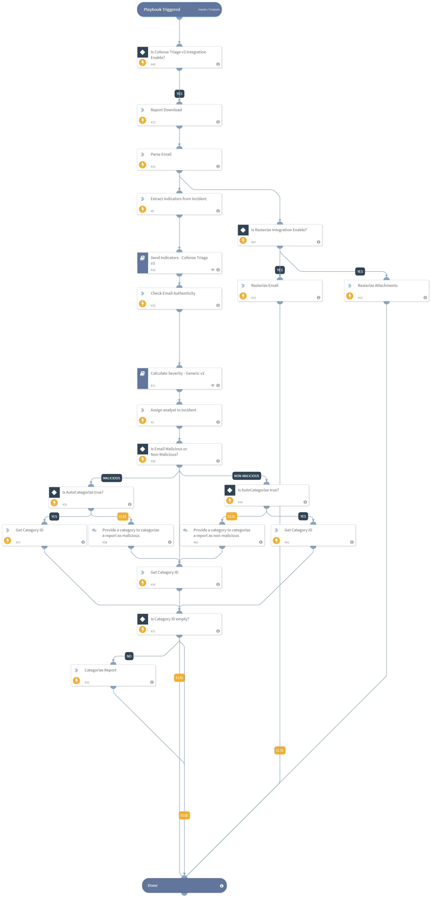

Report Categorization playbook investigates reports that are unprocessed or uncategorized on Cofense Triage as incident alerts in XSOAR and categorizes them based on the severity of the incident.

Users are only able to run the playbook in v6.0.0 or higher as it requires commands to execute the task.
## Dependencies
This playbook uses the following sub-playbooks, integrations, and scripts.

### Sub-playbooks
* Calculate Severity - Generic v2
* Send Indicators - Cofense Triage v3

### Integrations
This playbook does not use any integrations.

### Scripts
* CheckEmailAuthenticity
* ParseEmailFiles
* AssignAnalystToIncident

### Commands
* extractIndicators
* rasterize-email
* cofense-category-list
* cofense-report-download
* rasterize-image
* cofense-report-categorize

## Playbook Inputs
---

| **Name** | **Description** | **Default Value** | **Required** |
| --- | --- | --- | --- |
| OnCall | Set to true to assign only user that is currently on shift. Requires Cortex XSOAR v5.5 or later. | false | Optional |
| ReportID | Requires report ID to investigate and categorize the report that is pulled from Cofense Triage. | incident.cofensetriagereportid | Required |
| AutoCategorize | Whether the user wants to categorize the report automatically or not. | False | Optional |
| MaliciousCategory | The category to be assigned to the report if it is malicious. |  | Optional |
| NonMaliciousCategory | The category to be assigned to the report if it is non-malicious. |  | Optional |

## Playbook Outputs
---
There are no outputs for this playbook.

## Playbook Image

