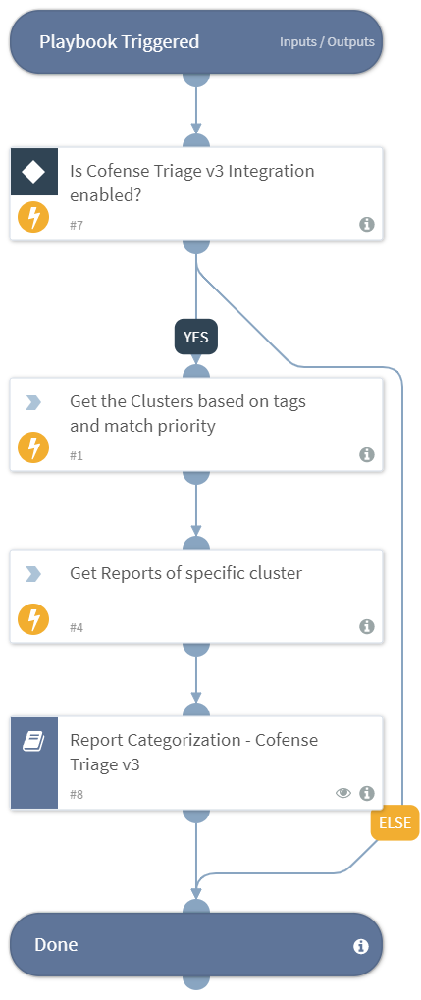
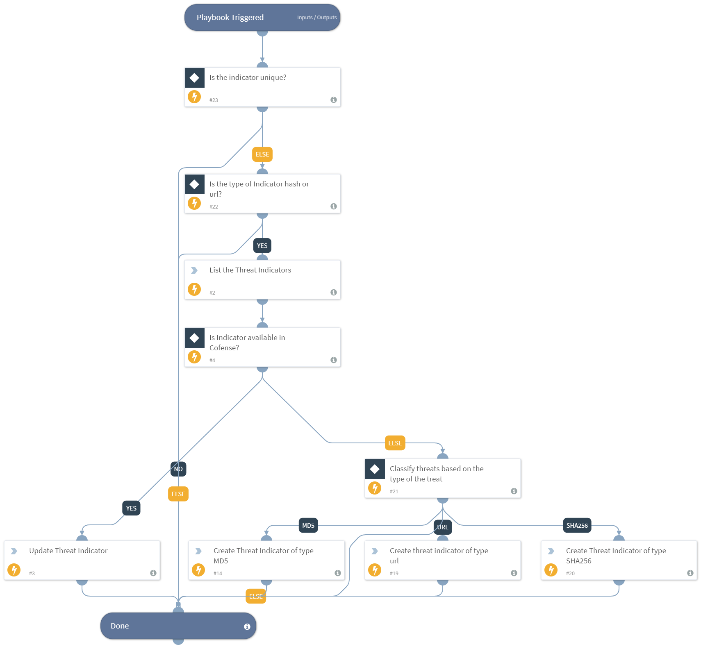
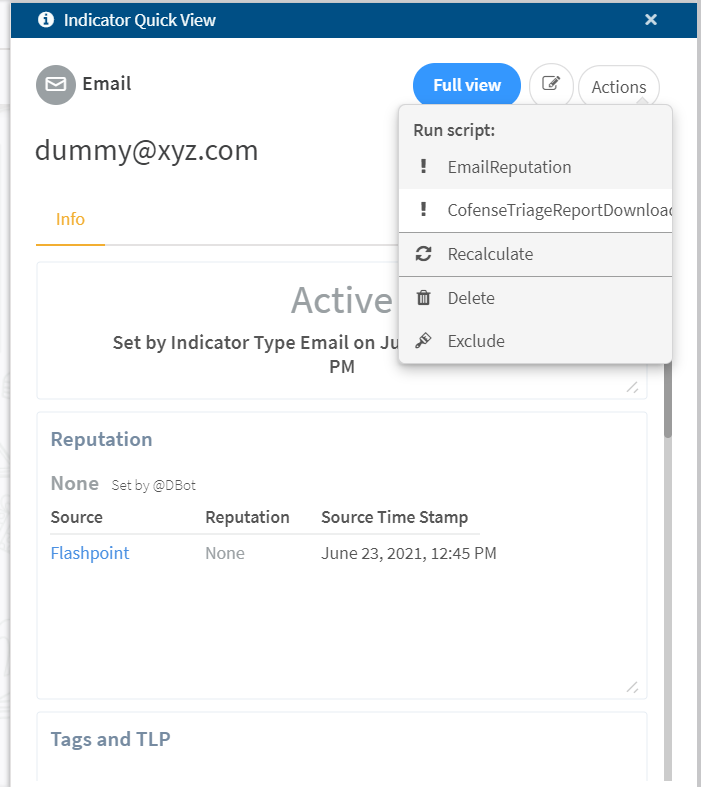
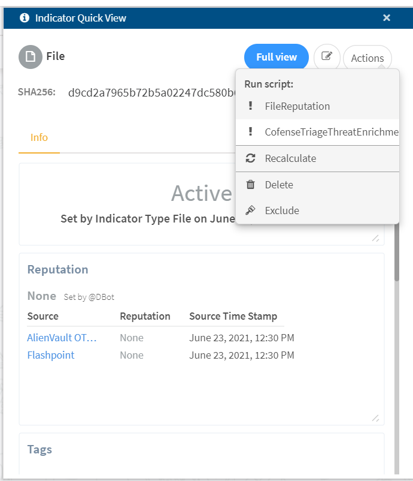

**Cofense Triage** is a post email gateway automated phishing analysis solution for SOC and incident response teams. Employees who report emails that have bypassed the email gateway are ingested and analyzed by Cofense Triage, **clustered into similar threats, and prioritized for action**. Cofense Triage filters benign spam-based emails, leaving security teams with **real world phish to remediate from employees who reported**. Cofense Triage's automation leverages integrations with **proprietary Cofense Intelligence curated research** as well as 3rd party sandbox, URL, and threat intelligence integrations. 

The Cofense Triage content pack integrates with Cortex XSOAR to ingest reported email attributes and operationalize in a playbook. Email attributes such as file payload and malicious links are ingestible into XSOAR as threat indicators. In addition, email reporter details, an email visual, and other related emails similar to the reported threat are searchable via Cofense's API.

##### What does this pack do?

The integration allows Cortex XSOAR to ingest phishing threats from Cofense Triage and run response playbooks based on email attributes.
- Ingest from Cofense Triage inbox and processed locations.
- Create security incidents in Cortex XSOAR based on processed location categories, such as crimeware, advanced threats, and credential phishing.
- Ingest phishing threat indicators based on severity from Cofense Triage - hashes, URLs, domains.
- View image of reported phish.
- Identify and respond to employees reporting phish, such as VIPs and other highly-credible reporters.
- Search reports for presence of threat indicator hashes, URLs, and domains.

Configuration with Cofense Triage allows for continuous API polling for new threats located in the inbox or processed location queues. Analysts can setup playbooks to respond to security incidents created in Cortex XSOAR.

### Playbooks

Users are only able to run the playbook in v6.0.0 or higher as it requires commands to execute the task.
This content pack includes the following playbooks: 
1. Report Categorization - Cofense Triage v3
2. Send Indicators - Cofense Triage v3
3. Cluster Report Categorization - Cofense Triage v3

#### Report Categorization - Cofense Triage v3
Report Categorization playbook investigates reports that are unprocessed or uncategorized on Cofense Triage as incident alerts in XSOAR and categorizes them based on the severity of the incident.

#### Send Indicators - Cofense Triage v3
Send Indicators playbook is used to create or update threat indicators in Cofense Triage that have been identified as malicious or suspicious by the analysis.

#### Cluster Report Categorization - Cofense Triage v3
Cluster Report Categorization playbook is used to retrieve the reports of specific clusters and perform the categorization of reports.

### Automation Scripts
This content pack includes the following scripts: 
1. Cofense Triage Report Download
2. Cofense Triage Threat Enrichment

#### Cofense Triage Report Download
This automation script helps to download all reports associated with the email address.

#### Cofense Triage Threat Enrichment
This automation script helps to enrich the threat indicator value from Cofense Triage.

_For more information about Cofense Triage and the integration with Cortex XSOAR, please visit: [https://cofense.com/wp-content/uploads/2019/12/Demisto-and-Cofense_Solution-Brief.pdf](https://cofense.com/wp-content/uploads/2019/12/Demisto-and-Cofense_Solution-Brief.pdf) and [https://cofense.com/product-services/cofense-triage/](https://cofense.com/product-services/cofense-triage/)._
