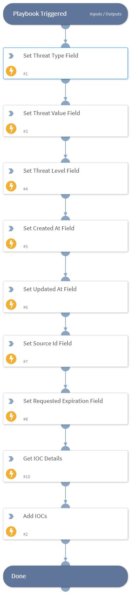

Add or update IOCs in Cofense Vision.

## Dependencies
This playbook uses the following sub-playbooks, integrations, and scripts.

### Sub-playbooks
This playbook does not use any sub-playbooks.

### Integrations
* Cofense Vision

### Scripts
* Set
* ConvertDictOfListToListOfDict

### Commands
* cofense-iocs-update

## Playbook Inputs
---

| **Name** | **Description** | **Default Value** | **Required** |
| --- | --- | --- | --- |
| source | A single IOC source value, to fetch the IOCs added or modified by that particular source. The value for source can contain uppercase letters, lowercase letters, numbers, and certain special characters \("." , "-" , "_" , "~"\).  Example: “Traige-1” or “IOC_Source-2”. |  | Required |
| threat_type | Type of the IOC.   Supported values: Domain, MD5, Sender, SHA256, Subject, or URL. |  | Required |
| threat_value | The actual value of the IOC match in the email. |  | Required |
| threat_level | The severity of the IOC. |  | Required |
| created_at | The UTC date and time, the IOC source included the IOC for the first time. |  | Required |
| updated_at | The UTC date and time, the IOC source last updated the IOC. |  | Optional |
| source_id | The unique identifier assigned by the IOC source. |  | Required |
| requested_expiration | The expected UTC expiration date and time. The IOC repository calculates an expiration date and time for the new IOC by default 14 days after the IOC is delivered to the IOC repository. |  | Optional |

## Playbook Outputs
---
There are no outputs for this playbook.

## Playbook Image
---
