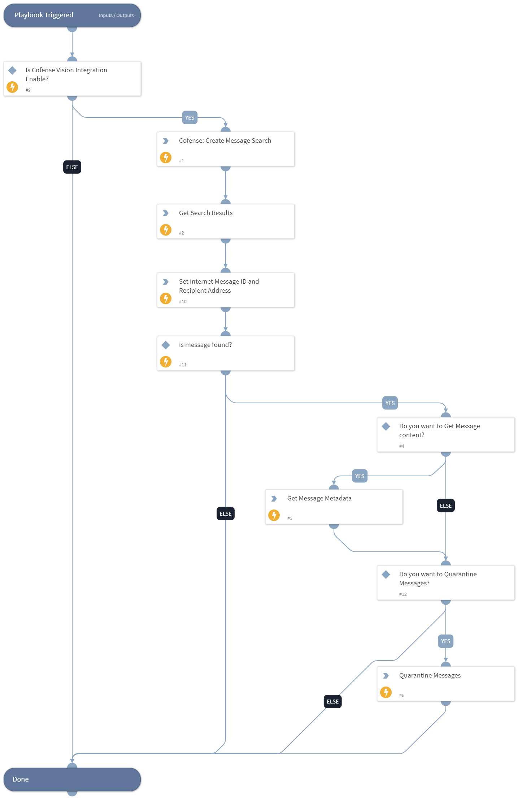

This playbook allows users to quarantine various messages that meet their specified criteria.

## Dependencies
This playbook uses the following sub-playbooks, integrations, and scripts.

### Sub-playbooks
This playbook does not use any sub-playbooks.

### Integrations
* Cofense Vision

### Scripts
* Set
* GetMessageIdAndRecipients

### Commands
* cofense-message-search-results-get
* cofense-quarantine-job-create
* cofense-message-metadata-get
* cofense-message-search-create

## Playbook Inputs
---

| **Name** | **Description** | **Default Value** | **Required** |
| --- | --- | --- | --- |
| subjects | A comma-separated string of subjects to create a search for an email’s subject. It supports the use of one or more wildcard characters \(\*\) in any position of a subject.  Note: The search can only have a maximum of 3 values. |  | Optional |
| senders | A comma-separated string of senders to create a search for an email’s sender. It supports the use of one or more wildcard characters \(\*\) in any position of a sender's email address.  Note: The search can only have a maximum of 3 values. |  | Optional |
| attachment_names | A comma-separated string of attachment names to create a search for an email’s attachments. It supports the use of one or more wildcard characters \(\*\) in any position of an attachment name.  Note: The search can only have a maximum of 3 values. |  | Optional |
| attachment_hash_match_criteria | The type of matching performed on the hashes specified in the attachment_hashes argument.  Possible values are: ALL: Emails must include all listed attachment hashes. ANY: Emails must contain at least one of the listed attachment hash. | ANY | Optional |
| attachment_hashes  | A comma-separated string of attachment hashes to create a search for an email’s attachment hashes.  Supported format: hashtype1:hashvalue1, hashtype2:hashvalue2  Possible values for hashtype are: MD5, SHA256  Example:  md5:938c2cc0dcc05f2b68c4287040cfcf71  Note: The search can only have a maximum of 3 values. |  | Optional |
| attachment_mime_types | A comma-separated string of MIME types to create a search for an email’s attachment MIME type.  Note: The search can only have a maximum of 3 values. |  | Optional |
| attachment_exclude_mime_types | A comma-separated string of MIME types to create a search for excluding an email’s attachment MIME type.  Note: The search can only have a maximum of 3 values. |  | Optional |
| domain_match_criteria | The type of matching to perform on the domains specified in the domains argument.  Possible values are: ALL: Emails must include all listed domains. ANY: Emails must contain at least one of the listed domains. | ANY | Optional |
| domains | A comma-separated string of domains to create a search for domains in an email’s body or its attachment. You can change the type of matching that happens on the specified domains using the domain_match_criteria argument.  Note: The search can only have a maximum of 3 values. |  | Optional |
| whitelist_urls | A comma-separated string of URLs to be whitelisted.  Note: The search can only have a maximum of 3 values. |  | Optional |
| headers | A comma-separated string of key-value pairs, defining the additional criteria to search for in the email header.   Supported format: key1:value1, key2:value1:value2:value3  Example: Content-Type:application/json  List of available headers to create a search can be retrieved by using the command “cofense-searchable-headers-list”.  Note: The search can only have a maximum of 3 values. |  | Optional |
| internet_message_id | The unique identifier of the email, enclosed in angle brackets. This argument is case-sensitive.  Example:  &amp;lt;513C8CD8-E593-4DC4-82BF6202E8AC95CB@example.com&amp;gt; |  | Optional |
| partial_ingest | Whether to create a search with partially ingested emails \(true\) or not with partially ingested emails \(false\). | False | Optional |
| received_after_date | Date and time to create a search for emails to specify the received on or after the specified UTC date and time.  Supported formats: N minutes, N hours, N days, N weeks, N months, N years, yyyy-mm-dd, yyyy-mm-ddTHH:MM:SSZ  Example: 01 Mar 2021, 01 Feb 2021 04:45:33, 2022-04-17T14:05:44Z |  | Optional |
| received_before_date | Date and time to create a search for emails to specify the received before or on the specified UTC date and time.  Supported formats: N minutes, N hours, N days, N weeks, N months, N years, yyyy-mm-dd, yyyy-mm-ddTHH:MM:SSZ  Example: 01 Mar 2021, 01 Feb 2021 04:45:33, 2022-04-17T14:05:44Z |  | Optional |
| recipient | Create a search with the specified recipient. Supports one or more wildcard characters \(\*\) in any position of a recipient's email address. |  | Optional |
| url | Create a search with the specified url. Supports one or more wildcard characters \(\*\) in any position of the URL. |  | Optional |
| message_size | The number of results to retrieve per page. The value must be a positive integer up to 2000.  Default value is ‘50’ | 50 | Optional |

## Playbook Outputs
---
There are no outputs for this playbook.

## Playbook Image
---
