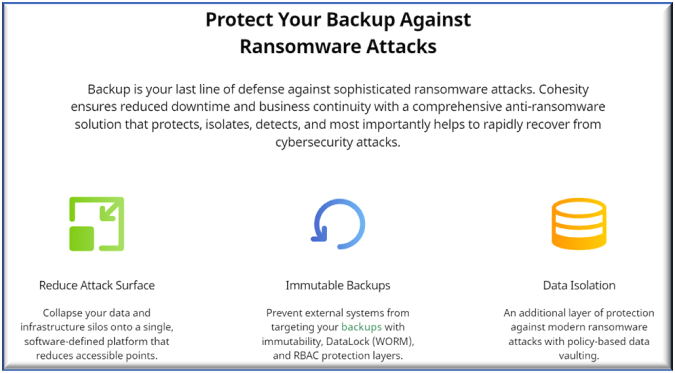
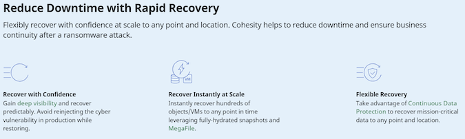

[Cohesity Helios](https://www.cohesity.com/products/helios/), [a next-gen data management platform](https://www.cohesity.com/next-gen-data-management/?utm_content=next-gen-dm&utm_medium=ppc&utm_source=google&utm_campaign=fy22-q2-11-amer-us-evergreen-brand&utm_term=cohesity%20helios&utm_targetid=kwd-822470811018&gclid=Cj0KCQiA8ICOBhDmARIsAEGI6o1yJVBLTWo_yp7tvaF507TZbSgeeHyZyVtcUjDc2kmRdPYsZHnUEFkaAmEyEALw_wcB), delivers a unique combination of an immutable file system with DataLock capabilities, anomaly detection,  policy-based data isolation, quorum and MFA to prevent backup data from becoming part of a [ransomware attack](https://www.youtube.com/watch?v=WnR4n4e_FaY).

This content pack from Cohesity provides Cortex XSOAR customers with alerts by integrating ransomware detection into an automated playbook for managing ransomware attack recovery to help reduce [ransomware risk](https://www.cohesity.com/dm/ransomware-risk-assessment/?utm_content=ransomware-quiz&utm_medium=ppc&utm_source=google&utm_campaign=fy22-q2-11-glob-en-evergreen-backup-recovery&utm_term=cohesity%20security&utm_targetid=kwd-1392771848867&gclid=Cj0KCQiAk4aOBhCTARIsAFWFP9HNb7Kw18i2ZqwxikFPu_pqUJjBeBsIe1_yVhKYHiLtTinbqoi-fvMaAg8oEALw_wcB).

Cohesity’s comprehensive, end-to-end solution [Cohesity Ransomware](https://www.cohesity.com/solutions/ransomware/) features a multi-layered approach to protect backup data against ransomware, detect, and rapidly recover from an attack. Cohesity’s unique [immutable architecture](https://www.cohesity.com/blogs/how-backup-immutability-defends-against-ransomware-attacks/) ensures that your backup data cannot be encrypted, modified or deleted. Using machine learning, it provides visibility and continuously monitors for any anomalies in your data. And if the worst happens, Cohesity helps to locate a clean copy of data across your global footprint, including public clouds, to instantly recover and reduce downtime.

#### What does this pack provide?

- Cohesity Helios and Cortex XSOAR enable your security and IT teams to recover from ransomware attacks.

- Command to fetch ransomware alerts based on attributes such as time duration, severity level, cluster identifiers and region identifiers.

- Command to restore a specified backed up object from its latest clean snapshot.

- Command to ignore a specified ransomware alert.

<~XSIAM>

- Rest API integration for your Cohesity Helios

- Audit and Alert logs XDM mapping

## Generate an api key from Helios UI

1. Login to Helios UI.
2. Click on **Settings** icon on top right corner and select **Access Management**.
3. From the available tabs, select **API Keys**.
4. Click on **Add API Key** button.
5. Give the apiKey a name and click the **Save** button.
6. Copy the **key**.

## Configure CohesityHelios in Cortex

| **Parameter** | **Description** | **Required** |
| --- | --- | --- |
| Your server URL |  | True |
| API Key | The API Key to use for connection | True |
| Trust any certificate (not secure) | Trust any certificate \(not secure\). | False |
| Use system proxy settings | Use system proxy settings. | False |
| Incident type |  | False |
| Maximum number of incidents to fetch every time |  | True |
| First fetch timestamp |  | False |
| Fetch incidents |  | False |
| Incidents Fetch Interval |  | False |

</~XSIAM>
