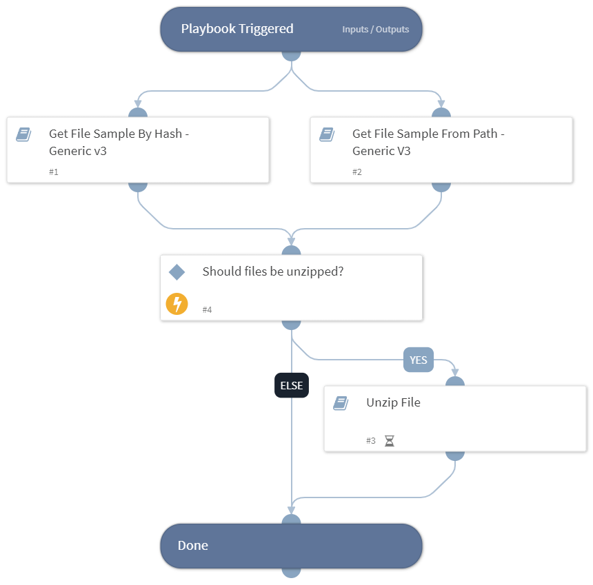

Retrieve files from endpoints by the file hash or the file path.

## Dependencies
This playbook uses the following sub-playbooks, integrations, and scripts.

### Sub-playbooks
* Get File Sample From Path - Generic V3
* Unzip File
* Get File Sample By Hash - Generic v3

### Integrations
This playbook does not use any integrations.

### Scripts
This playbook does not use any scripts.

### Commands
This playbook does not use any commands.

## Playbook Inputs
---

| **Name** | **Description**                                                                           | **Default Value** | **Required** |
| --- |-------------------------------------------------------------------------------------------| --- | --- |
| MD5 | The MD5 hash of the file to retrieve.                                                     | File.MD5 | Optional |
| SHA256 | The SHA256 hash of the file to retrieve.                                                  | File.SHA256 | Optional |
| Hostname | The hostname from which to retrieve the file.                                             | Endpoint.Hostname | Optional |
| AgentID | The agent ID that should be used to retrieve the file.                                    | incident.agentid | Optional |
| FilePath | The full path to the file that needs to be retrieved.                                     | incident.filepath | Optional |
| NewFilename | Optional. A new name for the retrieved file. If left empty, the filename will not change. |  | Optional |
| UnzipFile | Whether to unzip zipped files after retrieving them.                                      |  | Optional |
| ZipTool | The tool used to unzip the file. The options are: 7z, zipfile.                            |  | Optional |
| ZipPassword | The password used to unzip zipped files.                                                  |  | Optional |

## Playbook Outputs
---

| **Path** | **Description**                                                | **Type** |
| --- |----------------------------------------------------------------| --- |
| File | File objects. Includes the zipped file and any unzipped files. | unknown |
| File.Size | The size of the file.                                          | number |
| File.Type | The type of the file.                                          | string |
| File.Info | General information about the file.                            | string |
| File.MD5 | The MD5 hash of the file.                                      | string |
| File.SHA1 | The SHA1 hash of the file.                                     | string |
| File.SHA256 | The SHA256 hash of the file.                                   | string |
| File.SHA512 | The SHA512 hash of the file.                                   | string |
| File.SSDeep | The SSDeep of the file.                                        | string |
| File.Extension | The file extension.                                            | string |
| File.EntryID | The file entry ID.                                             | string |
| File.Name | The file name.                                                 | string |
| ExtractedFiles | Files that were unzipped.                                      | unknown |

## Playbook Image
---
