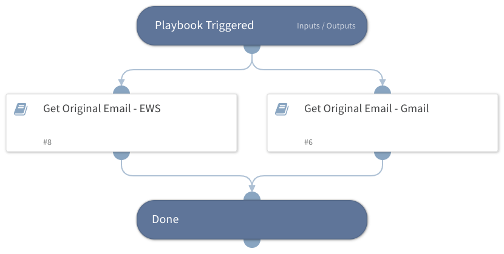

Deprecated. Use the "Get Original Email - Generic v2" playbook under the "Phishing" pack instead.

## Dependencies
This playbook uses the following sub-playbooks, integrations, and scripts.

### Sub-playbooks
* Get Original Email - Gmail
* Get Original Email - EWS

### Integrations
This playbook does not use any integrations.

### Scripts
This playbook does not use any scripts.

### Commands
This playbook does not use any commands.

## Playbook Inputs
---
There are no inputs for this playbook.

## Playbook Outputs
---

| **Path** | **Description** | **Type** |
| --- | --- | --- |
| Email | The email object | unknown |
| File | Original attachments | unknown |
| Email.To | The recipient of the email | string |
| Email.From | The sender of the email | string |
| Email.CC | The CC address of the email | string |
| Email.BCC | The BCC address of the email | string |
| Email.HTML | The email HTML | string |
| Email.Body | The email text body | string |
| Email.Headers | The email headers | unknown |
| Email.Subject | The email subject | string |
| Email.HeadersMap | The headers of the email. | unknown |

## Playbook Image
---
