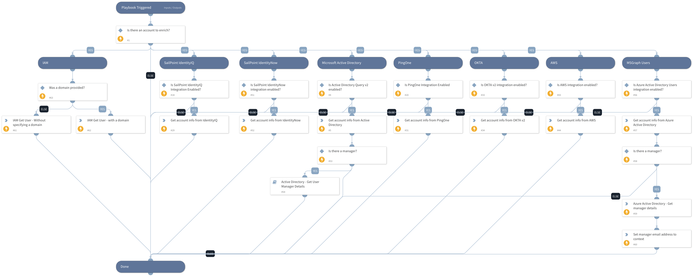

Enrich accounts using one or more integrations.
Supported integrations:
- Active Directory
- SailPoint IdentityNow
- SailPoint IdentityIQ
- PingOne
- Okta
- AWS IAM

Also, the playbook supports the generic command 'iam-get-user' (implemented in IAM integrations. For more information, visit https://xsoar.pan.dev/docs/integrations/iam-integrations.

## Dependencies

This playbook uses the following sub-playbooks, integrations, and scripts.

### Sub-playbooks

* Active Directory - Get User Manager Details

### Integrations

This playbook does not use any integrations.

### Scripts

* Set
* IsIntegrationAvailable

### Commands

* ad-get-user
* msgraph-user-get
* pingone-get-user
* identityiq-search-identities
* okta-get-user
* msgraph-user-get-manager
* iam-get-user
* aws-iam-get-user
* identitynow-get-accounts

## Playbook Inputs

---

| **Name** | **Description** | **Default Value** | **Required** |
| --- | --- | --- | --- |
| Username | The username to enrich. | Account.Username | Optional |
| Domain | Optional - This input is needed for the IAM-get-user command \(used in the Account Enrichment - IAM playbook\). Please provide the domain name that the user is related to. Example: @xsoar.com |  | Optional |

## Playbook Outputs

---

| **Path** | **Description** | **Type** |
| --- | --- | --- |
| Account | The account object. | unknown |
| ActiveDirectory.Users.sAMAccountName | The user's SAM account name. | unknown |
| ActiveDirectory.Users.userAccountControl | The user's account control flag. | unknown |
| ActiveDirectory.Users.mail | The user's email address. | unknown |
| ActiveDirectory.Users.memberOf | Groups the user is a member of. | unknown |
| IAM | Generic IAM output. | unknown |
| IdentityIQ.Identity | Identity asset from IdentityIQ. | unknown |
| PingOne.Account | Account in PingID. | unknown |
| ActiveDirectory.Users.manager | The manager of the user. | unknown |
| IAM.Vendor.active | When true, indicates that the employee's status is active in the 3rd-party integration. | unknown |
| IAM.Vendor.brand | Name of the integration. | unknown |
| IAM.Vendor.details | Provides the raw data from the 3rd-party integration. | unknown |
| IAM.Vendor.email | The employee's email address. | unknown |
| IAM.Vendor.errorCode | HTTP error response code. | unknown |
| IAM.Vendor.errorMessage | Reason why the API failed. | unknown |
| IAM.Vendor.id | The employee's user ID in the app. | unknown |
| IAM.Vendor.instanceName | Name of the integration instance. | unknown |
| IAM.Vendor.success | When true, indicates that the command was executed successfully. | unknown |
| IAM.Vendor.username | The employee's username in the app. | unknown |
| IdentityIQ.Identity.userName | The IdentityIQ username \(primary ID\). | unknown |
| IdentityIQ.Identity.id | The IdentityIQ internal ID \(UUID\). | unknown |
| IdentityIQ.Identity.active | Indicates whether the ID is active or inactive in IdentityIQ. | unknown |
| IdentityIQ.Identity.lastModified | Timestamp of when the identity was last modified. | unknown |
| IdentityIQ.Identity.displayName | The display name of the identity. | unknown |
| IdentityIQ.Identity.emails | Array of email objects. | unknown |
| IdentityIQ.Identity.entitlements | Array of entitlement objects that the identity has. | unknown |
| IdentityIQ.Identity.roles | Array of role objects that the identity has. | unknown |
| IdentityIQ.Identity.capabilities | Array of string representations of the IdentityIQ capabilities assigned to this identity. | unknown |
| IdentityIQ.Identity.name | Account name. | unknown |
| IdentityIQ.Identity.name.formatted | The display name of the identity. | unknown |
| IdentityIQ.Identity.name.familyName | The last name of the identity. | unknown |
| IdentityIQ.Identity.name.givenName | The first name of the identity. | unknown |
| IdentityIQ.Identity.manager | The account's manager returned from IdentityIQ. | unknown |
| IdentityIQ.Identity.manager.userName | The IdentityIQ username \(primary ID\) of the identity's manager. | unknown |
| IdentityIQ.Identity.emails.type | Type of the email being returned. | unknown |
| IdentityIQ.Identity.emails.value | The email address of the identity. | unknown |
| IdentityIQ.Identity.emails.primary | Indicates if this email address is the identity's primary email. | unknown |
| PingOne.Account.ID | PingOne account ID. | unknown |
| PingOne.Account.Username | PingOne account username. | unknown |
| PingOne.Account.DisplayName | PingOne account display name. | unknown |
| PingOne.Account.Email | PingOne account email. | unknown |
| PingOne.Account.Enabled | PingOne account enabled status. | unknown |
| PingOne.Account.CreatedAt | PingOne account create date. | unknown |
| PingOne.Account.UpdatedAt | PingOne account updated date. | unknown |
| Account.PasswordChanged | Timestamp for when the user's password was last changed. | unknown |
| Account.StatusChanged | Timestamp for when the user's status was last changed. | unknown |
| Account.Activated | Timestamp for when the user was activated. | unknown |
| Account.Created | Timestamp for when the user was created. | unknown |
| Account.Status | Okta account status. | unknown |
| Account.Username | The user SAM account name. | unknown |
| Account.Email | The user email address. | unknown |
| Account.ID | The user distinguished name. | unknown |
| ActiveDirectory.Users.dn | The user distinguished name. | unknown |
| ActiveDirectory.Users.displayName | The user display name. | unknown |
| ActiveDirectory.Users.name | The user common name. | unknown |
| ActiveDirectory.Users.userAccountControlFields | The user account control fields. | unknown |
| ActiveDirectory.Users.userAccountControlFields.SCRIPT | Whether the login script is run. Works for \*Windows Server 2012 R2\*. | unknown |
| ActiveDirectory.Users.userAccountControlFields.ACCOUNTDISABLE | Whether the user account is disabled. Works for \*Windows Server 2012 R2\*. | unknown |
| ActiveDirectory.Users.userAccountControlFields.HOMEDIR_REQUIRED | Whether the home folder is required. Works for \*Windows Server 2012 R2\*. | unknown |
| ActiveDirectory.Users.userAccountControlFields.LOCKOUT | Whether the user is locked out. Works for \*Windows Server 2012 R2\*. | unknown |
| ActiveDirectory.Users.userAccountControlFields.PASSWD_NOTREQD | Whether the password is required. Works for \*Windows Server 2012 R2\*. | unknown |
| ActiveDirectory.Users.userAccountControlFields.PASSWD_CANT_CHANGE | Whether the user can change the password. Works for \*Windows Server 2012 R2\*. | unknown |
| ActiveDirectory.Users.userAccountControlFields.ENCRYPTED_TEXT_PWD_ALLOWED | Whether the user can send an encrypted password. Works for \*Windows Server 2012 R2\*. | unknown |
| ActiveDirectory.Users.userAccountControlFields.TEMP_DUPLICATE_ACCOUNT | Whether this is an account for users whose primary account is in another domain. Works for \*Windows Server 2012 R2\*. | unknown |
| ActiveDirectory.Users.userAccountControlFields.NORMAL_ACCOUNT | Whether this is a default account type that represents a typical user. Works for \*Windows Server 2012 R2\*. | unknown |
| ActiveDirectory.Users.userAccountControlFields.INTERDOMAIN_TRUST_ACCOUNT | Whether the account is permitted to trust a system domain that trusts other domains. Works for \*Windows Server 2012 R2\*. | unknown |
| ActiveDirectory.Users.userAccountControlFields.WORKSTATION_TRUST_ACCOUNT | Whether this is a computer account for a computer running Microsoft Windows NT 4.0 Workstation, Microsoft Windows NT 4.0 Server, Microsoft Windows 2000 Professional, or Windows 2000 Server and is a member of this domain. | unknown |
| Account.Manager | The user manager. | unknown |
| Account.Groups | Groups for which the user is a member. | unknown |
| Account.DisplayName | The user display name. | unknown |
| ActiveDirectory.Users.userAccountControlFields.PARTIAL_SECRETS_ACCOUNT | Whether the account is a read-only domain controller \(RODC\). | unknown |
| ActiveDirectory.Users.userAccountControlFields.TRUSTED_TO_AUTH_FOR_DELEGATION | Whether the account is enabled for delegation. | unknown |
| ActiveDirectory.Users.userAccountControlFields.DONT_REQ_PREAUTH | Whether this account require Kerberos pre-authentication for logging on. | unknown |
| ActiveDirectory.Users.userAccountControlFields.USE_DES_KEY_ONLY | Whether to restrict this principal to use only Data Encryption Standard \(DES\) encryption types for keys. | unknown |
| ActiveDirectory.Users.userAccountControlFields.NOT_DELEGATED | Whether the security context of the user isn't delegated to a service even if the service account is set as trusted for Kerberos delegation. | unknown |
| ActiveDirectory.Users.userAccountControlFields.TRUSTED_FOR_DELEGATION | Whether the service account \(the user or computer account\) under which a service runs is trusted for Kerberos delegation. | unknown |
| ActiveDirectory.Users.userAccountControlFields.SMARTCARD_REQUIRED | Whether to force the user to log in by using a smart card. | unknown |
| ActiveDirectory.Users.userAccountControlFields.MNS_LOGON_ACCOUNT | Whether this is an MNS login account. | unknown |
| ActiveDirectory.Users.userAccountControlFields.SERVER_TRUST_ACCOUNT | Whether this is a computer account for a domain controller that is a member of this domain. Works for \*Windows Server 2012 R2\*. | unknown |
| IAM.Vendor | The returning results vendor. | unknown |
| IAM.Vendor.action | The command name. | unknown |
| IAM.UserProfile | The user profile. | unknown |
| SailPointIdentityNow.Account | The IdentityNow account object. | unknown |
| SailPointIdentityNow.Account.id | The IdentityNow internal ID \(UUID\). | unknown |
| SailPointIdentityNow.Account.name | Name of the identity on this account. | unknown |
| SailPointIdentityNow.Account.identityId | The IdentityNow internal identity ID. | unknown |
| SailPointIdentityNow.Account.nativeIdentity | The IdentityNow internal native identity ID. | unknown |
| SailPointIdentityNow.Account.sourceId | Source ID that maps this account. | unknown |
| SailPointIdentityNow.Account.created | Timestamp when the account was created. | unknown |
| SailPointIdentityNow.Account.modified | Timestamp when the account was last modified. | unknown |
| SailPointIdentityNow.Account.attributes | Map of variable number of attributes unique to this account. | unknown |
| SailPointIdentityNow.Account.authoritative | Indicates whether the account is the true source for this identity. | unknown |
| SailPointIdentityNow.Account.disabled | Indicates whether the account is disabled. | unknown |
| SailPointIdentityNow.Account.locked | Indicates whether the account is locked. | unknown |
| SailPointIdentityNow.Account.systemAccount | Indicates whether the account is a system account. | unknown |
| SailPointIdentityNow.Account.uncorrelated | Indicates whether the account is uncorrelated. | unknown |
| SailPointIdentityNow.Account.manuallyCorrelated | Indicates whether the account was manually correlated. | unknown |
| SailPointIdentityNow.Account.hasEntitlements | Indicates whether the account has entitlement. | unknown |
| UserManagerEmail | The email of the user's manager. | unknown |
| UserManagerDisplayName | The display name of the user's manager. | unknown |
| MSGraphUser.ID | User's ID. | unknown |
| MSGraphUser.DisplayName | User's display name. | unknown |
| MSGraphUser.GivenName | User's given name. | unknown |
| MSGraphUser.JobTitle | User's job title. | unknown |
| MSGraphUser.Mail | User's mail address. | unknown |
| MSGraphUser.Surname | User's surname. | unknown |
| MSGraphUser.UserPrincipalName | User's principal name. | unknown |
| MSGraphUserManager.Manager.ID | Manager's user ID. | unknown |
| MSGraphUserManager.Manager.DisplayName | User's display name. | unknown |
| MSGraphUserManager.Manager.GivenName | User's given name. | unknown |
| MSGraphUserManager.Manager.Mail | User's mail address. | unknown |
| MSGraphUserManager.Manager.Surname | User's surname. | unknown |
| MSGraphUserManager.Manager.UserPrincipalName | User's principal name. | unknown |

## Playbook Image

---

