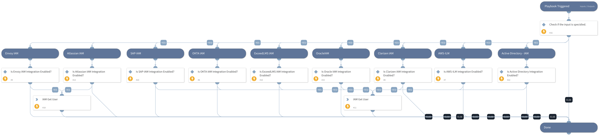

This playbook aims to retrieve user information from various vendors using the 'iam-get-user'.

Current Supported Integrations:
- Active Directory
- AWS ILM
- Clarizen IAM
- Oracle IAM
- ExceedLMS IAM
- OKTA IAM
- SAP-IAM
- Atlassian IAM
- Envoy IAM

## Dependencies
This playbook uses the following sub-playbooks, integrations, and scripts.

### Sub-playbooks
This playbook does not use any sub-playbooks.

### Integrations
This playbook does not use any integrations.

### Scripts
* IsIntegrationAvailable

### Commands
* iam-get-user

## Playbook Inputs
---

| **Name** | **Description** | **Default Value** | **Required** |
| --- | --- | --- | --- |
| Username | Specify the useranme |  | Optional |

## Playbook Outputs
---

| **Path** | **Description** | **Type** |
| --- | --- | --- |
| IAM.Vendor.action | The command name. | unknown |
| IAM.Vendor.username | The employee username in the app. | unknown |
| IAM.Vendor.success | If true, the command was executed successfully. | unknown |
| IAM.Vendor.instanceName | The integration instance name. | unknown |
| IAM.Vendor.id | The employee user ID in the app. | unknown |
| IAM.Vendor.errorMessage | The reason the API failed. | unknown |
| IAM.Vendor.errorCode | The HTTP error response code. | unknown |
| IAM.Vendor.email | The employee email address. | unknown |
| IAM.Vendor.details | Tells the user if the API was successful, otherwise provides error information. | unknown |
| IAM.Vendor.brand | The integration name. | unknown |
| IAM.Vendor.active | If true the employee status is active. | unknown |
| IAM.Vendor | Queried IAM vendor name. | unknown |
| IAM.UserProfile | The user profile. | unknown |
| IAM | Returened IAM infomration from the query. | unknown |

## Playbook Image
---
