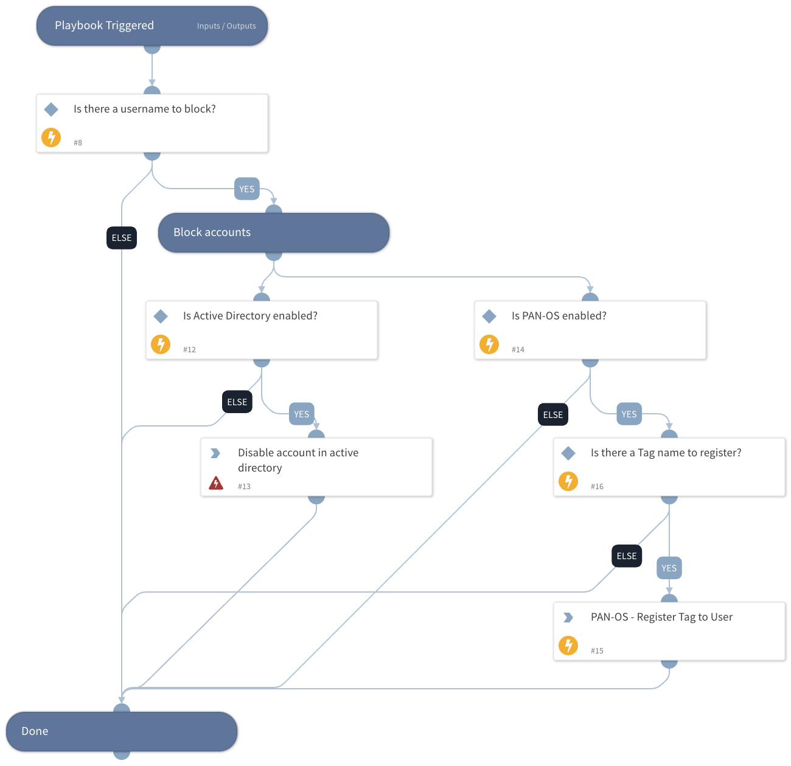

Deprecated. Use 'Block Account - Generic v2' instead. This playbook blocks malicious usernames using all integrations that you have enabled.

Supported integrations for this playbook:
* Active Directory
* PAN-OS - This requires PAN-OS 9.1 or higher.

## Dependencies

This playbook uses the following sub-playbooks, integrations, and scripts.

### Sub-playbooks

This playbook does not use any sub-playbooks.

### Integrations

* activedir

### Scripts

This playbook does not use any scripts.

### Commands

* pan-os-register-user-tag
* ad-disable-account

## Playbook Inputs

---

| **Name** | **Description** | **Default Value** | **Required** |
| --- | --- | --- | --- |
| Username | Array of malicious usernames to block. |  | Optional |
| Tag | PAN-OS tag name to apply to the username that you want to block. |  | Optional |

## Playbook Outputs

---
There are no outputs for this playbook.

## Playbook Image

---

