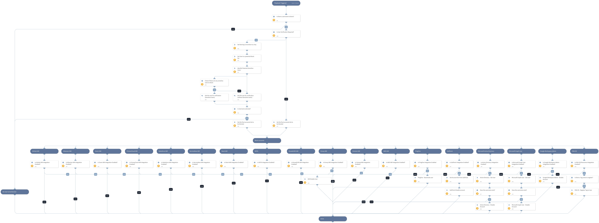

This playbook blocks malicious usernames using all integrations that you have enabled.

Supported integrations for this playbook:
* Active Directory
* PAN-OS - This requires PAN-OS 9.1 or higher.
* SailPoint
* PingOne
* AWS IAM
* Clarizen IAM
* Envoy IAM
* ExceedLMS IAM
* Okta
* Microsoft Graph User (Azure Active Directory Users)
* Google Workspace Admin
* Slack IAM
* ServiceNow IAM
* Prisma Cloud IAM
* Zoom IAM
* Atlassian IAM
* GitHub IAM

## Dependencies

This playbook uses the following sub-playbooks, integrations, and scripts.

### Sub-playbooks

This playbook does not use any sub-playbooks.

### Integrations

* Active Directory Query v2

### Scripts

* SetAndHandleEmpty
* IsIntegrationAvailable

### Commands

* ad-disable-account
* gsuite-user-update
* identityiq-disable-account
* pan-os-register-user-tag
* iam-disable-user
* msgraph-user-account-disable
* pingone-deactivate-user

## Playbook Inputs

---

| **Name** | **Description** | **Default Value** | **Required** |
| --- | --- | --- | --- |
| Username | Array of malicious usernames to block. |  | Optional |
| Tag | PAN-OS Tag name to apply to the username that you want to block. | Bad Account | Optional |
| NamingConvention | In case you are using naming convention in your IDP, please specify a prefix for special/service accounts \(use comma separated\) |  | Optional |
| UserVerification | Possible values:True/False. Default:True. Specify if User Verification is Requrired | True | Optional |

## Playbook Outputs

---

| **Path** | **Description** | **Type** |
| --- | --- | --- |
| Blocklist.Final | Blocked accounts | unknown |

## Playbook Image

---

