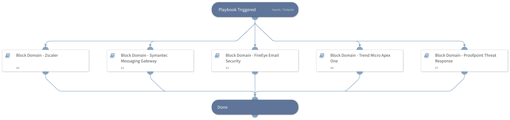

Deprecated. Use 'Block Domain - Generic v2' instead. This playbook blocks malicious Domains using all integrations that are enabled.

Supported integrations for this playbook:
* Zscaler
* Symantec Messaging Gateway
* FireEye EX
* Trend Micro Apex One
* Proofpoint Threat Response

## Dependencies

This playbook uses the following sub-playbooks, integrations, and scripts.

### Sub-playbooks

* Block Domain - FireEye Email Security
* Block Domain - Proofpoint Threat Response
* Block Domain - Zscaler
* Block Domain - Trend Micro Apex One
* Block Domain - Symantec Messaging Gateway

### Integrations

This playbook does not use any integrations.

### Scripts

This playbook does not use any scripts.

### Commands

This playbook does not use any commands.

## Playbook Inputs

---

| **Name** | **Description** | **Default Value** | **Required** |
| --- | --- | --- | --- |
| Domain | The Domain to block. |  | Optional |
| DomainBlackListID | The Domain List ID to add the Domain to. product: Proofpoint Threat Response |  | Optional |

## Playbook Outputs

---
There are no outputs for this playbook.

## Playbook Image

---

