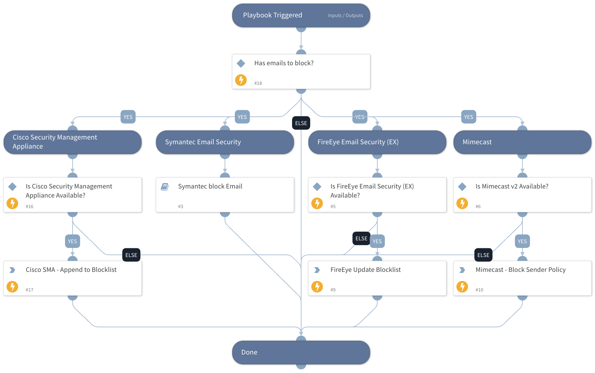

This playbook will block emails at your mail relay integration.

Supported integrations for this playbook:
* Mimecast
* FireEye Email Security (EX)
* Cisco Email Security
* Symantec Email Security

## Dependencies

This playbook uses the following sub-playbooks, integrations, and scripts.

### Sub-playbooks

* Symantec block Email

### Integrations

This playbook does not use any integrations.

### Scripts

* IsIntegrationAvailable

### Commands

* mimecast-create-policy
* cisco-email-security-list-entry-add
* cisco-sma-list-entry-append
* fireeye-ex-update-blockedlist

## Playbook Inputs

---

| **Name** | **Description** | **Default Value** | **Required** |
| --- | --- | --- | --- |
| EmailToBlock | The email address that will be blocked. |  | Optional |

## Playbook Outputs

---
There are no outputs for this playbook.

## Playbook Image

---

