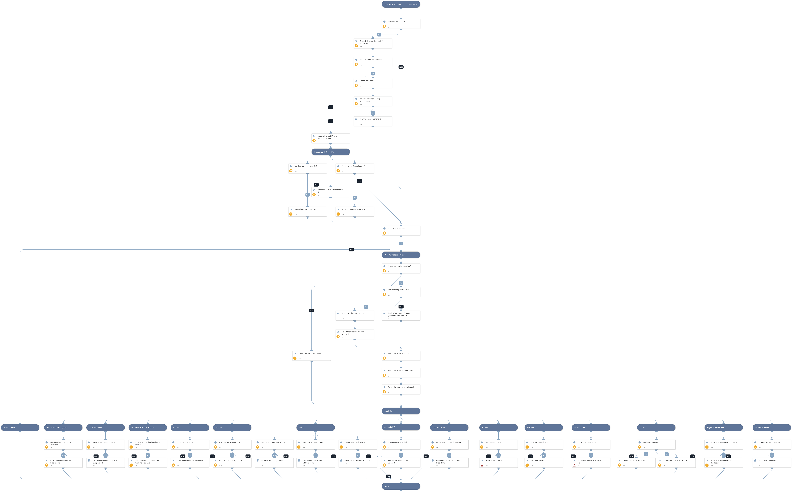

This playbook blocks malicious IPs using all integrations that are enabled. The direction of the traffic that will be blocked is determined by the XSOAR user (and set by default to outgoing).
Note the following:
- Some of those integrations require specific parameters to run, which are based on the playbook inputs. Also, certain integrations use FW rules or appended network objects.
- The appended network objects should be specified in blocking rules inside the system later on. 

Supported integrations for this playbook [Network security products such as FW/WAF/IPS/Etc]: 

* Check Point Firewall
* Palo Alto Networks PAN-OS
* Zscaler
* FortiGate
* Aria Packet Intelligence
* Cisco Firepower 
* Cisco Secure Cloud Analytics
* Cisco ASA
* Akamai WAF
* F5 SilverLine
* ThreatX
* Signal Sciences WAF
* Sophos Firewall

## Dependencies
This playbook uses the following sub-playbooks, integrations, and scripts.

### Sub-playbooks
* Checkpoint - Block IP - Custom Block Rule
* PAN-OS DAG Configuration
* Sophos Firewall - Block IP
* Cisco FirePower- Append network group object
* PAN-OS - Block IP - Static Address Group
* PAN-OS - Block IP - Custom Block Rule

### Integrations
* Check Point Firewall
* Palo Alto Networks PAN-OS
* Zscaler
* FortiGate
* Aria Packet Intelligence
* Cisco Firepower 
* Cisco Secure Cloud Analytics
* Cisco ASA
* Akamai WAF
* F5 SilverLine
* ThreatX
* Signal Sciences WAF
* Sophos Firewall

### Scripts
* IsIPInRanges
* SetAndHandleEmpty
* isError

### Commands
* cisco-asa-create-rule
* threatx-blacklist-ip
* sw-block-domain-or-ip
* sigsci-blacklist-add-ip
* zscaler-blacklist-ip
* ip
* fortigate-ban-ip
* f5-silverline-ip-object-add
* threatx-block-ip
* akamai-add-elements-to-network-list
* aria-block-dest-subnet

## Playbook Inputs
---

| **Name** | **Description** | **Default Value** | **Required** |
| --- | --- | --- | --- |
| IP | An array of malicious IPs to block. Enter a comma-separated list of IPs \(i.e: 1.1.1.1,2.2.2.2\). |  | Optional |
| CustomBlockRule | This input determines whether Palo Alto Networks Panorama or Firewall Custom Block Rules are used. Specify "True" to create new Custom Block Rules (2 FW rules inside the PAN-OS device). For "False" - no rules will be created. | True | Optional |
| LogForwarding | Panorama log forwarding object name. This will indicate what type of Log Forwarding setting will be specified in the PAN-OS custom rules. |  | Optional |
| AutoCommit | Whether to commit the configuration automatically on PAN-OS devices.  Yes - Commit automatically. No - Commit manually. | No | Optional |
| StaticAddressGroup | Whether Palo Alto Networks Panorama or Firewall Static Address Groups is used. Specify the Static Address Group name for IPs list handling. |  | Optional |
| IPListName | Whether Palo Alto Networks Panorama or Firewall External Dynamic Lists are used for blocking IPs. Specify the EDL name for IPs list handling. |  | Optional |
| Tag | Insert a tag name with which indicators will get tagged. This tag can be used later in the External Dynamic Lists integration by using the tag for filtering IPs in the indicator query. |  | Optional |
| UserVerification | Whether to request user verification for blocking those IPs. Default: True.   False - No prompt will be displayed to the user.  True - The server will ask the user for blocking verification and will display the blocking list. | True | Optional |
| InternalRange | A comma-separated list of internal IP ranges to check IP addresses against. The list should be provided in CIDR notation. An example of a list of ranges is: "172.16.0.0/12,10.0.0.0/8,192.168.0.0/16" \(without quotes\). If a list is not provided, will use the default list provided in the IsIPInRanges script \(the known IPv4 private address ranges\). |  | Optional |
| SiteName | Signal Sciences WAF - Enter the site name for the integration to be applied. The site name can be found in your instance console. |  | Optional |
| AkamaiNetworkListID | Akamai's WAF network list ID, which is mandatory to be mentioned for the integration. The chosen IPs will be added to this ID. |  | Optional |
| CiscoFWSource | Cisco ASA \(firewall\) value for Rule's source object in the created blocking rule. Can be the value of an IPv4, an address block, or the name of a network object. |  | Optional |
| InputEnrichment | Enrich input IP address/es with reputation commands. Possible values: True/False.  Default: True | True | Optional |
| RuleName | The rule name/description that will be presented on the created rule in certain integrations \(if there is a need\). The supported integrations are: PAN-OS, CheckPoint.  Default Input- "XSOAR - Block IP playbook - $\{incident.id\}" | XSOAR - Block IP playbook - ${incident.id} | Optional |
| RuleDirection | Determine if a newly created rule should be with the network direction of outbound or inbound blocked traffic. Possible values: inbound or outbound Default: outbound | outbound | Optional |

## Playbook Outputs
---

| **Path** | **Description** | **Type** |
| --- | --- | --- |
| Aria.BlockDestSubnet.Rule | The rule name/ID that was created in the system for this playbook. | unknown |
| Aria.BlockDestSubnet.Status | The status of the command that created the rule above.  | unknown |
| Stealthwatch.IP.id | The ID of the object created in Cisco Secure Cloud Analytics. | unknown |
| Stealthwatch.IP.identifier | The value of the object created in Cisco Secure Cloud Analytics. | unknown |
| CiscoASA.Rules.ID | The rule ID that was created on Cisco ASA for this playbook. | unknown |
| CiscoASA.Rules.Source | The rule's source object that was set in the associated rule. | unknown |
| CiscoASA.Rules.Dest | The rule's destination object that was set in the associated rule. | unknown |
| CiscoASA.Rules.IsActive | The rule's state that was set in the associated rule. | unknown |
| SigSciences.Corp.Site.Blacklist.ID | Signal Sciences created rule ID. | unknown |
| SigSciences.Corp.Site.Blacklist.Source | Signal Sciences blocked address in a dedicated rule. | unknown |
| SigSciences.Corp.Site.Blacklist.CreatedBy | Signal Sciences - the blocking rule's creator name. | unknown |

## Playbook Image
---

