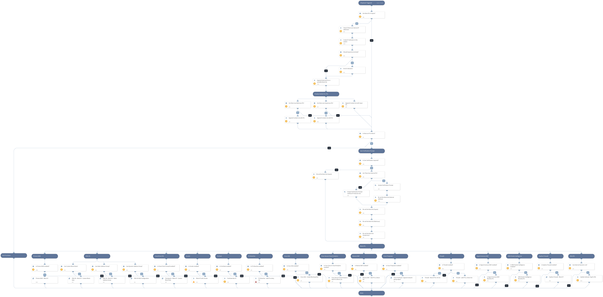

This playbook blocks malicious IPs using all integrations that are enabled. The direction of the traffic that will be blocked is determined by the XSOAR user ( and set by default to outgoing)
Please note the following:
-  some of those integrations require specific parameters to run, which are based on the playbook inputs. Also, Certain integrations use FW rules or Appanded network objects
- Note that the Appended Network objects should be specified in blocking rules inside the system later on. 

Supported integrations for this playbook [Network security products such as FW/WAF/IPS/Etc]: 

* Check Point Firewall
* Palo Alto Networks PAN-OS
* Zscaler
* FortiGate
* Aria Packet Intelligence
* Cisco Firepower 
* Cisco Secure Cloud Analytics
* Cisco ASA
* Akamai WAF
* F5 SilverLine
* ThreatX
* Signal Sciences WAF
* Sophos Firewall

## Dependencies
This playbook uses the following sub-playbooks, integrations, and scripts.

### Sub-playbooks
* Checkpoint - Block IP - Custom Block Rule
* PAN-OS DAG Configuration
* Sophos Firewall - Block IP
* Cisco FirePower- Append network group object
* IP Enrichment - Generic v2
* PAN-OS - Block IP and URL - External Dynamic List v2
* PAN-OS - Block IP - Static Address Group
* PAN-OS - Block IP - Custom Block Rule

### Integrations
* Check Point Firewall
* Palo Alto Networks PAN-OS
* Zscaler
* FortiGate
* Aria Packet Intelligence
* Cisco Firepower 
* Cisco Secure Cloud Analytics
* Cisco ASA
* Akamai WAF
* F5 SilverLine
* ThreatX
* Signal Sciences WAF
* Sophos Firewall

### Scripts
* IsIPInRanges
* SetAndHandleEmpty
* isError

### Commands
* cisco-asa-create-rule
* threatx-blacklist-ip
* sw-block-domain-or-ip
* sigsci-blacklist-add-ip
* zscaler-blacklist-ip
* ip
* fortigate-ban-ip
* f5-silverline-ip-object-add
* threatx-block-ip
* akamai-add-elements-to-network-list
* aria-block-dest-subnet

## Playbook Inputs
---

| **Name** | **Description** | **Default Value** | **Required** |
| --- | --- | --- | --- |
| IP | An array of malicious IPs to block. Enter a list of IPs separated by comma delimiter \(i.e: 1.1.1.1,2.2.2.2\). |  | Optional |
| CustomBlockRule | This input determines whether Palo Alto Networks Panorama or Firewall Custom Block Rules are used. Specify True to use Custom Block Rules.  For true statement - This option will create 2 FW rules inside the PAN-OS device. | True | Optional |
| LogForwarding | Panorama log forwarding object name. This will indicate what type of Log Forwarding setting will be specified in the PAN-OS custom rules. |  | Optional |
| AutoCommit | This input determines whether to commit the configuration automatically on PAN-OS devices.  Yes - Commit automatically. No - Commit manually. | No | Optional |
| StaticAddressGroup | This input determines whether Palo Alto Networks Panorama or Firewall Static Address Groups are used. Specify the Static Address Group name for IPs list handling. |  | Optional |
| IPListName | This input determines whether Palo Alto Networks Panorama or Firewall External Dynamic Lists are used for blocking IPs. Specify the EDL name for IPs list handling. |  | Optional |
| EDLServerIP | This input determines whether Palo Alto Networks Panorama or Firewall External Dynamic Lists are used: \* The IP address of the webserver on which the files are stored. \* The web server IP address is configured in the integration instance. |  | Optional |
| DAG | This input determines whether Palo Alto Networks Panorama or Firewall Dynamic Address Groups are used. Specify the Dynamic Address Group tag name for IPs list handling. |  | Optional |
| ResolveIP | This input is required for the IP Enrichment - Generic v2. Will be used for resolving IP's hostname. Default: False. \(Input value: True/False\) | False | Required |
| UserVerification | Possible values: True/False.  Default: True. Asking for user verification for blocking those IPs.   False - No prompt will be displayed to the user. True - The server will ask the user for blocking verification and will display the blocking list. | True | Optional |
| InternalRange | A list of internal IP ranges to check IP addresses against. The list should be provided in CIDR notation, separated by commas. An example of a list of ranges would be: "172.16.0.0/12,10.0.0.0/8,192.168.0.0/16" \(without quotes\). If a list is not provided, will use default list provided in the IsIPInRanges script \(the known IPv4 private address ranges\). |  | Optional |
| SiteName | Signal Sciences WAF - Enter the Site Name for the integration to be applied. The site name can be found in your instance console. |  | Optional |
| CiscoFPName | Cisco FirePower - Enter the Object Group Name to be appended with the blocklisted IPs. |  | Optional |
| CiscoFPID | Cisco FirePower - Enter the Object Group ID  to be appended with the blocklisted IPs. |  | Optional |
| AkamaiNetworkListID | Akamai's WAF network list ID, which is mandatory to be mentioned for the integration. To this ID, the chosen IPs will be added. |  | Optional |
| CiscoFWSource | Cisco ASA \(firewall\) value for Rule's source object in the created blocking rule. Can be the value of an IPv4, an address block, or the name of a network object. |  | Optional |
| InputEnrichment | Possible values: True/False . Default: True Enrich Input IP address/es with reputation commands. | True | Optional |
| RuleName | The Rule name/description that will be presented on the created rule in certain integrations \(if there is a need\). The supported integrations: PAN-OS, CheckPoint.  Default Input- "XSOAR - Block IP playbook - $\{incident.id\}" | XSOAR - Block IP playbook - ${incident.id} | Optional |
| RuleDirection | Determine if a newly created rule should be with the network direction of outbound or inbound blocked traffic. Possible values: inbound/outbound Default: outbound | outbound | Optional |

## Playbook Outputs
---

| **Path** | **Description** | **Type** |
| --- | --- | --- |
| Aria.BlockDestSubnet.Rule | The rule name/ID which was created in the system for this playbook. | unknown |
| Aria.BlockDestSubnet.Status | The status of the command that created the rule above.  | unknown |
| Stealthwatch.IP.id | The ID of the object created in Cisco Secure Cloud Analytics. | unknown |
| Stealthwatch.IP.identifier | The value of the object created in Cisco Secure Cloud Analytics. | unknown |
| CiscoASA.Rules.ID | The rule ID that was created on Cisco ASA for this playbook. | unknown |
| CiscoASA.Rules.Source | Rule's source object that was set in the associated rule. | unknown |
| CiscoASA.Rules.Dest | Rule's destination object that was set in the associated rule. | unknown |
| CiscoASA.Rules.IsActive | Rule's state that was set in the  associated rule. | unknown |
| SigSciences.Corp.Site.Blacklist.ID | Signal Sciences created rule ID. | unknown |
| SigSciences.Corp.Site.Blacklist.Source | Signal Sciences blocked address in a dedicated rule. | unknown |
| SigSciences.Corp.Site.Blacklist.CreatedBy | Signal Sciences - the blocking rule's creator name. | unknown |

## Playbook Image
---
