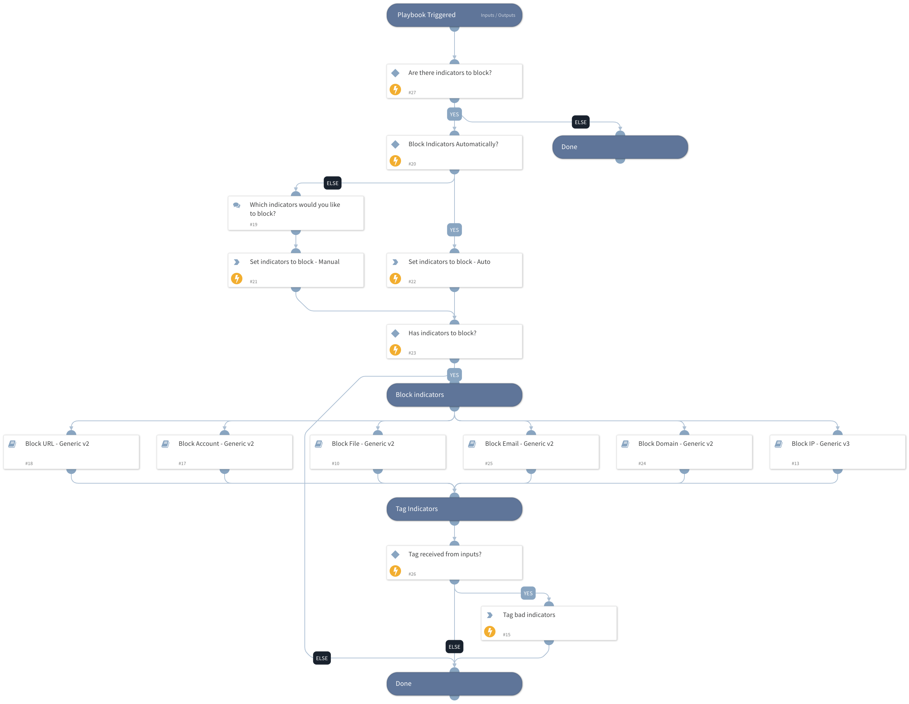

This playbook blocks malicious indicators using all integrations that are enabled, using the following sub-playbooks:

- Block URL - Generic v2
- Block Account - Generic v2
- Block IP - Generic v3
- Block File - Generic v2
- Block Email - Generic v2
- Block Domain - Generic v2.

## Dependencies

This playbook uses the following sub-playbooks, integrations, and scripts.

### Sub-playbooks

* Block Account - Generic v2
* Block Domain - Generic v2
* Block Email - Generic v2
* Block File - Generic v2
* Block IP - Generic v3
* Block URL - Generic v2

### Integrations

This playbook does not use any integrations.

### Scripts

* Set

### Commands

* appendIndicatorField

## Playbook Inputs

---

| **Name** | **Description** | **Default Value** | **Required** |
| --- | --- | --- | --- |
| IP | An array of malicious IPs to block. Enter a comma-separated list of IPs \(i.e.: 1.1.1.1,2.2.2.2\). | DBotScore.Indicator | Optional |
| URL | Array of malicious URLs to block. | DBotScore.Indicator | Optional |
| Username | Array of malicious usernames to block. | DBotScore.Indicator | Optional |
| MD5 | The MD5 hash of the file you want to block. | DBotScore.Indicator | Optional |
| SHA256 | The SHA256 hash of the file you want to block. | DBotScore.Indicator | Optional |
| FilesToBlock | Array of malicious file hashes to block. | DBotScore.Indicator | Optional |
| DomainToBlock | The domain that you wish to block. | DBotScore.Indicator | Optional |
| EmailToBlock | The email address that you wish to block. | DBotScore.Indicator | Optional |
| AutoBlockIndicators | Should the given indicators be automatically blocked, or should the user be prompted to select whether to block them?  Possible values: True/False.  Default value: True.  If set to True - No prompt will appear. All of the provided indicators will be blocked automatically.  If set to False - The user will be prompted to select which indicators to block. | True | Optional |
| CustomBlockRule | This input determines whether Palo Alto Networks Panorama or Firewall Custom Block Rules are used. Specify "True" to create new Custom Block Rules \(2 FW rules inside the PAN-OS device\).  For "False" - no rules will be created. | True | Optional |
| LogForwarding | Panorama log forwarding object name. Indicate what type of Log Forwarding setting will be specified in the PAN-OS custom rules. |  | Optional |
| AutoCommit | This input determines whether to commit the configuration automatically on PAN-OS devices and other FWs.  Yes - Commit automatically. No - Commit manually. | No | Optional |
| StaticAddressGroup | This input determines whether Palo Alto Networks Panorama or Firewall Static Address Groups are used. Specify the Static Address Group name for IPs list handling. |  | Optional |
| CustomURLCategory | Custom URL Category name. | XSOAR Remediation - Malicious URLs | Optional |
| type | Custom URL category type. Insert "URL List"/ "Category Match". |  | Optional |
| device-group | Device group for the Custom URL Category \(Panorama instances\). |  | Optional |
| categories | The list of categories. Relevant from PAN-OS v9.x. |  | Optional |
| DomainBlackListID | The Domain List ID to add the Domain to. product: Proofpoint Threat Response |  | Optional |
| Tag | Insert a tag name with which indicators will get tagged. This tag can be used later in the External Dynamic Lists integration by using the tag for filtering IPs in the indicator query. | Blocked Indicator In Systems | Optional |
| DAG | This input determines whether Palo Alto Networks Panorama or Firewall Dynamic Address Groups are used. Specify the Dynamic Address Group tag name for IPs list handling. |  | Optional |
| UserVerification | Possible values: True/False.  Default: True. Whether to provide user verification for blocking those IPs.   False - No prompt will be displayed to the user. True - The server will ask the user for blocking verification and will display the blocking list. | True | Optional |
| InternalRange | A list of internal IP ranges to check IP addresses against. The comma-separated list should be provided in CIDR notation. For example, a list of ranges would be: "172.16.0.0/12,10.0.0.0/8,192.168.0.0/16" \(without quotes\). | lists.PrivateIPs | Optional |
| SiteName | Signal Sciences WAF - Enter the site name for the integration to be applied. The site name can be found in your instance console. |  | Optional |
| AkamaiNetworkListID | Akamai's WAF network list ID, which is mandatory to be mentioned for the integration. The chosen IPs will be added to this ID. |  | Optional |
| CiscoFWSource | Cisco ASA \(firewall\) value for the rule's source object in the created blocking rule. Can be the value of an IPv4, an address block, or the name of a network object. |  | Optional |
| InputEnrichment | The rule name/description that will be presented on the created rule in certain integrations \(if there is a need\). The supported integrations: PAN-OS, CheckPoint.  Default input- "XSOAR - Block IP playbook - $\{incident.id\}" | False | Optional |
| RuleName | The rule name/description that will be presented on the created rule in certain integrations \(if there is a need\). The supported integrations: PAN-OS, CheckPoint.  Default input- "XSOAR - Block IP playbook - $\{incident.id\}" | XSOAR - Block Indicators playbook - ${incident.id} | Optional |
| RuleDirection | Determine if a newly created rule should be with the network direction of outbound or inbound blocked traffic. Possible values: inbound or outbound Default: outbound | outbound | Optional |
| EDLServerIP | EDL Server IP Address |  | Optional |

## Playbook Outputs

---

| **Path** | **Description** | **Type** |
| --- | --- | --- |
| CheckpointFWRule.Domain | Rule domain. | unknown |
| CheckpointFWRule.Enabled | Rule status. | unknown |
| CheckpointFWRule.Name | Rule name. | unknown |
| CheckpointFWRule.UID | Rule UID. | unknown |
| CheckpointFWRule.Type | Rule Type. | unknown |
| CheckpointFWRule.DestinationNegate | Rule destination negate status \(True/False\). | unknown |
| CheckpointFWRule.Action | Rule action \(Valid values are: Accept, Drop, Apply Layer, Ask, Info\). | unknown |
| CheckpointFWRule.Destination | Rule Destination. | unknown |
| CheckpointFWRule.ActionSetting | Rule action settings. | unknown |
| CheckpointFWRule.CustomFields | Rule custom fields. | unknown |
| CheckpointFWRule.Data | Rule data. | unknown |
| CheckpointFWRule.DataDirection | Rule data direction. | unknown |
| CheckpointFWRule.DataNegate | Rule data negate status \(True/False\). | unknown |
| CheckpointFWRule.Hits | Rule hits count. | unknown |
| PanoramaRule.Direction | Direction of the Panorama rule. Can be 'to','from', 'both'. | string |
| PanoramaRule.IP | The IP the Panorama rule blocks. | string |
| PanoramaRule.Name | Name of the Panorama rule. | string |
| CheckpointFWRule.Data.Name | Rule data object name. | unknown |
| CheckpointFWRule.Data.Domain | Information about the domain the data object belongs to. | unknown |
| CheckpointFWRule.Domain.Name | Rule domain name. | unknown |
| CheckpointFWRule.Domain.UID | Rule domain UID. | unknown |
| CheckpointFWRule.Domain.Type | Rule domain type. | unknown |
| CheckpointFWRule.Hits.FirstDate | The date of the first hit for the rule. | unknown |
| CheckpointFWRule.Hits.LastDate | The date of the last hit for the rule. | unknown |
| CheckpointFWRule.Hits.Level | Level of rule hits. | unknown |
| CheckpointFWRule.Hits.Percentage | Percentage of rule hits. | unknown |
| CheckpointFWRule.Hits.Value | Value of rule hits. | unknown |
| IndicatorsToBlock | Selected indicators to block. | unknown |

## Playbook Image

---

