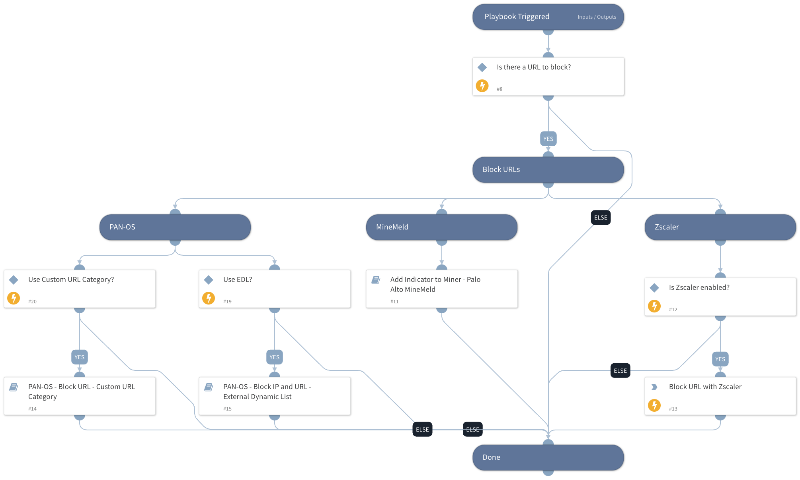

Deprecated. Use 'Block URL - Generic v2' instead.

## Dependencies

This playbook uses the following sub-playbooks, integrations, and scripts.

### Sub-playbooks

* PAN-OS - Block URL - Custom URL Category
* PAN-OS - Block IP and URL - External Dynamic List
* Add Indicator to Miner - Palo Alto MineMeld

### Integrations

This playbook does not use any integrations.

### Scripts

This playbook does not use any scripts.

### Commands

* zscaler-blacklist-url

## Playbook Inputs

---

| **Name** | **Description** | **Default Value** | **Required** |
| --- | --- | --- | --- |
| URLBlacklistMiner | The name of the URL block list Miner in  Minemeld. |  | Optional |
| URL | Array of malicious URLs to block. |  | Optional |
| URLListName | URL list from the instance context with which to override the remote file. | Demisto Remediation - URL EDL | Optional |
| LogForwarding | Log Forwarding object name. |  | Optional |
| EDLServerIP | EDL server IP address. |  | Optional |
| AutoCommit | This input establishes whether to commit the configuration automatically. Yes - Commit automatically. No - Commit manually. | No | Optional |
| CustomURLCategory | Custom URL Category name. | Demisto Remediation - Malicious URLs | Optional |
| type | Custom URL category type. Insert "URL List"/ "Category Match". |  | Optional |
| device-group | Device group for the Custom URL Category \(Panorama instances\). |  | Optional |
| categories | The list of categories. Relevant from PAN-OS v9.x. |  | Optional |

## Playbook Outputs

---
There are no outputs for this playbook.

## Playbook Image

---

