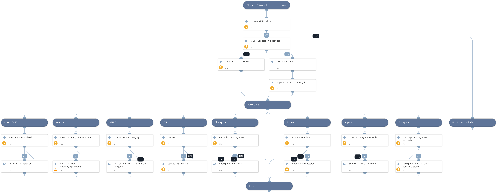

This playbook blocks malicious URLs using all integrations that are enabled.

Supported integrations for this playbook:
* Palo Alto Networks PAN-OS
* Zscaler
* Sophos
* Forcepoint
* Checkpoint
* Netcraft

## Dependencies

This playbook uses the following sub-playbooks, integrations, and scripts.

### Sub-playbooks

* PAN-OS - Block URL - Custom URL Category
* Sophos Firewall - Block URL
* Checkpoint - Block URL

### Integrations

* Netcraft
* Forcepoint
* Zscaler

### Scripts

* SetAndHandleEmpty
* IsIntegrationAvailable

### Commands

* fp-add-address-to-category
* netcraft-report-attack
* appendIndicatorField
* zscaler-blacklist-url

## Playbook Inputs

---

| **Name** | **Description** | **Default Value** | **Required** |
| --- | --- | --- | --- |
| URL | Array of malicious URLs to block. |  | Optional |
| LogForwarding | Log Forwarding object name. |  | Optional |
| AutoCommit | This input establishes whether to commit the configuration automatically. Yes - Commit automatically. No - Commit manually. | No | Optional |
| CustomURLCategory | Custom URL Category name. | XSOAR Remediation - Malicious URLs | Optional |
| type | Custom URL category type. Insert "URL List"/ "Category Match". |  | Optional |
| categories | The list of categories. Relevant from PAN-OS v9.x. |  | Optional |
| UserVerification | Possible values:True/False. Default:True. Specify if User Verification is Requrired | True | Optional |
| EDLServerIP | EDL Server IP Address |  | Optional |
| device-group | Device group for the Custom URL Category \(Panorama instances\). |  | Optional |
| Tag | Insert a tag name with which indicators will get tagged. This tag can be used later in the External Dynamic Lists integration by using the tag for filtering IPs in the indicator query. |  | Optional |

## Playbook Outputs

---
There are no outputs for this playbook.

## Playbook Image

---

